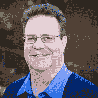
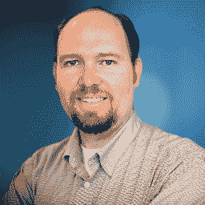

# 网络研讨会:ChatOps:对话驱动的 DevOps

> 原文：<https://devops.com/webinar-chatops-unlocking-cross-organizational-collaboration-maximum-results/>

从本质上来说，DevOps 的目标是在组织的开发和运营团队之间进行更好的沟通。一些有助于实现这一目标的工具包括版本控制、聊天和监控。通过将围绕开发和运营的对话从电子邮件转移到聊天，每个人都可以确切地看到每一步都发生了什么。

在本专题讲座中，您将了解可用于以下目的的工具和策略:

*   自动化系统通知

*   将对话转换为文档

*   同步组织内的团队

*   使用运营指标和事件进行协作

加入 Atlassian 和 Datadog，他们正在讨论如何更好地将组织的所有部分整合到一个协作团队中。

* * *

# 录像

[https://www.youtube.com/embed/kzXac9ZWc_k](https://www.youtube.com/embed/kzXac9ZWc_k)

# 幻灯片

[seoslides embed_id=”27e31b714435″ script_src=”https://devops.com/embed-script/5394/5410/” overview_src=”https://devops.com/slides/5394/” site_src=”https://devops.com” site_title=”DevOps.com” title=” ” /]

# 小组成员

**[](https://devops.com/wp-content/uploads/2015/02/IanBuchanan-Atlassian-200x200.png) 而 **Ian Buchanan** 对 Java 和。作为大型企业中敏捷方法的拥护者，他最为人所知。他推动了整个组织的流程改进，从而提高了生产率、质量和客户满意度。他建立了重视自我导向和自我组织的跨国团队。当不说话或编码时，您可能会发现 Ian 沉迷于解析器、元编程和特定领域语言。**

[](https://devops.com/wp-content/uploads/2014/12/mattWilliamsDatadog.png)***是 Datadog 的 **DevOps 布道者**。这意味着他说，写，并编码技术，让每个人都相信使用 Datadog 监控事件和指标。过去，他曾在其他初创公司担任传道者，包括 Placester 和 Yottaa(微软的一名 Linux 员工)，以及 Sun、Oracle、OpenText 等公司的各种其他职位。你可以在推特上找到马特，地址是 [@Technovangelist](https://twitter.com/Technovangelist) 。***

### ****日期:2015 年 3 月 10 日星期二****

### ****时间:美国东部标准时间**下午 2 点**

```
**REGISTRATION LINK:**([EXPIRED](http://#)**) **
```