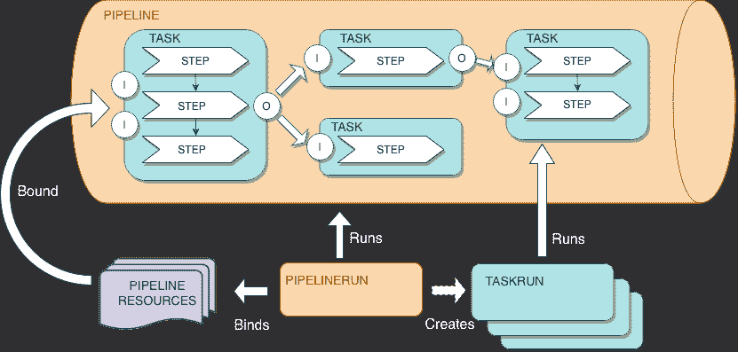
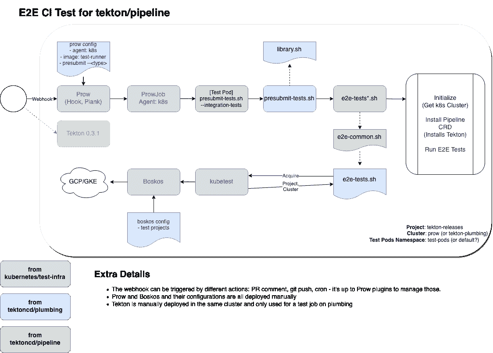

# 马里奥在泰克顿的冒险

> 原文：<https://devops.com/marios-adventures-in-tekton-land/>

[Tekton](https://tekton.dev/) 是一个开源的云原生 CI/CD 管道引擎。该项目起源于 [Knative](https://knative.dev/)) 项目，大约一年前，该项目以“Knative Pipeline”的名称开始，目的是提供一个扩展，以构建 Knative 自己的“源到图像”服务。大约八个月前，该项目重生为 Tekton，它从 Knative 空间转移到自己的 GitHub 组织，并加入了新成立的 [CD 基金会](https://cd.foundation/)，肩负新的使命:成为云原生空间中 CI/CD 的共同标准。但是泰克顿将如何实现它的新抱负呢？

为了取得成功，我们希望 Tekton 直观、可靠、易于操作和维护。Tekton 工作组讨论了这一点，我们认为如果我们自己开始将 Tekton 作为日常工作的一部分，使用它向社区提供 CI/CD 服务，这将是有用的。

## 潜入泰克顿

Tekton pipeline 旨在提供一组组件，用于在 Kubernetes 之上创建成熟的云原生 CI/CD 系统。

Tekton 的核心项目( [tektoncd/pipeline](https://github.com/tektoncd/pipeline) )定义了一组 Kubernetes 定制资源(CRD)作为创建 CI/CD 管道的标准构造。以下是对这些 CRD 的简要介绍:

*   **任务:**在 pod 的不同容器中运行的一系列命令(步骤)。
*   **流水线:**按规定顺序执行的任务集合。
*   **PipelineResource:** 到管道的输入(例如 git repo)和输出(例如 image registry)。
*   **TaskRun:** 任务执行的运行时表示。
*   **PipelineRun:** 管道执行的运行时表示。

这些管道构建块可以被重用，在嵌入了最佳实践的目录( [tektoncd/catalog](https://github.com/tektoncd/catalog) )中进行版本控制和管理。

此外，Tekton 社区致力于提供更多组件:

*   Tekton 触发器( [tektoncd/triggers](https://github.com/tektoncd/triggers) )能够对事件进行操作(例如:GitHub webhooks、CloudEvents 等等)。
*   Tekton CLI ( [tektoncd/cli](https://github.com/tektoncd/cli) )，它提供了一个命令行界面，侧重于 Tekton APIs 和特性(比如获取运行日志、启动管道等等)。
*   tek ton Dashboard([tek toncd/Dashboard](https://github.com/tektoncd/dashboard))提供了一个简单的仪表板(à-la-kube-dashboard)来从浏览器查看管道和日志。

## 重新铺设测试基础设施

我们将 Tekton 设计得直观、可靠、易于操作和维护。我们开始将 Tekton 作为日常工作的一部分，使用它为社区提供 CI/CD 服务。但是我们不是从一张空白的画布开始的。

Tekton 从 [Knative](https://knative.dev) 生态系统中继承了一些特性，包括 CI 设置。这很棒，因为它允许该项目使用与 Kubernetes 生态系统中的其他几个项目(包括 Kubernetes 本身)共享的工具相对容易地启动其 CI——结合了 [Prow](https://github.com/kubernetes/test-infra/tree/master/prow) 、Tide、Boskos、[k8s.io/test-infra](https://github.com/kubernetes/test-infra/)的一些工具和几个 bash 脚本，有助于执行诸如运行 E2E 集成测试之类的任务。

各种 CI 服务的部署是手动的，它们的配置也是如此。大多数版本都是手工制作的。由于 Tekton 由几个项目组成，我们设置了 tektoncd/plumbing repository 来托管共享的 CI/CD 基础设施:prow 配置、共享的测试脚本和工具、测试 docker 映像。马里奥冒险开始了！

## 马里奥历险记

我们开始致力于我们称之为狗粮项目的工作，基本上是用 Tekton 来建造 Tekton。就像一团毛线和一只猫一样，我们想得越多，问题就越多。Tekton 将如何与现有的基于 prow 的 CI 基础设施集成？我们如何孤立地测试管道回购的变更？我们如何部署用于运行 Tekton CI 管道的 Tekton 实例？我们如何在不中断 CI 服务的情况下做到这一切？

持续测试代码是必不可少的基础设施，对于云原生软件来说更是如此，一次性重新安装管道可能会让我们没有自来水。我们决定循序渐进，尽可能地减少影响的范围，并开始我们的旅程，首先处理发布自动化工作。

以下是我们在这次旅程中所做工作的摘录:

1.  使用 Tekton 运行我们的版本。这是最初的工作，使用 Tekton 至少释放自己，即使它被手动触发。
2.  整合 Tekton 和 Prow。Prow 能够从今年 4 月开始创建 Tekton 资源( [#1](https://github.com/kubernetes/test-infra/pull/11888) [1888](https://github.com/kubernetes/test-infra/pull/11888) 如果你好奇的话)，尽管它需要一些迭代才能在我们自己的 CI 上使用它。
3.  根本不用 Prow 看解决方案。这是(现在仍然是)最棘手的:

## 马里奥在库比肯的冒险

马里奥的冒险将在圣地亚哥的库比肯继续。如果你正在参加会议，并且你很想知道更多，来听我们的演讲，或者会后在 [CNCF youtube 频道](https://www.youtube.com/channel/UCvqbFHwN-nwalWPjPUKpvTA/featured)观看。

*This article was co-authored by Andrea Frittoli is a developer advocate at IBM and an open source enthusiast. He is a contributor to the Tekton project and he has contributed to OpenStack for several years. He’s a strong advocate for transparency in open source. Andrea has previously been a speaker at FOSSASIA, FOSS Backstage, OpenStack summits, Open Source Summits, Devoxx Days and various meetups.*

[文森特词人](https://devops.com/author/vincent-demeester/)