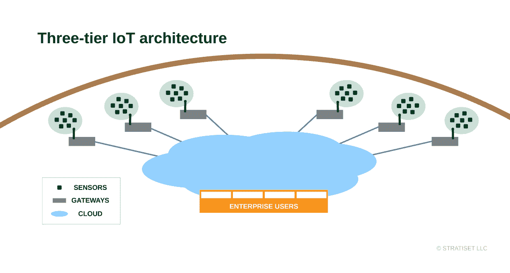
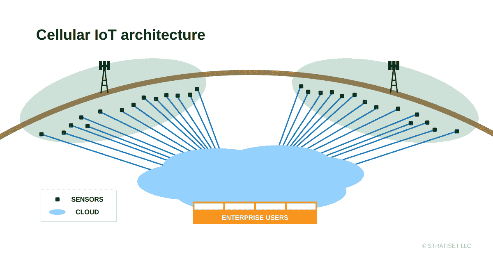

# 当网关远离蜂窝物联网

> 原文：<https://devops.com/when-gateways-go-away-with-cellular-iot/>

多年来，网关一直是三层物联网架构的重要组成部分。随着蜂窝物联网技术的推出，他们在边缘和云之间的传统位置正在发生变化。什么时候网关仍然是正确的方法？网关将如何远离蜂窝物联网？这是 DevOps 团队在传统三层和蜂窝物联网架构之间的权衡。

## **跨越鸿沟**

物联网边缘设备和企业网络往往不兼容。企业和云运行在 IP 数据包和更重的协议上，如 HTTPS、TLS 和 XML。运行这些设备需要处理能力，这种能力通常是小型电池供电的边缘设备无法企及的。即使有所改进，Wi-Fi 也是企业网络兼容的，但对于许多边缘设备来说太重了。

这就是为什么无线传感器网络，如蓝牙，线程，ZigBee，Z-Wave 和其他演变。这些紧凑、高效的堆栈运行在微型微控制器上，在传感器以小脉冲发送数据时消耗能量。除了有线控制网络，还有更多无线技术，如 6LoWPAN、ISA100 和 WirelessHART。网关中的实时协议转换将数据从这些设备带入基于 IP 的企业网络。

在某些情况下，网关可能像智能手机、平板电脑或小型电路板一样简单。一些网关拥有更快的处理器、交流电源、更好的冷却和封装，适合恶劣环境。更快的网关还可以在边缘计算角色中预处理数据流。这减少了网络流量，加快了决策速度，而无需依赖云分析。

在工业设施内设置几个网关很容易。分散在各处的传感器群需要跨越这些间隙的许多网关。随着物联网应用的增长，网关会带来开发和部署成本。每当另一个网关关闭时，DevOps 必须保护并更新它。

## **一个高耸的选择**

直到最近，三层物联网架构还没有替代品。适用于边缘设备的无线传感器网络缺乏许多使用案例的覆盖范围。如果不扩大设备覆盖范围，而是扩大网络覆盖范围，会怎么样？低功耗广域网(LPWAN)技术迎接了这一挑战。

目前存在三种主要的 LPWAN 技术:Sigfox、LoRaWAN 和 cellular IoT。Sigfox 是一种低数据速率上行链路解决方案，在农村地区连接 30 至 50 公里内的设备和 Sigfox 发射塔。LoRaWAN 使用未经许可的频谱，将其占空比限制在 1%左右，并且需要一个无线网关来覆盖 5 到 7 公里的农村范围。两种技术的城市范围都更短，仍然只有几公里。两者都适用于主要休眠和传输少量数据的传感器。

蜂窝物联网技术起步较晚，理由很充分。更快、低成本、低功耗、具有蜂窝级范围和安全性的无线电规格是一项艰巨的任务。3GPP 定义了两条路径:LTE-M 和 NB-IoT。LTE-M 提供 1Mb/s 的数据速率和更低的延迟。NB-IoT 专注于更低的数据速率，没有占空比限制。虽然数据传输速率上下波动约 200kb/s，但它仍然比 Sigfox 或 LoRaWAN 快得多。NB-IoT 还可以更好地穿透建筑物，避免干扰，并实现设备 10 年的电池寿命。

全球移动网络运营商(MnO)正在竞相部署 NB-IoT 和 LTE-M 网络。在最新的 [GSMA 移动物联网部署报告](https://www.gsma.com/iot/deployment-map/)中，NB-IoT 在采用方面处于领先地位。这些部署与昂贵的 5G 基础设施无关，因此 MnO 正在增加投资。

塔准备就绪后，最后一项工作是支持远程 SIM 卡供应(RSP)。蜂窝物联网设备通常与最新苹果 iPhones 中的 eSIM 一起工作，有一个主要区别。一名 iPhone 用户扫描二维码，调出 RSP 的个人资料。

## **跨网络推送**

蜂窝物联网设备使用 RSP 的推送模式。当具有 eSIM 的边缘设备加电时，它使用引导网络配置文件。然后，它可以与 RSP 服务器通信，以加载选择的操作配置文件。通过这种空中配置，一个设备配置几乎可以到达覆盖范围内的任何地方。它开启了强大的应用案例，如农业或石油和天然气，在室内和室外设置广泛分布的传感器。

所有这些都是在没有 DevOps 团队规划和投资基础设施的情况下发生的。跨国公司是主要投资者。物联网应用开发人员面临的变数包括网络覆盖、运营商档案创建和设置流媒体设备。如果一个 MNO 在特定位置被证明是昂贵的或不可靠的，设备可以通过空中接收另一个配置文件。

蜂窝物联网可以部署一个或多个传感器，无需网关。随着位置越来越分散，蜂窝物联网的优势变得更加强大。简化的网络架构看起来更像物联网应有的样子——每个设备都是可寻址的。

替代品之所以存在，是因为它们很好地服务于某些用例，其中一些在新技术到来后会持续多年。对于一些开发运维团队来说，风险是一个重要因素，他们可能更喜欢基于网关的架构所提供的控制。在紧密的传感器集群中，少数网关的生命周期成本可能会更低。如果网关不适合某个应用，它们可能会随着蜂窝物联网的推出而迅速消失。

我看到无处不在的覆盖推动了蜂窝物联网的发展势头。随着消费者增长放缓，提供物联网服务是移动网络运营商的优先事项。有大量资源可用于深入了解蜂窝物联网技术——如果我能帮您指明正确的方向，请联系我。

— [唐·迪丹吉](https://devops.com/author/don-dingee/)