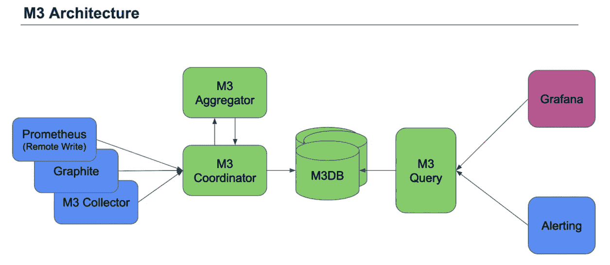

# 在分布式系统中扩展指标的挑战

> 原文：<https://devops.com/the-challenge-of-scaling-metrics-in-distributed-systems/>

无论是从整体架构迁移，还是从零开始构建分布式系统，微服务架构都有许多优势可以利用——更快的软件部署周期、增强的可扩展性、更好的风险隔离。然而，分布式系统是复杂的，因此，伴随着许多挑战，特别是当涉及到度量的可伸缩性时。

## **分布式系统中可观测性的重要性**

为了实现分布式系统的优势，数据驱动的优化策略是必不可少的。这里的悖论是可见性简化了复杂性，而可见性的复杂性在分布式系统中急剧增加。

正如 New Relic 在其电子书[中指出的，云原生是新的常态](https://newrelic.com/resource/cloud-native-is-new-normal)，传统的监控方法需要进行调整以满足分散式架构的需求，包括:

*   通过学习如何将复杂的环境网络中的点连接起来，克服端到端监控能力的丧失。
*   制定策略，快速深入到相互关联的问题，以缩短解决问题的平均时间(MTTR)。
*   引入主动可靠性策略，首先关注测量，然后关注改进。

## **在什么都不监控和监控一切之间找到恰当的平衡**

大多数应用工程师利用 Grafana、Prometheus 或 Graphite 等度量工具来跟踪系统健康状况的重要指标。虽然[监控](https://devops.com/how-monitoring-and-observability-feed-each-other-to-create-a-holistic-approach-to-visibility/)是必不可少的，但是当涉及到度量摄取时，会有膨胀这样的事情；这种过载转化为影响性能、成本和可靠性的可扩展性挑战。

那么，你怎么知道要监控什么呢？为了从您的系统中获得最有价值的见解，您必须首先理解和识别组件，更具体地说，这些组件中的哪些属性驱动关键指标。了解这一点需要非常熟悉分布式系统中的所有部分是如何协同工作的。

谷歌的[站点可靠性工程](https://landing.google.com/sre/book.html)一书提供了一个框架来决定在分布式系统中监控什么。他们将信号分为四个不同的类别:

*   **延迟:**了解资源需求，识别瓶颈。
*   **流量:**监控系统对不同负载水平的响应**；**与其他指标搭配时最有用。
*   **错误:**跟踪请求/响应流程中中断的频率和性质。
*   **饱和度:**表面容量相关问题。

即使您已经确定了要跟踪的最重要的指标，可伸缩性仍然是一个必须解决的挑战，尤其是在处理跨复杂应用程序体系结构处理大量数据的应用程序时。

## **M3:优步开源大规模度量平台**

一个直接解决大规模分布式度量挑战的解决方案是 M3，一个由优步的工程团队开发的开源项目。

[在使用 M3](https://eng.uber.com/m3/) 之前，优步团队将指标发送到一个石墨堆栈，该堆栈使用共享碳集群中的 Whisper 文件格式进行存储处理。在那里，他们创建了 Grafana 仪表板来可视化数据，并使用 Nagios 通过源代码控制的脚本基于 Graphite 阈值检查来发出警报。随着指标数量的持续增长，扩展解决方案的手动流程变得不可持续，重复失败导致永久数据丢失，这促使他们构建一个容错性更强、可扩展的系统。

M3 专注于为长期保留的大规模指标提供可靠的存储解决方案，通过为 Prometheus metrics 提供多租户存储来解决与 Prometheus 固有的单节点相关的限制。该解决方案的一个关键组件是 M3 的可扩展存储后端 [M3DB](https://m3db.github.io/m3/m3db) 。

M3DB 内置于 Go 中，是一个分布式时间序列存储和反向索引，具有可配置的无序写入。通过长期保存实时指标，M3DB 可以取代 Prometheus 集群。在开发 M3DB 解决方案的过程中，优步团队基本上将 Prometheus 分解为微服务，以实现每个组件的独立扩展。通过采用这种方法，M3DB 能够提供更好的可靠性、效率和性能。

至少，M3DB 可以用作 Prometheus 的远程存储(或用于替代任何其他远程存储解决方案)。但是，该解决方案还提供了其他功能，包括外部聚合引擎和独立的查询引擎。

M3DB 项目仍在开发中，贡献者社区在不断增长。

要了解更多关于集装箱化基础设施和云原生技术的信息，请考虑参加 11 月 18 日至 21 日在圣地亚哥举办的 [KubeCon + CloudNativeCon NA](https://events.linuxfoundation.org/events/kubecon-cloudnativecon-north-america-2019/) 。

莫莉·沃奇克