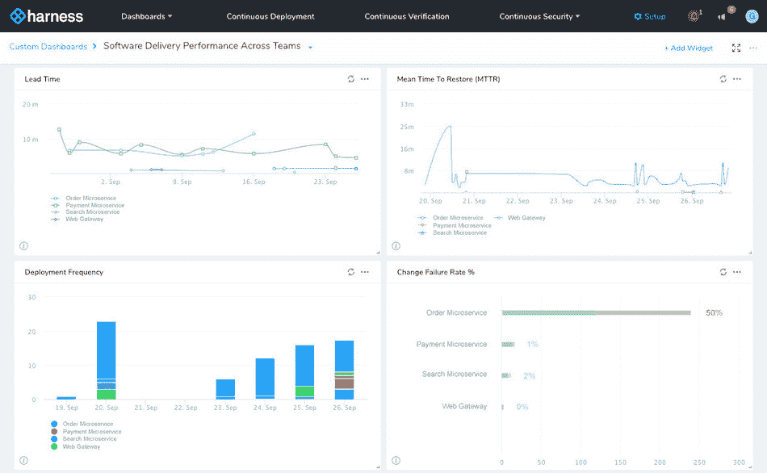

# Harness 为 CDaaS 平台增加了分析功能

> 原文：<https://devops.com/harness-adds-analytics-to-cdaas-platform/>

Harness 在其同名的持续交付即服务(CDaaS)平台中添加了一个分析模块，可以更轻松地将受限的软件开发资源与业务目标相结合。

Harness 产品营销总监 Omed Habib 表示,[持续洞察](https://www.prnewswire.com/news-releases/harness-releases-continuous-insights-enabling-organizations-to-measure-software-delivery-performance-across-development-teams-300930170.html)通过自动收集部署频率、交付周期、平均恢复时间(MTTR)和变更失败率等指标，使组织能够识别瓶颈并改善整体软件交付。

The Harness Continuous Insights dashboard

Habib 说，组织在持续交付方面面临的最大挑战是大多数 it 环境的微妙性。他说，复杂系统之间的所有相互依赖迫使 IT 组织依赖手动流程和定制脚本，并指出每当出现问题时回滚应用程序的过程可能需要数天或数周时间。

Harness CDaaS 平台提供了一种更加无缝的应用交付方法，可以自动检测 GitHub、Bamboo、Jenkins、Artifactory 或 Nexus 存储库或任何 Git 存储库中的新版本。Habib 补充说，一旦 DevOps 团队收到警报，他们就可以利用图形工具，不仅使用 YAML 文件自动完成管道建设过程，还可以利用机器学习算法来评估部署质量，然后通过访问 AppDynamics、New Relic、Splunk、Elastic Search 和 Sumologic 等工具的数据，在必要时自动回滚部署。

马具有三种类型。有 Harness 支持的专业版和免费的永久社区版。还有一个面向不需要全套企业和安全功能的中型公司的基础版。Harness Professional Edition 的所有新老客户都可以免费使用持续洞察分析模块。

Habib 说，尽管在 DevOps 和持续集成方面取得了所有的进步，但是组织仍然在与持续交付作斗争。因为他们中的许多人似乎不能像构建代码那样快速地将代码投入生产，IT 环境中的创新步伐被扼杀了。当企业领导想知道为什么创新的速度慢了下来时，他们中的许多人现在要求访问应用交付指标。

尚不清楚提供对这些指标的访问会在多大程度上吸引组织采用 CDaaS 平台。然而，随着开发人员和企业领导对应用程序交付的速度越来越失望，变革的浪潮正在兴起。许多 IT 领导者现在希望尽可能多地自动化应用交付过程，以防止这种挫败感演变成全面的叛乱。

与此同时，有一句古老的谚语说，衡量的事情就是完成的事情。并不是每个人都喜欢关注应用交付的关键性能指标。然而，事实是，大多数组织永远不会真正解决应用程序交付难题，直到有人开始产生相关的度量标准，使他们能够理解挑战的真正范围。

— [迈克·维扎德](https://devops.com/author/mike-vizard/)