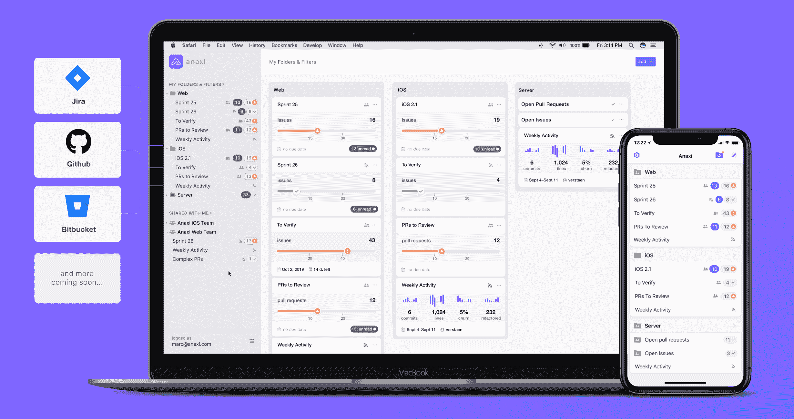

# Anaxi 为 ALM 工具增加了报告功能

> 原文：<https://devops.com/anaxi-adds-reporting-capabilities-to-alm-tool/>

Anaxi 今天宣布，它已经在其同名应用生命周期管理(ALM)工具中添加了[报告功能，使其可以更新利益相关者关于软件开发项目的状态，这些项目驻留在 GitHub 和 Bitbucket Cloud 等存储库中，以及吉拉等项目管理应用程序中。](https://www.globenewswire.com/news-release/2019/10/17/1931468/0/en/Anaxi-Adds-Reporting-and-Sharing-Capabilities-to-Provide-Unprecedented-Visibility-into-Software-Development.html)

公司首席执行官 Marc Verstaen 表示，报告功能将使 Anaxi 更容易使用，例如，通过使 it 领导者能够生成类似于当今商业领导者如何使用商业智能(BI)应用程序来共享销售预测的报告，让商业领导者了解软件开发计划的更新。

Anaxi 工具旨在为 IT 领导者提供单一工具，用于跟踪多个 DevOps 平台的进展。Verstaen 说，随着越来越多的组织开始意识到他们实际上是软件公司，对软件交付管理工具的兴趣正在上升。他说，IT 领导者面临的报告挑战是，由于 DevOps 工具链固有的碎片化特性，他们创建整体报告所需的信息位于多个存储库中。

为了更容易采用 Anaxi，ALM 工具数据采用了组织为访问 GitHub、Bitbucket 和吉拉而创建的相同凭证。Anaxi 应用程序直接连接到用户的 GitHub 或 Bitbucket 存储库和吉拉项目，以确保数据隐私和安全。在 Anaxi 应用程序上执行的任何操作都会写回到 GitHub、Bitbucket 和吉拉上，以保持涉及多个团队成员的项目的一致性。

其核心是，Anaxi 从 DevOps 工具中提取元数据，应用分析来跟踪单个开发人员的工作效率和团队绩效。例如，IT 领导可以每周分析添加和删除了多少代码、重构和代码变动。Anaxi 既可以用来代替项目管理应用程序，也可以作为现有项目管理工具的补充，使分析变得更加容易。

主要目标是让 it 领导更容易识别 DevOps 瓶颈，并以推进业务目标的方式对项目进行优先级排序。太多的组织正在编写比以往更多的代码，却发现项目被推迟了，因为其他模块所依赖的单个组件落后于计划。如果 IT 领导已经意识到需要根据另一个项目的预期延迟对时间表进行更改，许多编写代码的开发人员可能已经在从事其他项目了。Verstaen 说，Anaxi 本质上是将预测分析应用于软件开发项目，以根据过去的历史来确定满足截止日期的可能性。

有了这种智能，IT 领导可以主动重新分配资源，或者通知业务利益相关方交付时间表的变化。Versaten 说，无论是哪种情况，目标都是使 IT 领导者能够避免任何可能出现的软件开发危机。

最多 10 人的团队可以免费使用 Anaxi 应用程序。超过 10 个用户的团队将被要求采用每个用户每月 19 美元的高级计划。

— [迈克·维扎德](https://devops.com/author/mike-vizard/)