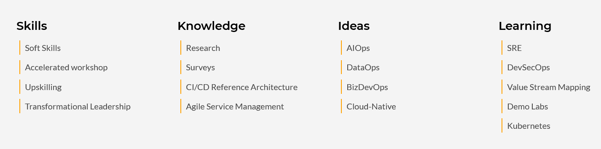

# DOI 的全球滑雪日提供免费 DevOps 培训

> 原文：<https://devops.com/free-devops-training-at-dois-global-skilup-day/>

DevOps Institute (DOI)将于 2019 年 12 月 10 日举办名为[全球滑雪日](https://devopsinstitute.com/globalskilupday/)的全球培训日。这是一个免费的虚拟活动，他们已经安排了 DevOps 空间中一些最聪明的头脑在一天中进行演讲/培训。

为什么是全球？他们真的在计划一种全天候的培训方法，全天在每个不同的地区进行培训。总的来说，该活动将持续 18 个小时，覆盖全球，这意味着无论您身在何处，都可以获得免费培训。

这个免费培训日的 SKIL(技能、知识、想法和学习)部分是 DOI 为 DevOps 下一阶段制定的培训方法。他们在全球范围内开展 SKILup Days 已经有一段时间了，这似乎是这一努力的虚拟化延伸。

“什么类型的培训，”你问？嗯，这里有一个由 DOI 分解的主题列表。

无论你的兴趣和/或需求是什么，在这次培训中你都会学到一些东西。

在撰写本文时，有 15 位演讲者将在三个地区进行 18 个小时的演讲，因此，虽然我不参与他们的内部计划，但作者猜测他们仍在填写约定。考虑到我们还有将近两个月的时间，这一点也不奇怪。令人惊讶的是，发言者名单中有很高比例的公认专家。这对训练有好处，因为不能出席的超级明星通常没有这些主持人的知名度。很大一部分有效的训练是演示。

所以去报名吧！找个地方，让系统做长时间的构建，学习一些新的东西。我喜欢参加这种类型的活动，只是因为我们的小实验室已经形成了自己的方式，接触新的方法/想法可以防止事情变得陈旧。虽然我不会占用 DOI 的空间，但当空间有限时，我宁愿把它留给你们所有人。

由于我目前的职责是负责一个测试实验室，这对于那些运行着代表你们组织的面向公众的系统的人来说更为重要。如果是的话，对我来说最大的挑战就是 AIOps，因为它是在我进行持续测试和将新工具集成到 DevOps 工具链中时悄悄出现的。事实上，我最近对这个主题的兴趣来自于对一个集成的观察，这个工具在 AIOps 上很重要——尽管 CI/CD 参考架构也很酷。标准化的尝试很有趣，因为即使一些部分已经稳定，我们仍然生活在不断变化的土地上。

除了你做的事情，挑一些你认为你不太在乎的事情。你可能会找到一个关心的好理由，这将有助于你继续努力。

*免责声明:我过去曾与 DevOps Institute 签约(通过根深蒂固的技术)，但我目前没有被他们聘用。我分享这个是因为这是免费培训，谁不想知道呢？*

唐·麦克维蒂