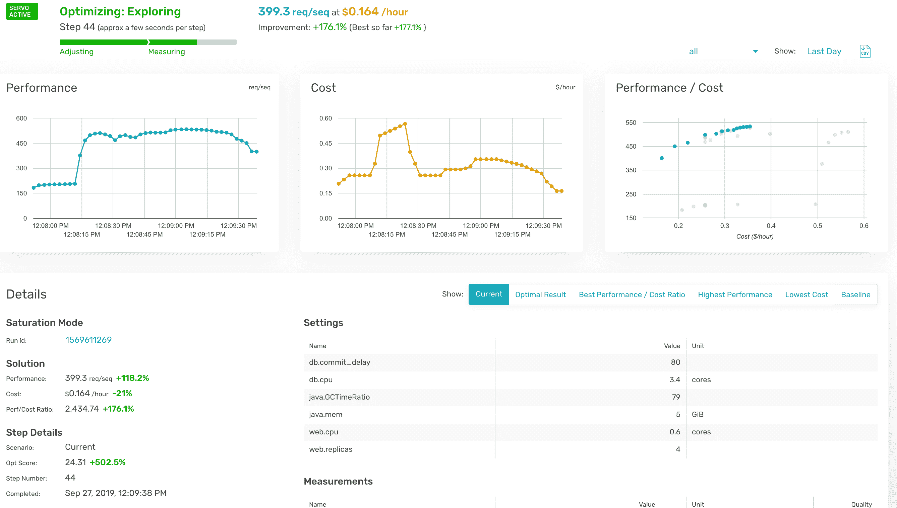

# 持续优化:一个时代已经到来的想法？

> 原文：<https://devops.com/continuous-optimization-an-idea-whose-time-has-come/>

敏捷让开发更快地交付代码。CI 使测试进行得更快，CD 使交付更快，但是是什么使跟踪变更量的所有这些更快地引入和交付优化呢？

这是奥普萨尼希望你问的问题。这是一个合理的问题。在复杂且不断变化的软件世界中，优化变得更加重要——如果它能跟上的话。奥普萨尼认为，只要有一点点 AIOps 的帮助，它就能做到。

前提很简单。有一些调整环境的方法可以提高性能和/或降低成本。这些方法各自相对简单(比如 JVM 设置或云实例规模)，但是结合起来就形成了一个影响整体性能的复杂网络，各个部分有时有帮助，有时有伤害。

在大型实例上增加 JVM 内存可能会有所帮助。例如，稍后切换到较小的实例，JVM 的变化可能会在较小的内存占用上引起问题。所以需要一些更有活力的东西。随着代码的变化，最佳优化选项也可能发生变化。随着环境的其他部分发生变化，这加剧了人们的担忧，即应用程序没有以最佳状态运行，可能会花费太多资金。

Opsani 对这个问题的回答是持续优化。使用 AIOps 检查不同的设置组合，其速度之快让操作人员即使有时间也无法应付。他们通常不会。

从我(而不是他们)的角度来看，这个谜题有两个部分。首先是收集输入并确定性能，其次是调整设置。然后重复。看似简单，但持续优化的工作环境越来越复杂。看看给定环境中有多少地方可以进行优化，从虚拟机/实例到代码、网络、管理平台到存储/数据库选择，都有很多地方在进行，所有这些设置都会相互影响。

因此，不断优化的想法吸引了我。他们拥有人们期望收集输入的接口，如[詹金斯](https://jenkins.io/)、[数据狗](https://www.datadoghq.com/)和[新遗迹](https://newrelic.com/)等名称。他们也有制定和测试变化的接口，与产品的接口如 [Kubernetes](https://kubernetes.io/) 、 [Terraform](https://www.terraform.io/) 、 [Rancher](https://rancher.com/) 和 [Wavefront](https://www.wavefront.com/) 。所以看起来他们已经掌握了基本知识。当然，我希望看到不在集成列表中的供应商接口，毫无疑问，对您来说也是如此。但核心就在这里，获得大多数公司经常使用的监控和管理工具。

奥普萨尼似乎也意识到了不同组织的不同舒适度。能够在开发或测试以及生产中运行。由于每个组织对将新想法投入生产都有不同的偏好，这是一个好主意，尽管就我个人而言，我的目标是最终的生产推广，因为那是橡胶与道路相遇的地方。让它作为正常操作的一部分运行，意味着即使是将应用程序的响应能力降低 25%的微小变化(我们都见过)也会被检测到，Opsani 可以尝试改变一些环境来进行补偿。

当我与他们交谈时，我们没有讨论成本，但我们讨论了节约。对于预算敏感的环境，值得研究一下贵组织的成本与每月实际节省的潜在费用。下面是一个屏幕截图，显示了结合了性能指标的成本指标。如果适合您的环境，减少每月开销来购买一个还能提高性能的工具可能是显而易见的。

我不能说它是否适合您的环境，其他任何分析师/权威人士也不能说。这要由你的组织来决定。但是持续优化的想法是个好主意。Opsani 并不是唯一一个致力于解决这个问题的人，所以即使这个特定的工具不适合您的需求，您也可以寻找其他适合的工具。我建议获得演示，看看他们有什么，以及它如何在您的环境中有所帮助。

唐·麦克维蒂