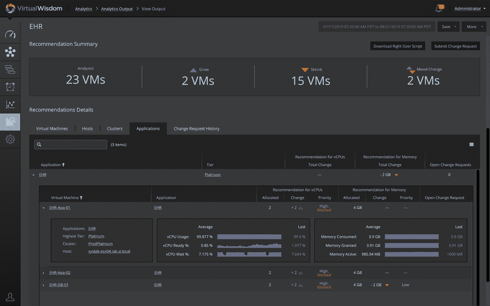

# 虚拟仪器公司的目标是融合 DevOps，ITSM 世界

> 原文：<https://devops.com/virtual-instruments-aims-to-meld-devops-itsm-worlds/>

虚拟仪器公司(Virtual Instruments)今天宣布了 IT 管理平台的新增产品，这些产品利用机器学习算法来识别应用程序漂移，并动态调整虚拟机的大小。

虚拟仪器产品高级副总裁 Tim Van Ash 表示，该公司的 VirtualWisdom 平台 6.2 版本是正在进行的一项活动的一部分，该活动旨在使用 AIOps 平台将传统的 IT 服务管理与最佳 DevOps 实践相结合。作为这一努力的一部分，虚拟仪器公司上个月[收购了 Metricly](https://devops.com/virtual-instruments-acquires-metricly-to-monitor-cloud-costs/) ，这是一家实时监控云成本的工具提供商。

该平台的最新更新还增加了针对任何应用程序的容量消耗率进行监控、报告、预测和警报的工具，而容量预测警报现在允许 IT 团队指定在任何一个节点或集群上发生潜在容量耗尽之前，他们希望在多少天、几周或几个月内收到通知。

最后，Virtual Wisdom 6.2 提供了对更新的 Virtual Wisdom 主动仪表板的访问，这些仪表板提供了对智能图表的访问，通过这些图表，除了特定于一组 IT 基础架构或应用程序的拓扑视图之外，AIOps 平台现在还支持注释、链接和智能命名。

Van Ash 表示，虚拟仪器的 AIOps 方法允许 it 团队实时响应不断变化的应用条件，并对任何特定应用程序可以消耗的容量设置粒度限制。他说，例如，IT 团队可以确保特定的应用程序获得白金级的优先权，以防止任何其他应用程序消耗分配给该应用程序的资源。

总的来说，Van Ash 表示，虚拟仪器正在寻求一种以应用为中心的 AIOps 方法，这将使 it 组织更容易动态优化 IT 基础设施容量。他说，AIOps 平台不是过分关注利用率和跟踪事件，而是需要能够解决整个 it 生命周期，因为它与 IT 环境对业务的价值有关。他指出，今天许多 DevOps 团队在构建和部署应用程序时，很少考虑或实际控制这些应用程序需要实现和维护的服务级别。他说，目标是提供一个单一的平台，通过该平台，精通传统 IT 服务管理(ITSM)模型(如 ServiceNow)的开发人员和 IT 运营团队可以协作实现一组共同的目标。

对于开发运维的支持者和 IT 团队来说，清算的一天即将到来，他们已经使用基于 ITIL 的流程构建了庞大的 IT 环境。这些基于 ITIL 的流程并不特别灵活，但是它们已经被成功地应用于大规模推广。AIOps 的进步将大大有助于将 it 管理的两个流派结合在一起，使可用的 IT 基础设施资源更容易适应试图共享公共资源池的多个应用程序开发人员的意愿。

与此同时，任何人都不应该指望人工智能能在一夜之间神奇地解决他们的问题。算法解决所有 It 难题需要一段时间。然而，开发人员和 IT 运营团队之间的关系可以被描述为最有争议的日子可能很快就要仁慈地结束了。

— [迈克·维扎德](https://devops.com/author/mike-vizard/)