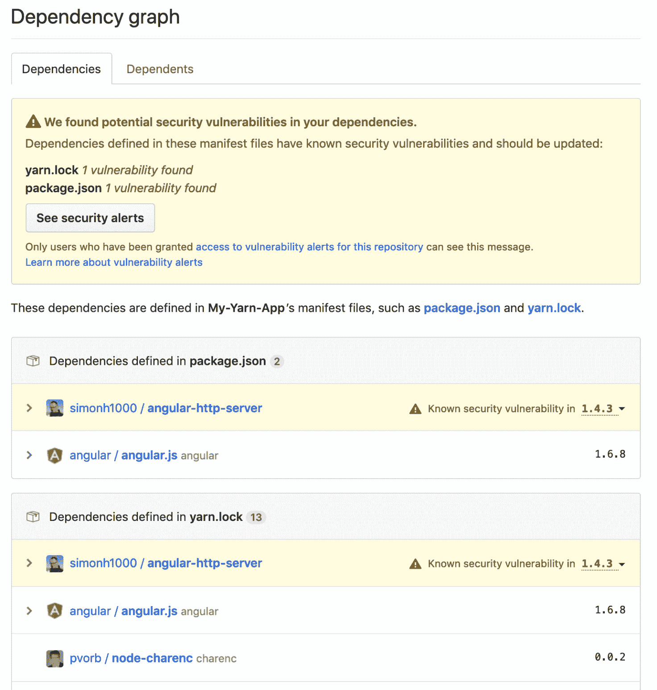

# GitHub 企业服务器更新扩展了企业推送

> 原文：<https://devops.com/github-enterprise-server-update-extends-enterprise-push/>

随着 GitHub Enterprise Server 的 [2.18 发布，GitHub 已经扩大了其在企业中的影响力，该版本包括一系列旨在使管理员的生活更加轻松的更新。](https://github.blog/2019-08-20-github-enterprise-server-2-18-is-here/)

GitHub Enterprise 的产品负责人马里奥·罗德里格斯表示，随着大公司更加积极地采用 DevOps 工具和流程，GitHub 的企业版正在经历三位数的增长，这些工具和流程已经证明自己在构建和部署大规模 web 应用程序时是有效的。

为了使这些环境的管理员能够更方便地访问 GitHub Enterprise Server 的内部版本或软件即服务(SaaS)版本，最新版本使管理员能够利用问题转移功能来删除一个存储库中的问题，并在一个步骤中将其与相关元数据一起移动到新的存储库中。

GitHub Enterprise Server 的其他新增功能包括一个可分配的 comments 功能，该功能允许具有写访问权限的维护人员将问题或拉请求分配给对其进行了评论的任何人，而不管他们的组织成员资格或存储库权限。

如果某个问题或拉式请求属于某个里程碑，则该里程碑的名称现在也会显示在项目卡和项目卡详细信息侧栏中。可以使用详细信息侧栏添加或删除来自里程碑的问题或拉动请求，并且可以使用搜索栏按里程碑组织项目卡。

GitHub 现在也为管理员提供存储库模板，允许他们拥有或拥有模板存储库的写权限。该功能允许任何能够访问存储库的人生成一个具有相同目录结构和文件的新存储库。如果管理员创建了一个用户拥有的存储库，他们现在也将能够自动监视它的更新。然而，forks 将不再被自动监视，即使是那些被授予推送访问权限的用户。

Rodriguez 说，GitHub 也开始扩展其平台的范围，以解决最佳 DevSecOps 流程。扩展的依赖图支持为依赖“yarn.lock”文件的项目添加了安全警报。这些警报有助于开发人员掌握影响其依赖性的漏洞，Rodriguez 说这一点至关重要，因为如今的安全问题可能会抵消以前在 DevOps 过程中获得的所有生产力收益。

扩展的审计日志功能允许管理员查看组织和存储库设置的更改，此外还可以查看何时使用 PAT 和 SSH 访问信息，以及何时组织和存储库成员发生了变化。

总的来说，Rodriguez 说，GitHub Enterprise Server 每季度更新一次，提供了 95%的 GitHub 知识库功能，超过 4000 万开发人员可以访问这些功能来共享代码和下载开源软件。企业 IT 组织显然希望在防火墙后复制 GitHub 开发人员的体验，以确保没有人会无意中访问为他们提供竞争优势的专有软件。当然，挑战与其说是建立存储库，不如说是定义需要围绕它的所有 DevOps 流程。

— [迈克·维扎德](https://devops.com/author/mike-vizard/)