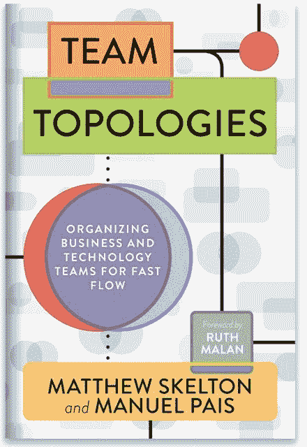

# IT 革命发布新书《团队拓扑结构:组织业务和技术团队实现快速流动》

> 原文：<https://devops.com/it-revolution-announces-new-book-team-topologies-organizing-business-and-technology-teams-for-fast-flow/>

合著者 Matthew Skelton 和 Manuel Pais 分享了确保 IT 组织成功的四种成功团队模式和三种互动模式的秘密。

俄勒冈州波特兰市。–2019 年 8 月 20 日—[IT 革命](http://icm-tracking.meltwater.com/link.php?DynEngagement=true&H=btYXC68syxmDVppbhVzFoYHdeMNV9070xvOlf%2FNdDQ0wXj6aidRhmzbwdCqGYzY%2FznCVALGPtz5dQdZg1wLKQurlIXZdsV8bqqdFWZed0baXfb%2Bkyk0BtQ%3D%3D&G=0&R=https%3A%2F%2Fitrevolution.com%2F%3Futm_medium%3Daffiliate%26utm_source%3Dpr%26utm_term%3Dttop-press-release-1%26utm_content%3Dshort-lead-presales%26utm_campaign%3Dttop&I=20190820125739.000003defe78%40mail6-114-ussnn1&X=MHwxMDQ2NzU4OjVkNWJlZTNiYWY4YTQzYWIyZDdhZDVmOTs%3D&S=Cfpptw7Ec-HKVu2zLiUkQrrgX1k0m-abcyVtGlccjBY) ，推进 DevOps 的行业领导者，今天宣布其最新著作《团队拓扑:组织业务和技术团队实现快速流动》的上市。由 IT 顾问 Matthew Skelton 和 Manuel Pais 撰写的《团队拓扑》基于四种基本的团队类型和三种团队交互模式，为组织设计和团队交互提供了一个实用的、循序渐进的适应性模型。它提出了一个模型，将团队视为软件交付的基本手段，其中团队结构和沟通途径能够随着技术和组织的成熟而发展。

《团队拓扑》的平装本、电子书和音频版[现在可以预购](https://itrevolution.com/team-topologies/)。

“Matthew Skelton 和 Manuel Pais 写了一本关于团队结构模式的精彩而实用的书，描述了它们的特征、成功因素和缺陷，”IT Revolution 的创始人 Gene Kim 说，他是即将出版的书籍《独角兽项目》的作者，也是凤凰项目、《DevOps 手册》和《加速》的合著者。“团队拓扑是任何构建或维护软件系统的人的必读之作，并通过一个实用的指南帮助我们扩展对组织架构的理解，该指南使团队能够更有效地为企业交付价值。”

《团队拓扑》的合著者 Manuel Pais 说:“成功的组织已经意识到构建和运行软件系统需要对社会技术环境的认识:人加上技术。”。“我们的书通过考虑康威定律、团队认知负荷和团队优先软件边界，帮助组织采用社会技术方法。这些都有助于使软件交付对企业来说更加可持续。”

《团队拓扑》的合著者 Matthew Skelton 说:“在当今快速发展的商业环境中，团队优先的软件系统方法是成功的关键。“我们的书受到了我们在世界各地(美国、欧洲、中国)的工作组织的启发和启发，许多公司努力使软件交付有效，因为团队边界和行为没有得到很好的定义。我们的书提供了有价值的模式和指导来帮助团队在软件方面取得成功。”

要下载书籍节选、收听有声读物节选或下载团队拓扑的有声读物伴侣，请点击[此处](https://itrevolution.com/team-topologies/)。

## 关于这本书

有效的软件团队是任何组织持续不断地交付价值的关键。但是一个领导者如何为特定的目标、文化和需求建立最好的团队组织呢？

团队拓扑是软件组织设计中的一个重大进步，它为团队提供了一种定义良好的交互和关联方式，有助于使最终的软件架构更加清晰和可持续，将团队间的问题转化为自导向组织的有价值的信号。

这本书是为任何关心软件系统交付和运行的有效性的人而写的:C 级领导(包括 CTO/CIO、CEO、CFO 等等)、经理、部门主管、软件架构师和参与构建或运行软件系统的系统架构师，他们需要使那些系统的交付和运行更加有效。

## **书评语录**

> “团队拓扑为如何预测和适应市场和技术变化提供了新的见解。为了生存，企业需要抛弃现有的指挥和控制结构，转而将权力移交给掌握最佳信息的领导者，让他们采取行动并做出响应。这本书将帮助高管和企业领导人专注于高绩效团队的关键战略，以有效应对当今的需求和未来不断变化的格局。”

—巴里·奥莱利(Barry O'Reilly)，ExecCamp 创始人，商业顾问，《忘却与精益企业》作者。

> “Matthew Skelton 和 Manuel Pais 说‘团队拓扑是一本功能性的书’——事实也的确如此。它的结构和路标都很好，基于合理的思考，并挑战读者像他们一样假设一个组织是一个社会技术系统或生态系统。从这个假设中，我们可以得到实际的建议，而不是处方，以及解释提供有效的技术/人力组织设计的方法的技巧。对于技术/组织设计领域的任何人来说，[团队拓扑]都值得一读。”

—娜奥米·斯坦福博士，组织设计从业者，教师，作家。

## **附加资源**

*   要了解更多关于团队拓扑及其作者的信息，请访问[https://teamtopologies.com/](https://teamtopologies.com/)。
*   要开始阅读团队拓扑，请在下载免费摘录。
*   要开始听有声读物的摘录，请访问[https://soundcloud . com/it evolution/sets/team-topology-organizing-business-and-technology-teams-for-fast-flow](https://soundcloud.com/itrevolution/sets/team-topologies-organizing-business-and-technology-teams-for-fast-flow)。
*   要了解马修·斯凯尔顿的生平信息和头像，请访问。
*   欲了解曼努埃尔·派斯的生平信息和头像，请访问。
*   要查看 Matthew Skelton 和 Manuel Pais 在 2019 年伦敦 DevOps 企业峰会上发表的“Monoliths vs micro service is Missing the Point-Start with Team Cognitive Load”，请访问[https://www.youtube.com/watch?v=haejb5rzKsM](https://www.youtube.com/watch?v=haejb5rzKsM)。
*   更多 IT 革命书籍，请访问。

###

**关于 IT 革命**
IT 革命通过出版、活动和研究聚集了技术领导者和实践者。我们的目标是提升技术工作的状态，量化与次优 IT 性能相关的经济和人力成本，并改善技术专业人员的生活。

-[维罗妮卡海格](https://devops.com/author/veronica/)