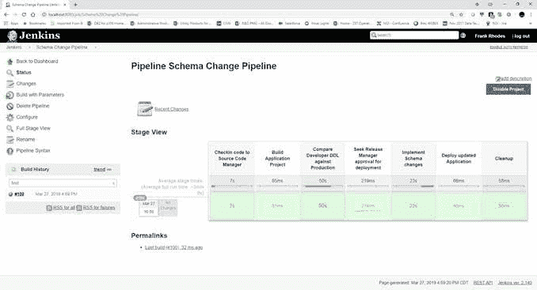

# BMC 将 DevOps 扩展到 Db2 数据库

> 原文：<https://devops.com/bmc-extends-devops-reach-to-db2-databases/>

BMC Software 正在扩展其[活动的范围，将大型机开发操作系统](https://devops.com/devops-deeper-dive-bmc-software-bets-on-aiops-transformation/)扩展到运行在这个古老平台上的 IBM Db2 数据库。

BMC 负责 ZSolutions 战略和创新的高级副总裁 John McKenny 表示, [BMC AMI DevOps for Db2](http://newsroom.bmc.com/phoenix.zhtml?c=253321&p=irol-newsArticle&ID=2405029) 使 DevOps 团队能够自动更改 Db2 模式，作为 Jenkins 持续集成/持续开发(CI/CD)平台上采用的管道的一部分。

作为将 DevOps 流程引入大型机的努力的一部分，McKenny 表示，BMC 正试图弥合 DevOps 团队和数据库管理员之间的历史鸿沟。许多 DevOps 团队试图绕过 DBA，他们通常认为 DBA 太慢，跟不上敏捷开发过程。然而，在大型机环境中，Db2 数据库仍然是应用程序的主要数据源。他说，BMC AMI DevOps for Db2 自动发现和确定数据库模式更改需求，简化审查和批准过程，并实施这些更改。

BMC AMI DevOps for Db2 是 BMC 自动化大型机智能(AMI)工具组合的一部分，这些工具利用策略引擎来实施数据库模式的最佳实践。McKenny 说，这些工具在使继续依赖大型机的组织能够在定义这些最佳实践的许多 IT 专业人员退休的时候获得这些最佳实践方面发挥了关键作用，并补充说 BMC 将根据需求评估是否将增加对 IMS 等其他大型机数据库的支持。

尚不清楚依赖大型机的组织在多大程度上甚至是否接受了最佳 DevOps 流程。BMC 等大型机环境工具提供商认为，数字化业务转型计划将要求这些组织用更灵活的 DevOps 流程替换其当前的应用程序开发和部署工具和流程。然而，挑战在于克服现有的瀑布式应用程序开发和部署方法会产生更可靠的软件的观念。因此，许多依赖大型机的组织正试图根据应用程序工作负载的性质和重要性来确定采用哪种方法。

与此同时，BMC 正在投资各种形式的人工智能(AI)来自动化 IT 运营，也称为 AIOps。当然，BMC 并不是唯一一家具有类似雄心的 IT 管理框架提供商，但它认为，在提供管理大型机和分布式计算环境的工具数十年后，它比其竞争对手更有能力聚合驱动任何 AIOps 平台核心模型所需的所有数据。

当然，it 组织对 AIOps 的适应程度还有待观察。除了对他们工作的威胁，许多 IT 专业人员怀疑人工智能模型是否足够复杂，足以可靠地自动化复杂的 IT 流程。有一点很清楚，随着 DevOps 和 AIOps 的同时崛起，IBM 平台的管理方式将会彻底改变。

— [迈克·维扎德](https://devops.com/author/mike-vizard/)