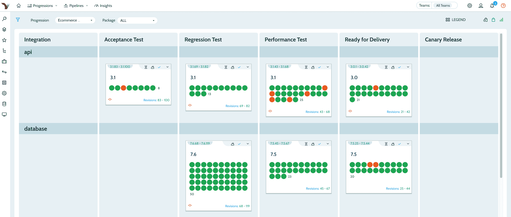

# CollabNet VersionOne 推进端到端开发运维战略

> 原文：<https://devops.com/collabnet-versionone-advances-end-to-end-devops-strategy/>

在其 [Agile 2019](https://www.agilealliance.org/agile2019/) 大会上，CollabNet VersionOne 宣布计划在本月晚些时候[扩展其软件交付和管理平台](https://www.prnewswire.com/news-releases/collabnet-versionone-demonstrates-major-new-agile-and-devops-capabilities-at-agile-2019-300896124.html)的功能，作为向组织提供更多关于不断变化的软件开发项目进度如何影响业务的可见性的努力的一部分。

公司首席执行官 Flint Brenton 表示，对 VersionOne 价值流企业管理平台的更新将包括一个改进的用户界面，该界面提供了对连续体持续集成(CI)平台内发生的事件的更多可见性。

Brenton 还表示，这些更新将进一步推动敏捷框架的采用，如 Scaled Agile Framework (SAFe)，这是一种结合最佳敏捷开发和 DevOps 实践的规范方法。

虽然组织可能会选择将 VersionOne 与其他 CI/CD 平台结合使用，但 Brenton 表示，CollabNet VersionOne 可以更全面地了解软件开发时间表的变化对业务的影响。

作为这项工作的一部分，CollabNet VersionOne 还宣布了 VS Exchange，这是一个定制和预配置 Continuum 和 VersionOne 扩展和工作流的市场，并增强了该公司 Continuum 实施中的 Continuum TestDrive 组件，从而简化了供应。

Brenton 说，随着越来越多的组织开始意识到他们对软件的依赖程度，商业领袖们正在寻求对软件开发项目进行更多的控制。他指出，生成更多的代码已经不够了；相反，DevOps 团队现在被要求更快地生成对业务产生最大影响的更可靠的代码。CollabNet VersionOne 通过以 VersionOne 的形式提供一个位于 Continuum 之上的管理平台，使组织能够实现这一目标。

CollabNet VersionOne 现在正在参与一场竞赛，将更多的业务分析注入软件开发生命周期(SDLC)平台。虽然通常采用 SDLC 平台来收集技术指标，但组织现在希望将这些数据与业务指标相关联。

现在还不太清楚的是，访问业务指标是否会影响对一个 CI/CD 平台的选择。随着时间的推移，人们期望各种形式的商业智能功能将成为平台的标准功能，尤其是在数字业务流程时代，IT 领导者将继续承担更大的业务责任。

业务和 It 角色开始融合可能还需要一段时间。与此同时，CollabNet VersionOne 显然认为这两个阵营之间将会有更多的合作。在许多方面，组织为变得更加敏捷而采用的 DevOps 最佳实践即将扩展到由软件支持的业务流程。精明的企业领导人将意识到，他们实现任何给定季度财务目标的能力都与新的数字客户体验的实现方式息息相关。事实上，也许有一天，IT 组织能够比大多数企业更快地交付软件更新。

— [迈克·维扎德](https://devops.com/author/mike-vizard/)