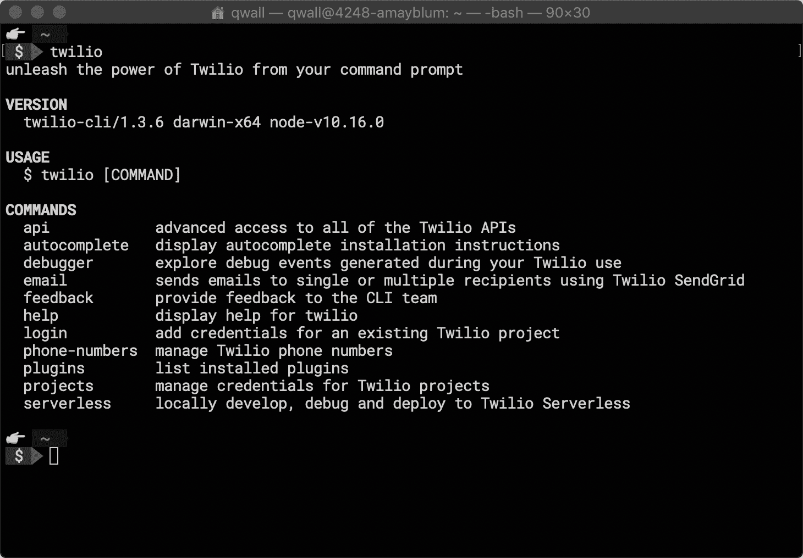

# Twilio 添加 DevOps 工具来调用通信服务

> 原文：<https://devops.com/twilio-adds-devops-tool-to-invoke-communications-services/>

在其年度 [SIGNAL](https://signal.twilio.com/) 大会上，Twilio 今天推出了一项计划，旨在简化在 DevOps 流程环境下将各种通信服务嵌入应用的过程。

Twilio 的开发者营销高级总监昆顿·沃尔(Quinton Wall)表示，开源的 Twilio 命令行界面工具(CLI)现已推出测试版，将有可能将 Twilio 云服务整合到更大的 DevOps 工具链中。

Twilio 为开发人员提供了一系列短信、音频和视频服务，这些服务都可以通过应用编程接口(API)调用集成到应用中。使用这些 API 创建的管道现在可以通过 GitHub 存储和共享。

Wall 说，CLI 工具还可以通过插件扩展这些服务。此外，DevOps 团队可以调用 Twilio 现有的无服务器计算能力，使用函数调用该公司的服务，Wall 补充道。

目前还不清楚 Twilio 等云服务将在多大程度上使用无服务器计算框架。开发人员曾经被要求嵌入到他们的应用程序中的许多功能被设置成外部服务，应用程序在需要时通过启动一个功能来调用这些服务。虽然这种方法使应用程序更加高效，但它给 it 团队带来了额外的压力，他们需要在已经复杂的 DevOps 管道环境中管理对各种无服务器计算框架的所有调用。

虽然无服务器计算框架仍然是一个新兴的 IT 平台，但无服务器计算框架被采用的速度表明，它们被普遍包含在 DevOps 工具链中的那一天已经不远了。

与此同时，Twilio 显然希望通过使其通信服务在 DevOps 工具链的上下文中更容易调用来增加消费。Twilio 长期以来一直公开 REST APIs，但 CLI 工具将使组织更容易跨一系列应用程序标准化 Twilio 通信服务。通过 API 和 CLI 工具公开这些服务，Twilio 相信最终用户打开单独的应用程序进行通信的日子已经屈指可数了。相反，大多数用户会在已经打开的商业智能应用程序的上下文中调用通信服务。该方法还消除了投资专用网络硬件来运行统一通信应用程序的需要，从 API 的角度来看，统一通信应用程序通常更难以编程方式调用。

随着 DevOps 流程变得越来越普遍，看看有多少其他云服务提供商开始定期提供 CLI 工具将会很有意思。可以说，任何不提供 CLI 工具的云服务提供商都会发现自己置身于开发运维流程之外。在采用最佳开发运维实践的组织中，提供 CLI 工具的服务提供商将是首选。事实上，DevOps 团队很快可能面临的挑战不是是否有可用的 CLI 工具，而是确定在他们采用的 DevOps 流程中，哪一个最适合。

— [迈克·维扎德](https://devops.com/author/mike-vizard/)