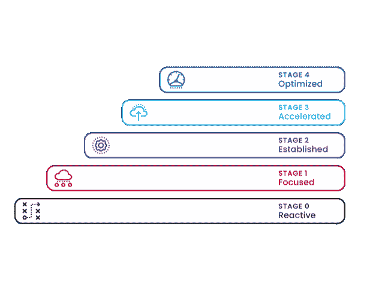

# 无情的自动化:成功的路线图

> 原文：<https://devops.com/relentless-automation-the-roadmap-to-success/>

随着数字化转型继续塑造组织范围内的计划，首席信息官们正在认识到自动化在减少错误和流程可变性方面的优势和价值，从而降低运营风险，加快执行和创新。事实上，根据 Gartner[最近的报告](https://www.gartner.com/smarterwithgartner/gartner-predicts-the-future-of-ai-technologies/)，到 2023 年，40%的 I & O 团队将在大型企业中使用人工智能增强的自动化，从而提高 IT 生产力。

尽管未来会有所上升，但由于复杂的基础架构、分散的任务自动化和工具蔓延，许多组织目前都缺乏自动化。随着类似云的功能成为常态，对自动化的重新关注将使 I&O 团队处于主导地位。为了获得最高的投资回报率，首席信息官们应该首先审核他们的组织，以确定自动化的需求水平以及需要自动化的具体领域。

任何组织要想大规模实施自动化，都必须有一个明确的任务。首席信息官需要向组织提出正确的问题，以确定自动化的基准。这些核心问题包括:由于缺乏自动化，组织在哪里遇到了业务问题？是什么阻碍了组织进一步自动化？组织是否拥有自动化所需的标准、人员和流程的正确基础？

根据我们的经验，在走向成熟自动化的过程中，公司通常会陷入以下五个阶段之一:

## **零级:无功**

处于被动阶段的组织不了解对 IT 服务的需求以及衡量 IT 服务结果的重要性。他们的客户没有既定的请求服务的方式，也不了解他们请求的状态。请求从各种来源获得，完成不一致，并且流程文档通常是零碎的。困难的请求通常指向在过去帮助过类似请求的个人，工具是由没有策略或指导的团队获得的。

## **第一阶段:聚焦**

专注的组织知道现有 IT 自动化的局限性，并积极创建计划来小规模地改进服务交付。在这个阶段，客户有一个请求服务的正式方法，但是没有完全遵循或执行。这些组织拥有有限的流程和工具，并且仍然是高度反应式的，严重依赖于特定个人的知识。自动化已定义并可重复，可能会产生一致的结果，所有公共服务都有文档记录，并且已经意识到工具和编码不一致。

## **第二阶段:成立**

处于建立阶段的组织更加积极主动，为 IT 服务提供了一种正式的方法来处理具有自动分类功能的服务请求。衡量工作流的完整性，并充分理解任务到完成的服务，以及自动化尚未完成的差距分析。在此阶段，至少有一项主要 IT 服务已经实现自动化。存在一个具有优先级的自动化积压。工具是标准化的，代码管理的过程在所有团队中都是统一的。尽管对自动化有一个一致认可的愿景，但集成到更广泛的服务(如 DevOps)中仍不完整或不一致。

## **第三阶段:加速**

加速的组织基于来自业务的输入积极地交付新的服务。服务级别和质量指标被捕获和改进，并且它有一个可供所有业务部门使用的服务目录。超过一半的主要 IT 服务已经自动化，开发人员已经将标准工具集成到管道中，并有了明确的结果。在这个阶段，组织关注的是流程执行和卓越，但是 KPI 是以流程为中心的，而不是整个业务。

## **第四阶段:优化**

优化的组织有一个成熟的、持续的服务改进计划，并有一个既定的改进节奏。整个 IT 服务套件已实现自动化，并与业务计划保持一致，直接影响业务成效。服务产品有各种选项来确保利用自动化，有团队来交付应用程序和软件，IT 服务有全面的文档记录并采用无缝集成的标准化流程。

## **实现持续自动化**

应该组建一个集中的、跨职能的团队来有效地评估和定义组织的自动化路线图。跨职能团队将为 IT 服务产品带来相关视角，旨在实现自动化。一旦建立了自动化的基准，首席信息官们就应该监控其自动化工作的进展，包括组织在基础设施、运营、应用开发、服务交付和企业服务管理等领域的发展潜力和遇到的障碍。

随着首席信息官们开始大规模实施自动化，他们将会看到运营成本和交付关键战略产品和服务的时间减少。因此，组织可以认识到收入的增加，提高组织的底线，并推动他们更接近全面的[数字化转型](https://devops.com/digital-transformations-fall-short-survey-claims/)。

— [德里克·怀斯](https://devops.com/author/derek-wise/)