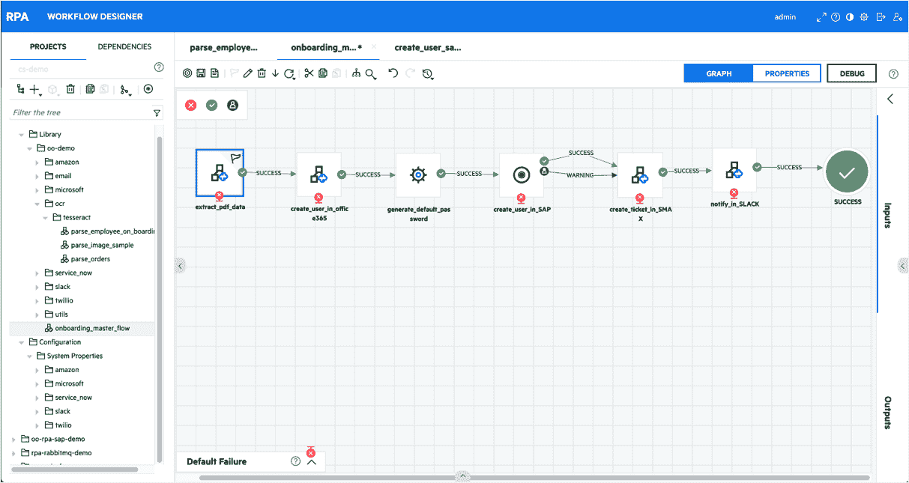

# 微焦点为 RPA 奠定 DevOps 基础

> 原文：<https://devops.com/micro-focus-lays-devops-foundation-for-rpa/>

微焦点已经宣布微焦点机器人流程自动化 (RPA)的[全面上市，这为采用 DevOps 流程构建高度自动化的业务流程奠定了基础。](https://www.prnewswire.com/news-releases/micro-focus-introduces-new-robotic-process-automation-product-ignites-enterprise-productivity-300884562.html)

由于人工智能(AI)和数字业务转型计划的兴起，人们对 RPA 的兴趣显著增加。然而，RPA 现在不是仅仅使用 RPA 来构建机器人以自动化一组狭窄的静态流程，而是利用机器和深度学习算法来优化更广泛的动态业务流程，并更轻松地适应应用程序中的变化。

微焦点 IT 运营管理高级总监 Travis Greene 表示，微焦点 RPA 中包含的对象识别技术等新功能使平台能够检测并自动适应用户界面的变化。

其他新功能现在包括使用记录屏幕动作的工具以可视化或编程方式创建工作流的能力，更轻松地结合跨多个平台的图形和编程工作流的能力，以及根据需要部署数十万个机器人的能力。一个集中的仪表板管理这些机器人，所有机器人都有唯一的 id 和加密的、基于角色的凭证。

随着 RPA 和其他形式的人工智能继续与应用程序集成和嵌入，Greene 表示，DevOps 实践扩展到 RPA 平台只是时间问题。随着越来越多的数据可用，组织将寻求不断训练机器人，这反过来将推动依赖于这些机器人的应用程序的更新。在大多数情况下，根据任务的复杂程度，机器人将混合使用应用程序编程接口(API)、命令行接口(CLI)和图形工具来构建。Greene 补充说，组织将需要定义过程，以确定每个组织将如何以及何时选择调用一个接口而不是另一个接口，无论是单独调用还是组合调用。

从历史上看，组织能够将 RPA 应用于静态流程，并取得了成功。随着人工智能的崛起，这些努力的范围变得更加雄心勃勃。商业领袖太倾向于相信几乎每个业务流程都可以通过人工智能和 RPA 的结合来实现自动化。然而，AI 和 RPA 仍然局限于相对狭窄的用例，涉及高度可预测的结果。

然而，这种情况正在改变，RPA 和 AI 在整个企业中变得越来越普遍。DevOps 团队将需要找到方法来更新他们的应用程序和 RPA/AI 模型，而不破坏其中一个。大多数当前的 RPA/AI 模型对它们所监控的应用程序环境的任何更改都非常敏感。不幸的是，主要负责构建这些 RPA/AI 模型的数据科学家还不太了解最佳 DevOps 流程。然而，这两个世界很快就会有碰撞的一天。

— [迈克·维扎德](https://devops.com/author/mike-vizard/)