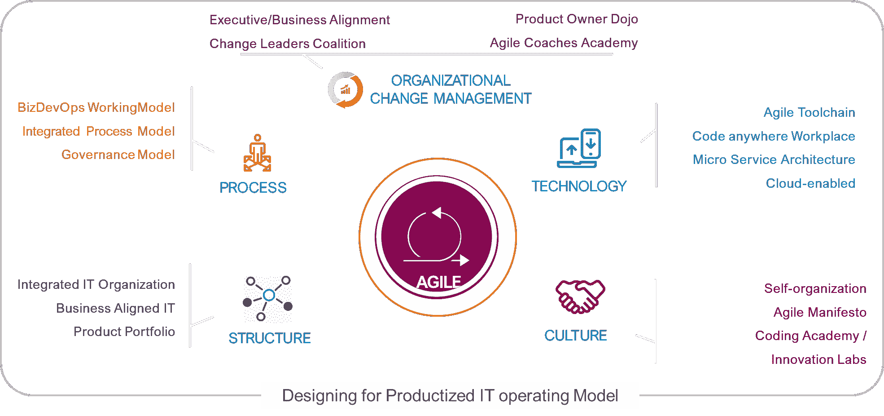

# 产品 IT 运营模式:数字世界的下一代模式

> 原文：<https://devops.com/product-it-operating-model-the-next-gen-model-for-a-digital-world/>

数字化为企业创造价值提供了许多新的机会。与此同时，这迫使它重新思考自己的运作方式。现代首席信息官需要一种能够理解 IT 和业务之间模糊界限的运营模式，这种模式旨在提高敏捷性和速度。以产品为中心的 IT 运营模式正迅速成为答案。

这个模型需要什么？在产品 IT 运营模式中，产品线是根据其对组织的战略价值自上而下地提供资金的，并由专门的管理和交付资源提供支持。整个产品团队根据一组共同的目标进行评估，包括客户体验、上市时间、效率改进、软件质量以及生产环境的可用性和可靠性。

## **产品 IT 运营模式的 5 个维度**

采用产品 IT 运营模型要求组织对基于产品的开发采取集成的方法，并踏上持续改进的旅程。在扩展将业务成果与工程工作相结合的敏捷开发运维时，企业必须关注以下五个关键维度:

**1。组织变革管理(OCM):** 成功地从传统的 IT 运营模式过渡到基于产品的开发方法需要组织范围的变革管理。经验丰富的 IT 服务提供商可以成为确保平稳过渡的重要盟友。

**2。文化:**文化是任何组织的固有特征，实施小而有效的文化变革并结合 OCM 是正确的过渡方法，而不是“大爆炸”式的变革。一些跨行业的知名企业也是这么做的。

**a .团队和协作:**跨多个组织团队的大型团队的联合提供了一个关于变革步伐的共同计划，并有助于不断地嵌入创新和实验以改进服务。

**3。结构:**跨设计、架构、开发和运营的以产品为中心的高素质团队是增强业务能力的关键。通过在相同的目标集合上度量整个团队，很容易增强客户体验、效率和软件质量，同时创建稳定的生产环境。

结构还意味着将传统的应用程序组合与特定的业务成果相结合，并将组织交付其业务成果所需的所有能力和资源集合在一起。

**4。技术:**如果说商业模式、组织架构、人员和工作方式是运转企业 IT 引擎的齿轮，那么技术就是让这个引擎平稳运转的油脂，没有摩擦。技术的两个关键方面包括:

**a .应用编程接口(API)** :基于 API 的架构提供了一个可扩展的构建块框架，反过来可以用来构建功能强大的应用或软件产品。易于维护是基于 API 的架构的一个标志，因为它可以快速地进一步移植到任何其他目标架构。

**b .云、微服务和容器**:现代组织需要按需可伸缩性。云和微服务可以做到这一点，而不会干扰持续的业务运营。但是，在选择云或基于容器的基础架构之前，必须首先了解组织的产品愿景和路线图、业务优先级、竞争、其业务领域的市场转型速度以及行业趋势。

**5。过程和自动化:**

**a .敏捷交付模型**:这是构建最小可行产品(MVP)的关键先决条件，确保关键增强的快速交付或以适当的增量交付一套产品特性。应该使用行业标准的敏捷实践，比如 LeSS 和 SAFe，因为它们允许完全的灵活性来动态地调整模型。

b. DevOps 和 DevSecOps:devo PS 文化是采用产品 IT 运营模式的基础。持续集成和交付(CI/CD)要求 DevOps 与软件开发生命周期(SDLC)完全交织在一起，并带有正确的工具和治理机制。这确保了在较短的部署交付周期内交付高质量的产品，同时能够以较短的平均恢复时间(MTTR)解决生产问题，并确保最大限度地降低或避免变更失败率。DevOps 还支持新时代的实践，如自动化测试、对基础架构的自助访问和自动化性能管理。

[DevSecOps](https://devops.com/6-traits-that-define-devsecops/) 与 DevOps 携手并进。它确保安全方面被构建到整个交付管道的产品中，因此产品在很大程度上不仅是容错的，而且是防呆的。经验丰富的 DevOps 团队构建并集成安全工具、解决方案和流程来保护组织。

**c .测试自动化和测试驱动开发(TDD):** 通过将测试自动化集成到开发过程中，产品 IT 运营模型允许组织创建高质量和可快速部署的产品。此外，TDD 通过开发与测试用例一致的质量代码来更精确地描述用户需求，从而使治理能够被集成到交付管道中。测试是完全自动化的，以确保代码的质量。

**d .服务健康状况:**KPI 关注项目的财务健康状况，因此可以根据业务能力和产品水平轻松设定预算，从而有效地实现业务目标。KPI 框架包含关键 KPI，如业务、财务、学习和创新以及员工敬业度成果，同时保持足够的灵活性以适应不同的合同模式。

## **在不断变化的商业环境中创造价值**

数字化要求 IT 在三个重要方面有所作为:缩短上市时间、优化成本和提高质量。采用产品 IT 运营模式有助于 IT 部门在不牺牲质量的情况下，以快速、经济的方式部署软件。然而，考虑到转变所涉及的变化范围，这不是一夜之间就能实现的。它必须以文化变革和持续学习之旅为基础，使用设计思维驱动、基于角色的变革之旅、调整研讨会和有针对性的活动和沟通等工具。与专家系统集成商合作可以帮助组织快速启动流程，并确保在业务中断最小的情况下顺利过渡。

— [加甘·贾恩](https://devops.com/author/gagan-jain/)