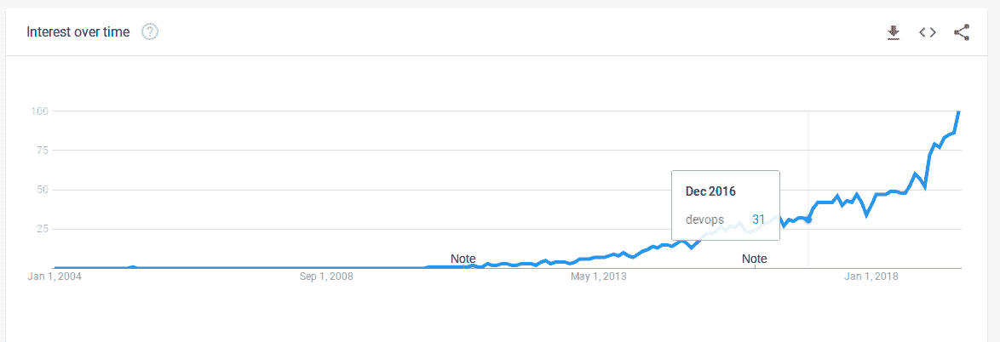

# DevOps 比以往更受欢迎的 3 个原因

> 原文：<https://devops.com/3-reasons-why-devops-is-more-popular-than-ever/>

DevOps 到底有多受欢迎？比以往任何时候都受欢迎，如果谷歌趋势可信的话。下面来看看 DevOps 的流行程度是如何随着时间的推移而增加的，以及是什么推动了这种变化。

## DevOps 的人气飙升

以下是 Google Trends 告诉我们的过去 15 年来人们对“DevOps”这个词的兴趣:

这是过去五年同一时期的数据:

如您所见，关于 DevOps 的讨论大约始于 2010 年，此后稳步增长。但直到 2019 年初，人们对 DevOps 的兴趣才急剧增加。

诚然，谷歌趋势是一个原始的闭源数据源。Google 衡量的对 DevOps 的兴趣当然不是 DevOps 的经济重要性或 DevOps 在编程社区中的影响力(与 Google 的整体用户群相比)的直接代表。

## 为什么 DevOps 比以往更受欢迎？

尽管如此，我还是很惊讶地看到，从今年年初开始，人们对 DevOps 的兴趣突然激增。我想不出任何单一事件可以解释这种趋势。但我能想到几个更长期的因素，当这些因素加在一起时，可能导致了一个比以往任何时候都更多的人在谈论 DevOps 的世界。

一个事实是 DevOps 似乎终于进入了主流计算机科学和 IT 教育领域。在这里，我说一点轶事。我不知道有多少大学的课程中包含了 DevOps。但我可以证明，在我任教的美国技术大学的一些计算机科学和信息技术课程中，至少提到了这一点。据我所知，就在几年前，情况并非如此。

这意味着该大学现在毕业的学生在进入职场时已经熟悉了 DevOps。他们正在把德沃普斯的福音传播给那些还没有听过它的组织，并且在已经存在的地方加强它。

我认为，另一个起作用的因素是 DevOps 工具的市场已经成熟和巩固。甚至就在五年前，大多数认真讨论 DevOps 的公司还是初创公司。现在，许多初创公司已经成为非常成功的独立公司(如 Slack)，或者被更大的组织收购(如 Wercker 或 Electric Cloud)。

诚然，许多其他 DevOps 创业公司已经失败或停滞。但事实上，其他人已经取得了惊人的成功，这极大地推动了人们对 DevOps 的持续兴趣。

最后但同样重要的是，DevOps 的工具已经随着市场的发展而成熟。大约在 2010 年，当关于 DevOps 的讨论开始时，谈论消除 it 组织的孤岛比在实践中打破孤岛要容易得多。当时，DevOps 友好的协作工具尚未成为主流。发布自动化套件也大多局限于 PaaS 风格的产品，其功能主要是自动化部署。他们缺乏现代 DevOps 发布工具的端到端集成、测试、构建和管理功能。许多更先进的 DevOps 发布平台都是由初创公司构建的，这使得采用它们有些冒险(因为你可能最终拥有一个突然倒闭的供应商的平台)。

相比之下，如今有大量成熟、功能丰富的 CI/CD 工具可供选择，更不用说 Slack 和 GitHub 等沟通和协作解决方案了。构建 DevOps 工具集非常容易，您不再需要依赖新的、未经市场测试的解决方案。这一事实也使得 DevOps 比以往任何时候都更受欢迎。

DevOps 的人气从这里会有怎样的变化？我的猜测是，随着市场和 DevOps 工具更加成熟，随着 DevOps 继续进入主流教育项目，它将继续上升。

— [克里斯·托齐](https://devops.com/author/chris-tozzi/)