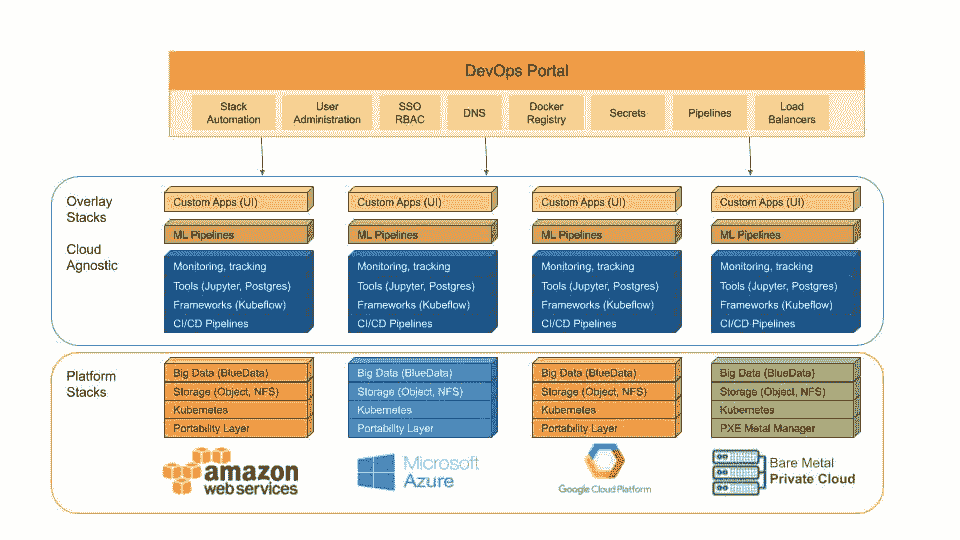

# 敏捷堆栈扩展了 DevOps 自动化平台的范围

> 原文：<https://devops.com/agile-stacks-extends-reach-of-devops-automation-platform/>

Agile Stacks 本周宣布,[将与其同名的 DevOps 自动化平台](https://www.agilestacks.com/news/multi-cloud-support-added-google-cloud-platform-red-hat-openshift-microsoft-azure?hs_preview=TaJqZfwd-10578558308)扩展到 Kubernetes 和其他云服务。

公司首席执行官 John Mathon 表示，通过扩展公司平台的覆盖范围，包括谷歌云平台(GCP)、微软 Azure 和 Red Hat 的 open shift Kubernetes 发行版以及对亚马逊 Web 服务(AWS)的现有支持，敏捷堆栈将使组织更容易在混合云计算环境中实施最佳 DevOps 实践。

敏捷堆栈在 [HPE 发现 2019](https://www.hpe.com/events/discover/) 大会上宣布了这一消息。惠普企业(HPE)是该公司的投资者之一，在本周的会议上， [HPE 本周概述了 Kubernetes 如何成为该公司不断发展的混合云计算战略](https://devops.com/hpe-extends-hybrid-cloud-computing-strategy/)的核心。

Mathon 表示，Agile Stacks 平台为跨多种工具和持续集成/持续部署(CI/CD)平台自动创建 DevOps 管道提供了一个框架。在 Agile Stacks 服务目录中总共有 80 多个 DevOps 工具和平台，包括 Kubeflow、Jenkins、GitLab、Spinnaker、Harbor、Minio、Ceph 和 Portworx。

Agile Stacks 平台的核心是一个 SuperHub automation hub，它使用一组可由 DevOps 团队配置的定制可组合堆栈来加速软件交付。堆栈的每个组件都自动配置为部署、升级、回滚、升级、克隆、备份、生成测试脚本、执行合并、执行性能测试、扫描漏洞和执行功能测试。

实际上，Mathon 说敏捷栈本质上是自动化 DevOps 自动化。已经采用最佳 DevOps 实践的组织倾向于依赖来自不同供应商的多种工具，这不可避免地导致自动化孤岛，这些孤岛通常工作目的不一致。Mathon 补充说，敏捷堆栈提供了一个可扩展的 GitOps 框架，用于集成所有这些工具，使组织能够随着开发运维流程的成熟而更容易地发展。

此外，他表示，敏捷栈希望通过降低组织在尝试采用开发运维实践时最初遇到的复杂性，在使开发运维更普遍可及方面发挥作用。

随着混合云计算开始变得越来越普遍，部分原因是 Kubernetes 的崛起，Mathon 说 DevOps 的复杂性只会增加。组织已经明确表示，他们希望在现有的内部 it 环境中利用多个云。然而，目前，与这些平台相关的 DevOps 流程充其量是零散的。除了更容易跨多个平台统一 DevOps 流程，Mathon 指出，敏捷堆栈还可以通过 Superhub 应用自动化云标记，让组织更好地跟踪云支出。

当然，大多数组织都面临着在单一平台上自动化软件开发和交付的挑战。然而，不管任何组织在开发运维的道路上走了多远，业务都在向前发展。在许多情况下，混合云计算的兴起将最终迫使许多组织在企业范围内实施一套最佳的 DevOps 流程。作为该过程的一部分，组织将尽可能在一组特定的 DevOps 工具上实现标准化，或者至少直到开发人员发现最新的 DevOps 工具来取代所有其他工具。

— [迈克·维扎德](https://devops.com/author/mike-vizard/)