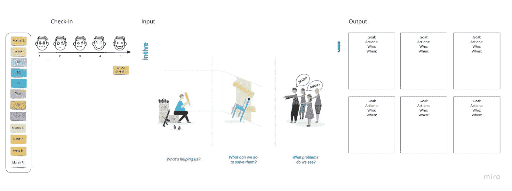
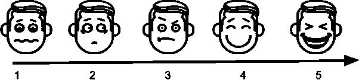
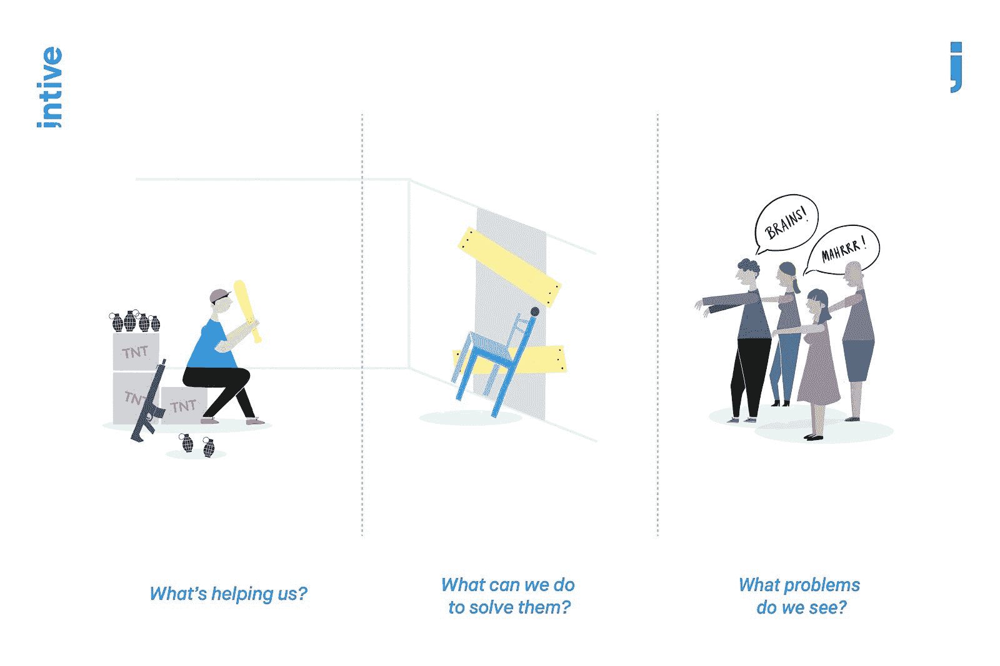

# 如何使用僵尸回顾三步解决任何问题

> 原文：<https://devops.com/how-to-solve-any-problem-in-3-steps-using-the-zombie-retrospective/>

面对挑战是生活中不可避免的一部分，但我们如何应对它们会有很大的不同。当问题出现时，重要的是专注于让我们团结起来的事情——有一个共同的敌人比内部斗争更好。复杂软件开发的经验告诉我，定期停下来思考和行动是至关重要的。

反馈循环是[敏捷](https://devops.com/are-your-development-processes-truly-agile/)思维模式的基础概念。我们将项目分成两到四周的小项目，而不是一年一个的项目。俗话说:吃大象只有一种方法——一次一口。

为了快速检查和适应，我建议时间范围只有两周。在这两周的冲刺阶段，团队必须努力实现目标。在每个两周的周期结束时，团队开会检查进展，并在下一个冲刺阶段制定改进计划。

回顾的目的是:

*   检查上一次 sprint 在人员、关系、流程和工具方面进展如何。
*   确定并排序进展顺利的主要项目和潜在的改进。
*   创建一个计划来改进团队的工作方式。

(来源: [Scrum 指南](http://post.spmailtechn.com/f/a/a3LALQ2l9gWJ5OX048x-9Q~~/AAIlaAA~/RgRe5OunP0QaaHR0cDovL3d3dy5zY3J1bWd1aWRlcy5vcmdXA3NwY0IKAAAnuANdYyj_41ITY2hhcmxlbmVAZGV2b3BzLmNvbVgEAAAAAA~~))。

这些回顾可以是一般性的，也可以集中在冲刺阶段发生的一个问题上。有时回顾是关于降低或解决冲突和紧张。如果冲刺没有按计划进行，主持人需要对他们如何进行回顾保持谨慎。他们需要记住他们如何说某些事情，因为团队成员可能已经情绪低落地参加了会议。

我远离使用苛刻的判断，指责特定的成员或显示我的沮丧。目标是为回顾会创造正能量。主持人应该在团队参与回顾会时激发他们的兴趣。我喜欢精力充沛，积极向上，并努力让其他人都站在同一条船上。

作为一个 scrum 大师，我很震惊地发现只有 81%的 scrum 大师会召开回顾会议。回顾是任何给定 sprint 的基本部分，并且提供了关于如何改进的有价值的信息。

## **准备**

在回顾会议之前，我考虑格式和工具。如果你像我一样在一个分布式团队中工作，那么推荐使用数字白板。使用数字白板，无论我们身在何处，我们都可以进行回顾。

这是我参加僵尸回顾会的流程。分为三步:签到，输入，输出。

Figure 1: Zombie Retrospective board.

## **第一步:签到(15 分钟)**

签到阶段有点像破冰。它应该很快，就像主菜之前的开胃菜一样——在这种情况下，这将是更深入和更有建设性的讨论。回顾开始时，签到被视为一种练习，以收集关于刚刚完成的 sprint 的信息。更深入讨论的一个很好的开端是幸福指数:一种快速检查团队并了解每个人如何经历最后冲刺的方法。

我问了这样一个问题:“用 1 到 5 的尺度，具体说明你对最后一次冲刺有多满意？5 号超级幸福，1 号完全不幸福。将带有一个关键字的便签贴在白板上的数字旁边。”

Figure 2: Icon made by Freepik from www.flaticon.com

**刻度为:**

5 =超级幸福！不想改变什么！

4 =相当开心，但是有些事情需要修正。

3 =我可以接受这一点，但有许多事情需要解决。

2 =现在感觉不太好。

1 =完全不开心，我想退出。

我给团队三到五分钟的时间收集意见，然后我们讨论问题。这是将问题转化为机遇的绝佳时机。您可以使用以解决方案为中心的问题，例如:

*   需要做些什么来提高你的幸福指数？"
*   让我们想象一下，我们有一个理想的世界，它会是什么样子？
*   你想怎么做？

**举例:**

团队成员认为他们还算满意，因为他们花了大量的时间为发布做准备。这项工作既无聊又重复。然后，我把问题颠倒过来，问我们希望如何解决。然后团队从他们想要的东西开始。

目标:作为一个团队，我们希望有自动回归测试，这样我们可以有更快的发布，并把我们的时间用于增值工作。

接下来，我们定义将帮助我们实现目标的行动项目——我们计划投入时间并实现自动化测试。产品负责人将负责管理产品积压，我们将在六个月内实现目标。

scrum 大师需要记住哪些团队成员更乐于分享他们的观点，哪些成员更保守。害羞的员工可能有很多很好的建议，但是如果他们不愿意分享，他们会只是坐下来听。scrum master 负责很好地了解团队，知道哪些团队成员可能需要额外的推动才能更加直言不讳，从更保守的同事那里收集意见。第一步是创造一个包容的工作场所，拥有信任、开放和透明的团队文化。你希望达到这样一个程度，即每个人都觉得他们真的是团队的一部分，并且知道他们的努力如何有助于团队的成功。重要的是要记住语气和肢体语言的重要性，以及由此产生的[积极影响](http://post.spmailtechn.com/f/a/1kVTdevtdaXQ7ydowgm95g~~/AAIlaAA~/RgRe5OunP0Q2aHR0cDovL3d3dy5icmFpbmZhY3RzLm9yZy9BcmNoaXZlcy8yMDA4L01pcnJvci1OZXVyb25zVwNzcGNCCgAAJ7gDXWMo_-NSE2NoYXJsZW5lQGRldm9wcy5jb21YBAAAAAA~)。

## **第二步:** **团队输入(45 分钟)**

在回顾过程中，有很多技术可以从团队中收集信息。当我准备回顾白板时，我会查看不同的技术，并选择我认为最适合当前环境的技术。当我们面对普遍存在的问题和挑战时，我特别喜欢僵尸回顾展。

Figure 3: “The Zombie Retrospective” by Agata Matynia. Image representing the zombie retrospective used to support the team input stage. This tool helps teams to visualize problems as part of the journey to aid creative solutions.

通过这张海报，我向团队解释了以下内容:当病毒将人类变成嗜血的突变体时，我们需要从僵尸攻击中拯救自己。我们需要想清楚，所以我们的讨论分成三组。

1.  插图中的僵尸代表了我们所面临的问题。
2.  被阻挡的椅子代表我们可以采取行动来阻止影响我们的问题。
3.  最后一个地方是我们的藏身之处。TNT 炸药、枪和手榴弹代表了团队实力。

一旦团队完成了他们的投入，我们就逐个案例地检查每一个想法并进行讨论。这一阶段最多需要 45 分钟。

讨论之后，我们进入回顾的最后阶段。这一步将所有输入转化为具体的、可衡量的目标，包括行动项目、负责人和明确的时间表。

## **第三步:团队产出(15 分钟)**

输出阶段概述了团队希望实现的目标，他们将采取的行动，谁将在何时采取行动。任务被分配给团队，scrum master 需要将人委派到有截止日期的特定区域，以确保事情完成。否则，每个人都会同意需要做一些事情，但什么都不会改变。

我使用以下格式来实现这一点:

*   目标:团队想要达到的最终结果。
*   **行动:**实现目标需要做的行动点。
*   **谁:**目标的拥有者。
*   **何时:**具体日期。

**举例:**

**目标**:作为一名开发团队成员，我想收集关于移动应用使用方式的分析，以便它可以专注于重要的事情。

**行动要点**:决定收集什么信息，由谁来做。

**谁**:安娜是这个话题的主人。

**当**:在下一次冲刺的时候。

冲刺阶段结束时的回顾不应该被忽略。它允许持续改进人员、关系、流程和工具。这让团队变得伟大。

## **可选步骤:检查并调整加号/Delta 格式的回顾(10 分钟)**

不时对回顾会进行评估是个好主意。目标是能够从当前的回顾中学习，以便下次做得更好。为此，我推荐使用一种快速、简单的技术，比如加号/Delta，来进行改进。

在这最后一步，团队确定回顾的优势，以及下一次可以做哪些改变。我要求团队使用便笺来分享他们的想法。

**Plus:** 团队可以改变或增加什么来为回顾会带来更多价值？我们如何重复它？

就我们作为一个团队如何开展回顾会而言，有什么我们应该改变的吗？

[Place for sticky notes][Place for sticky notes]

**动作点**

来源:[https://lean construction . org/media/learning _ laboratory/Plus _ Delta/Plus-Delta . pdf](http://post.spmailtechn.com/f/a/AbNDT3CNkpnE_8-NMuZ2ig~~/AAIlaAA~/RgRe5OunP0RQaHR0cHM6Ly9sZWFuY29uc3RydWN0aW9uLm9yZy9tZWRpYS9sZWFybmluZ19sYWJvcmF0b3J5L1BsdXNfRGVsdGEvUGx1cy1EZWx0YS5wZGZXA3NwY0IKAAAnuANdYyj_41ITY2hhcmxlbmVAZGV2b3BzLmNvbVgEAAAAAA~~)

这些问题的答案可以给 scrum masters 宝贵的反馈，告诉他们如何团结团队，如何更有效地解决问题，以及如何充分利用回顾中的时间。到目前为止，团队成员只讨论了之前的 sprint，所以给他们一些时间反思会议本身有时会帮助他们放松。

## **为你的下一次回顾展增添趣味的更多想法**

回顾会议是检查和适应的好机会。如果你像我一样，想每两周开一次会，那么一年中你将会有 26 次这样的会议。僵尸回顾很棒，但是你应该避免每次都使用相同的方法。尽你所能发挥创造力——有许多变化和可能性值得探索。

为了检查，我还喜欢使用[疼痛量表](http://post.spmailtechn.com/f/a/roAwOQee2O_O8biy7cdXzg~~/AAIlaAA~/RgRe5OunP0RDaHR0cHM6Ly93d3cudmVyeXdlbGxoZWFsdGguY29tL3BhaW4tc2NhbGVzLWFzc2Vzc21lbnQtdG9vbHMtNDAyMDMyOVcDc3BjQgoAACe4A11jKP_jUhNjaGFybGVuZUBkZXZvcHMuY29tWAQAAAAA)，这是一种在各种医疗环境和设置中使用的常见交流工具。相信我，这在商业上也非常有效。先试试[乐高疼痛评估工具](http://post.spmailtechn.com/f/a/m1YwHp6FZkTA7dfAR7HbQg~~/AAIlaAA~/RgRe5OunP0Q8aHR0cHM6Ly93d3cuZmxpY2tyLmNvbS9waG90b3MvYnJlbmRhbnBvd2VsbHNtaXRoLzQ4MjM2NDU2MTIvVwNzcGNCCgAAJ7gDXWMo_-NSE2NoYXJsZW5lQGRldm9wcy5jb21YBAAAAAA~)。

对于输入阶段，您可以使用:

*   [热气球](http://post.spmailtechn.com/f/a/7Ou1pMJ9vctfEGLtFugBgg~~/AAIlaAA~/RgRe5OunP0Q9aHR0cDovL3d3dy5mdW5yZXRyb3NwZWN0aXZlcy5jb20vaG90LWFpci1iYWxsb29uLWJhZC13ZWF0aGVyL1cDc3BjQgoAACe4A11jKP_jUhNjaGFybGVuZUBkZXZvcHMuY29tWAQAAAAA)
*   [飞车](http://post.spmailtechn.com/f/a/4PESP0TMbOOB0_8EMdzDwA~~/AAIlaAA~/RgRe5OunP0QraHR0cDovL3d3dy5mdW5yZXRyb3NwZWN0aXZlcy5jb20vc3BlZWQtY2FyL1cDc3BjQgoAACe4A11jKP_jUhNjaGFybGVuZUBkZXZvcHMuY29tWAQAAAAA)
*   [海星](http://post.spmailtechn.com/f/a/cJ0W8qmwSX_erKcMXxEXUQ~~/AAIlaAA~/RgRe5OunP0QqaHR0cDovL3d3dy5mdW5yZXRyb3NwZWN0aXZlcy5jb20vc3RhcmZpc2gvVwNzcGNCCgAAJ7gDXWMo_-NSE2NoYXJsZW5lQGRldm9wcy5jb21YBAAAAAA~)
*   [船舶回顾](http://post.spmailtechn.com/f/a/dKN9Xbf8sfhVCubwmGUnlQ~~/AAIlaAA~/RgRe5OunP0RRaHR0cHM6Ly9kYW5keXBlb3BsZS5jb20vYmxvZy90aGUtc3BlZWRib2F0LXJldHJvc3BlY3RpdmUtZnJlZS1kb3dubG9hZC1vZi1wb3N0ZXIvVwNzcGNCCgAAJ7gDXWMo_-NSE2NoYXJsZW5lQGRldm9wcy5jb21YBAAAAAA~)

记住:快乐正是让团队成员更感兴趣的东西！

米哈尔·谢尔凯扎