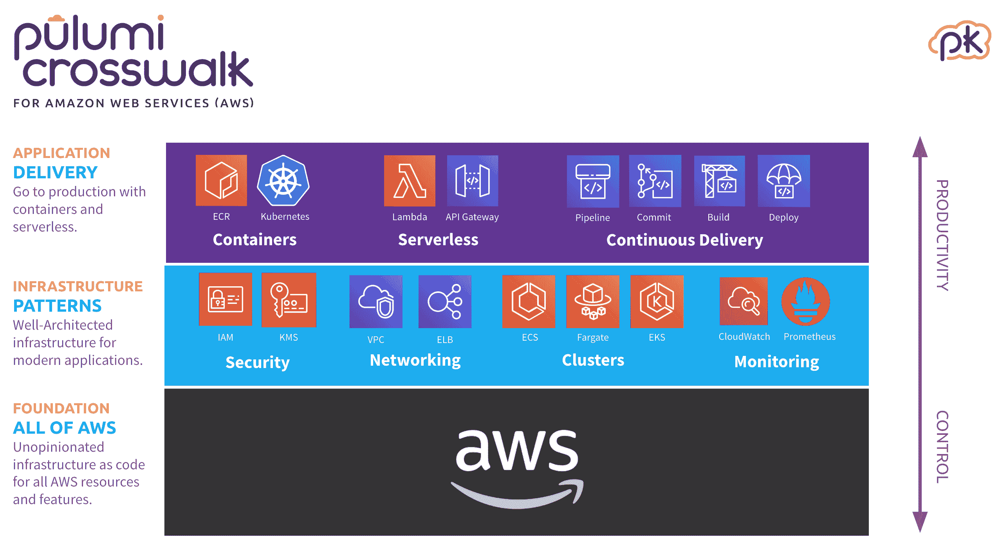

# Pulumi 在 AWS 上推进 DevOps

> 原文：<https://devops.com/pulumi-advances-devops-on-aws/>

Pulumi 宣布为 Amazon Web Services (AWS)提供 Pulumi Crosswalk，这是一个用于在 Amazon Web Services (AWS)上部署应用程序的开源框架。

公司首席执行官 Joe Duffy 表示，Pulumi Crosswalk for AWS 提供了一种软件即服务(SaaS)应用程序，通过该应用程序，DevOps 团队可以使用 Pulumi 的软件开发工具包(SDK)在 AWS 基础设施上自动部署应用程序。SDK 基于 JavaScript、Python、TypeScript 和 Go 等编程工具，大多数开发人员已经知道如何使用这些工具。他说，这种方法消除了 DevOps 团队学习如何使用 YAML 文件或获取 CloudFormation 或 Terraform 等工具以在 AWS 上部署应用程序的需要。

Duffy 指出，Pulumi Crosswalk for AWS 还将 AWS 推荐的最佳 DevOps 流程直接嵌入其 SaaS 工具中，包括容器和无服务器计算框架的模式。

用于 AWS 的 Pulumi 人行横道在 GitHub 上可用。它旨在与 Pulumi 提供的支持和培训的现有 Crosswalk 团队和企业版集成。

除了 AWS，Pulumi Crosswalk 还支持其他云平台，包括微软 Azure 和谷歌云平台(GCP)。该公司还计划为私有云提供支持，并利用 Kubernetes 集群在混合云计算环境中实现自动化部署。

Duffy 指出，尽管人们对 DevOps 充满热情，但许多 IT 运营团队却被抛在了后面。虽然在统一后端云服务方面投入了大量时间和精力，但云中的运营体验仍然围绕着低级应用程序编程接口(API)或专用工具，这对 IT 运营团队来说是一个挑战。这种情况通常会导致 IT 运营部门积压大量要部署的应用程序。他说，Crosswalk 使 IT 运营团队能够利用开发人员在 AWS 上部署他们批准的应用程序的技能。

随着云计算在 DevOps 时代的发展，开发人员和 IT 运营团队之间的关系变得更加微妙。IT 运营团队仍然需要设置防护栏，但是他们不能被视为降低应用程序在云中部署速度的瓶颈。IT 运营团队必须克服的挑战是找到一种方法，使开发人员能够在内部 IT 团队定义的一组策略指导原则内尽可能多地自助满足他们的应用程序部署需求。这种方法将使开发人员和 IT 运营团队能够各行其是。

It 运营和开发人员可能需要一段时间才能找到最适合其组织的开发运维平衡。企业中的各个团队倾向于根据团队中可用的专业知识来定义他们自己的最佳实践。理想情况下，这些最佳实践可以在企业的其他部分共享和实现。

与此同时，看看云服务提供商如何积极地采用 Pulumi 等工具将是一件有趣的事情。云服务提供商在尽快将尽可能多的工作负载部署到他们的云中方面有既得利益。他们往往对任何在 DevOps 团队认为合适的时候更容易迁移这些工作负载的事情不太感兴趣。

— [迈克·维扎德](https://devops.com/author/mike-vizard/)