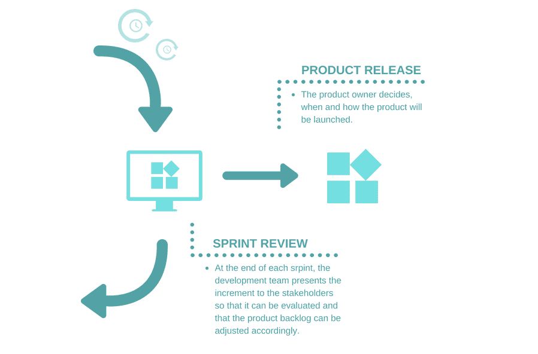
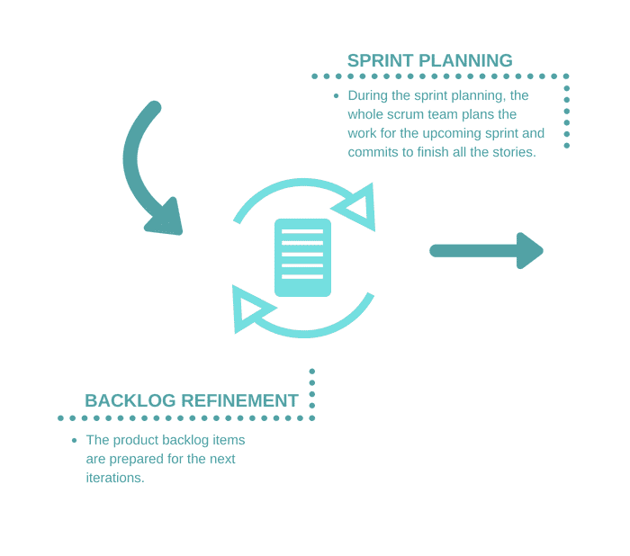

# 你的开发过程真的敏捷吗？

> 原文：<https://devops.com/are-your-development-processes-truly-agile/>

许多组织正在转向敏捷驱动的环境，但是敏捷开发不仅仅是一个名字。您如何确定您的组织是否真正敏捷？评估从敏捷宣言开始。如果你遵循了宣言中的原则，这是一个好的迹象，表明你已经踏上了敏捷之旅。

然而，对于那些不熟悉宣言的人，让我们快速回顾一下它的要点。[敏捷宣言](http://agilemanifesto.org/)的核心很简单——宣言的要点包括以下几点:

个人和互动优先于流程和工具。这意味着组织及其领导者更重视人而不是过程。人们响应业务需求，他们驱动组织内的开发过程。

工作软件优先于综合文档。这并不是说不提供任何文档，而是您应该简化文档。任何存在的文档应该只对当前和未来的开发有必要。

**客户协作超过合同谈判。**在整个开发过程中让客户参与进来，可以让您的员工更容易满足客户的需求。这样做意味着所有业务案例的特征对客户来说都是清晰和有用的。【T2

按照计划应对变化。这意味着在整个项目中，每个项目都欢迎改变，并允许优先级随着时间的推移而改变，而不是遵循僵化或照本宣科的开发计划。****

## 敏捷宣言 12 步

本质上，敏捷宣言的核心价值可以用 12 个步骤或原则来详细说明。这些原则支持宣言的关键点，并提供了在敏捷环境中如何遵循实践的额外细节。同样，对于那些目前遵循敏捷宣言的人来说，以下内容可能是多余的。对于那些对这个概念不熟悉的人来说，这些步骤提供了从整体上驱动敏捷过程的澄清和方向。

*   自组织团队鼓励伟大的架构、需求和设计。
*   定期思考如何变得更有效率。
*   工作软件的频繁交付。
*   简单。
*   支持和信任参与这一过程的人。
*   实现面对面的互动。
*   工作软件是进步的主要衡量标准。
*   敏捷过程支持一致的开发速度。
*   对技术细节和设计的关注增强了灵活性。
*   业务涉众和开发人员在整个项目中的协作。
*   通过早期和持续的软件交付实现客户满意度。
*   在整个开发过程中适应不断变化的需求。

基于这些原则，有三点——这里列出的最后三点——是我们经常发现的最有说服力的。我的一位同事 Tobias Spö cker 是 scrum master 和 QA 工程师，他说，对于像 TOPdesk 这样的组织来说，这些要点自然会浮到顶部。

原因是相当明显的。我们创造的产品销售给世界各地成千上万的客户。为了指出任何开发问题，我们查看 scrum 指南中描述的 scrum 过程，重点放在过程的最后部分。例如，下图有助于解释这一过程:

请注意，在上面说明的“产品发布”阶段，这里列出的团队关注于开发冲刺的完成工作。模型的这一部分应该能够向涉众(包括客户)逐步展示产品。理想情况下，这些增量是通过连续交付模型来发布的。这里有两个原则进一步说明了这一点:业务涉众和开发人员在整个项目中的协作，以及通过软件的早期和持续交付的客户满意度。

提供价值时还有一个额外的考虑:开发正确的东西；不要简单地开发正确的东西。

## 增加价值

在 TOPdesk，为客户提供适当的价值是我们的主要目标。为了实现我们的组织目标，我们考虑对客户的影响，因此当我们开始一个新产品开发项目时，我们总是与我们的一些客户合作，让他们参与到开发过程中，这使得过程和产品对每个人都更好。那些参与过我们开发过程的客户通常告诉我们，他们发现这种体验很有价值，并且在他们使用解决方案时，成为过程的一部分也有助于他们。这些客户也对我们的努力表示满意——作为开发过程中的合作伙伴——并对我们作为一个组织表示满意。

## 直接反馈是更好发展的关键

我们收到的即时和直接的反馈也有助于实现我们的另一个关键操作原则:在整个开发过程中适应不断变化的需求。通过在开发阶段与客户的合作，我们能够定期收到建设性的反馈——甚至是批评——从而导致产品地图和开发流程的变化和发展。这种反馈促进了最重要的过程和特性的细化，并将它们移动到优先级列表的顶部，从而导致一个关注最有价值的领域的项目，以便最明智地使用开发能力(对我们的组织来说)。

## 总而言之

如果使用得当，敏捷思维和 scrum 框架是强大的工具。在考虑遵循什么开发原则的时候，不要盲目的进去。了解工具箱的哪些部分有助于您的组织成为最敏捷、最高效、最以客户为中心的组织，并利用最适合您的组织的流程和原则是一个好主意。

考虑来自客户的直接反馈，这些反馈可以立即在产品范围内实施。提供简单易用的客户沟通工具，包括内置于软件、调查和反馈门户的指标。产品的现场演示，如果准备好了，可以非常有效地帮助你有效地收集丰富的反馈。然而，如果你的反馈回路太大——意味着你的厨房里有太多的厨师——整个过程将很快膨胀超过利润，导致一个不太敏捷的开发过程。

我们使用这些原则开发的项目是那些最快速地向客户交付最大价值的项目。包括来自客户的反馈使开发团队对他们正在创建的东西更有信心，我们的客户告诉我们，他们觉得他们的需求和输入已经被听到了，他们非常感激。

南希·范·埃尔萨克·路易斯诺