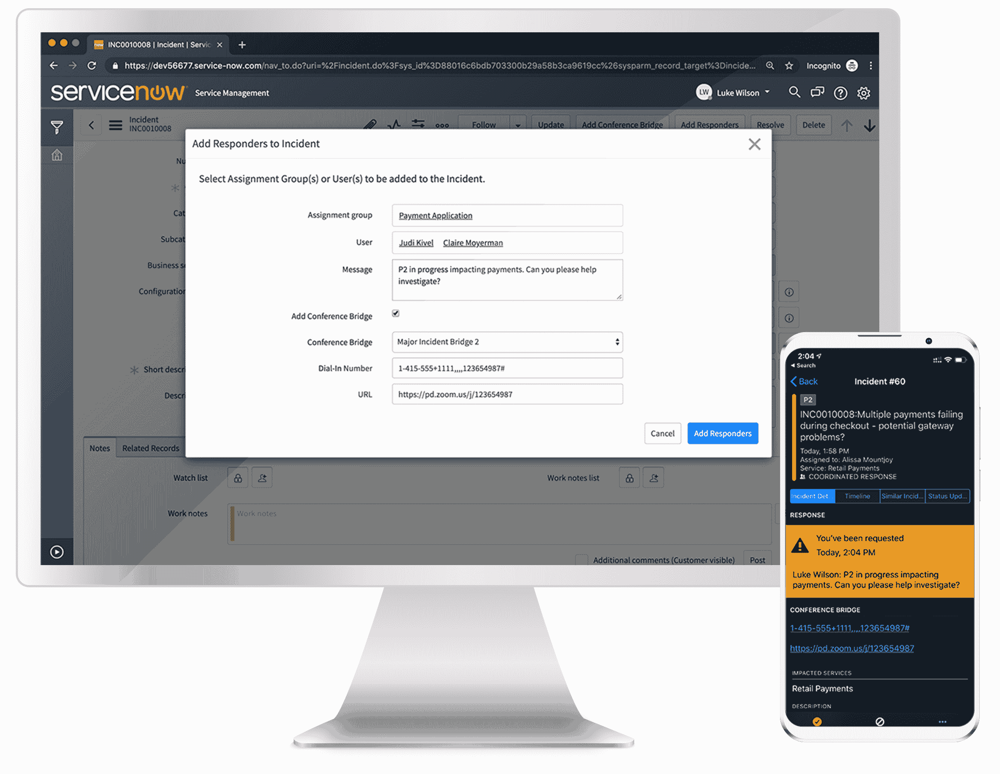

# IT 运营:PagerDuty 推出混合 ITSM 平台

> 原文：<https://devops.com/it-operations-pagerduty-unveils-hybrid-itsm-platform/>

PagerDuty 今天公布了一个框架，旨在使组织能够为 it 运营连接多种风格的 IT 服务管理(ITSM)方法。

page duty 产品副总裁 Rachel Obstler 表示，HybridOps 的 page duty 解决方案提供了一个全面的事件管理框架，能够跨越 IT 运营的 ITIL 和 DevOps 流程。

针对 HybridOps 的 PagerDuty 解决方案将现有和新产品功能(如事件智能和现代事件响应)与机器学习算法以及该公司在其事件管理软件和 300 多种第三方产品之间开发的双向集成相结合。

Obstler 说，这些功能使得促进平台之间的实时通信成为可能，这些平台往往受到主要依赖 itIL 流程的 IT 部门的青睐，如 ServiceNow 和依赖 Slack 相互通信的 DevOps 团队。

她说，PagerDuty Solution for HybridOps 允许组织在他们认为最合适的地方和时间选择性地应用每个模型，而不是强迫整个 IT 组织过渡到单一的 IT 运营框架。

ITIL 框架的最新版本为在历史上被视为僵化的 IT 管理方法注入了一些灵活性。ITIL 框架离像过去几年中许多组织为加速应用程序开发和部署而采用的各种形式的开发运维一样敏捷还有很长的路要走。

Obstler 表示，PagerDuty 正在通过利用机器学习算法来对 IT 环境中所有工具生成的所有各种警报进行分组，从而弥合这一鸿沟。她指出，这种能力不仅可以减少任何 it 运营团队可能遭受的警报疲劳，还可以更容易地确定任何 IT 事故的根本原因。

DevOps 在企业中被均匀采用的主要原因之一是，IT 运营团队被期望能够以编程方式调整 IT 基础设施，以满足开发人员的需求。然而，拥有这些技能的 IT 操作数量有限。理论上，没有编程技能的 IT 运营团队可以依靠自动化框架来实现这个目标。但是，这种方法要求 IT 组织在跨计算、存储和网络服务的单一 IT 自动化框架上实现标准化。能够跨越他们交付的所有服务中采用的所有自动化孤岛的组织数量少之又少。综上所述，很明显，在未来十年，ITSM 的传统和现代方式将需要共存。

与此同时，IT 领导可能要考虑一下那句关于牵马到水边的古老谚语。IT 领导可以发布他们想要的所有指令。但是当要完成一项任务时，大多数 it 专业人员自然会依靠他们所知道的。面临的挑战是，要想办法让 IT 运营人员摆脱这些遗留流程，但不一定会导致一切都陷入停顿，因为没有人知道如何解决一个根本不会等待的问题。

— [迈克·维扎德](https://devops.com/author/mike-vizard/)