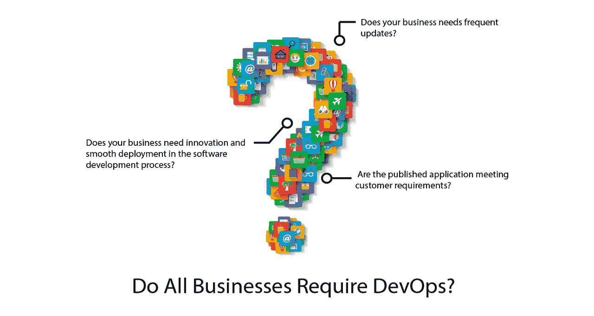
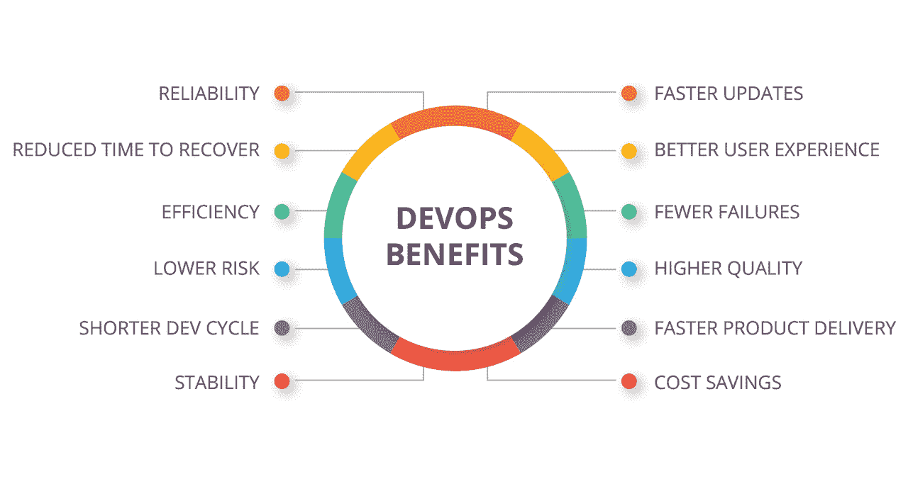

# 不同的组织，不同的发展成果

> 原文：<https://devops.com/different-organizations-different-devops-outcomes/>

发明 DevOps 平台的主要动机是帮助开发者和 IT 运营之间的紧密协作。基本上，DevOps 作为一个伟大的平台出现，将开发者和应用程序开发过程的受益者更紧密地联系在一起。DevOps 发起了跨越开发和运营的跨学科实践。

DevOps 方法的最终好处是消除了特定业务流程中软件应用程序的开发和部署之间的障碍。无论如何，并不是所有的企业都能从 DevOps 平台中获益。

DevOps 真的适合所有不同规模和利基的企业吗？利用 DevOps 平台的主要注意事项是什么？这些是我们将通过这篇文章试图回答的问题。

## 所有业务都需要 DevOps 吗？

****

普遍的共识是，任何面向创新的软件开发公司都必须接受 DevOps 环境。任何在软件开发过程中考虑创新和顺利部署的企业都应该利用 DevOps 平台的优势，这是他们长期发展战略的一个关键因素。每当任何服务提供商需要采用新策略来跟上软件领域的发展时，DevOps 将成为不可替代的平台选择。

尽管有这种共识和广泛接受的看法，但市场上仍有不同的意见。许多行业专家认为，要获得平台的好处，您需要有一个专门的 DevOps 团队。如果你的公司有 DevOps 文化和内部 DevOps 团队，你就能获得竞争优势。

## **开发运维的主要优势**

DevOps 的主要好处是软件交付速度更快，质量大大提高。根据行业的不同，还可以有其他一些好处。

虽然一些公司提到自他们采用 DevOps 文化以来停机时间的大幅减少，但仍有许多人只是称赞该平台，因为它的集成方法使流程更加敏捷和快速。

对于大多数公司来说，以更快的速度获得更好的软件的多米诺骨牌效应最终带来了可持续的增长和收入机会。

下面我们来看看 DevOps 平台在三种类型的企业中的作用:小公司和初创公司、中型公司和大型企业。

## **小公司和创业公司**

在资源和人力资本仍然不足的小型公司和初创公司中，归属于开发人员、工程师和部署专业人员的责任往往会变得模糊或重叠。由于人力资源的稀缺，开发人员和工程师经常被分配多重职责。自然地，在这样的公司中，跨职能团队很容易参与到各种开发项目中。这使他们成为接受 DevOps 文化并与之一起成长的理想商业组织。

## **中型企业**

随着这些公司的规模和资源越来越大，它们在运营和开发等垂直行业之间的鸿沟也越来越大(而且往往不可逾越)。在这样的组织中，员工不太可能接受跨职能的责任，因为许多人一直在做同样的工作，做同样的任务，并感到安定。这带来了一个停滞的组织过程，在这个过程中，强烈的部门分歧决定了业务过程的结果。

这种停滞不前的工作文化使得这类公司不太适合实施 DevOps 环境。为了让这些公司从 DevOps 平台中获益，应该在团队结构中引入大规模的组织变革。建立一个独立的跨职能 DevOps 团队来处理一些重点项目对他们来说也是一个很好的实践。

## **大公司**

大公司享受奢侈和丰富的资源，这使他们比其他组织更有优势。亚马逊、脸书、谷歌和微软等公司拥有多样性、丰富的经验和强大的能力，可以将来自开发和运营部门的跨职能专家聚集在一起，共同致力于雄心勃勃的项目。众所周知，这些组织拥有面向产品的部门，由开发和运营专家组成。

除了跨职能专业知识、以产品为中心的方法和丰富的新项目资源，大公司还可以通过每个团队的每个成员共享的高度统一的愿景和战略性长期目标，对团队合作和激励产生重大影响。这就是为什么大公司总是作为合适的候选人来为他们的项目接受 DevOps 方法和环境。

## **确定正确的开发运维策略:需要考虑的 3 件事**

除了采用跨职能 DevOps 方法的组织差异和核心优势和劣势之外，我们还必须了解为任何组织制定将 DevOps 纳入其事物方案的正确战略的关键方面。问题是，尽管有缺点和不足，你怎样才能拥抱 DevOps 环境并从中获益呢？这里我们提供一些线索:

*   让改变成为一种习惯。一些战略家认为，任何组织变革都会面临许多摩擦，对直接的业务成果造成实质性伤害。但不应该为此而不愿改变。相反，通过带来不断的变化，人们习惯了摩擦和痛苦，这就变得正常了。这是用开发运维取代传统 IT 思维的一种方式。
*   从一个整洁的团队做起。显然，为您的 DevOps 项目找到合适且可信的熟练员工并非易事。这就是为什么创建小型创业公司或单位是明智的，在这种情况下，分享共同的愿景和拥抱跨职能的方法成为一天的秩序。最重要的是，尽你最大的努力从你的团队中发掘出最好的一面，并雇佣一些有经验的、了解 DevOps 的人。
*   **持续发展的心态。**我们都知道 DevOps 平台始终关注持续开发方法。软件开发人员更容易接受这种方法，但是对于操作人员来说，您必须慢慢地让他们认为基础设施是不断发展和慢慢构建的组件。这很有挑战性，但并非不可能。

## **结论**

DevOps 已经成为现代软件开发人员最有前途的开发方法。尽管对于许多开发公司来说，源自严格角色划分的摩擦正在成为一种障碍，但 DevOps 对跨职能方法的积极推动看起来是不可抗拒的。

— [阿特曼方法](https://devops.com/author/atman-rathod/)