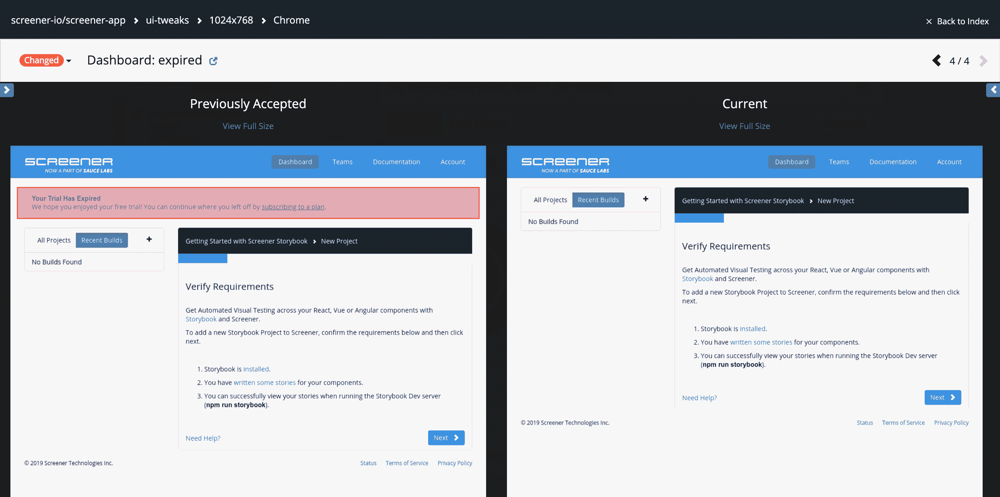

# Sauce Labs 收购 Screener 视觉测试工具

> 原文：<https://devops.com/sauce-labs-acquires-screener-visual-testing-tool/>

在 SauceCon 2019 大会上，Sauce Labs 今天透露，它已经收购了 Screener，为其自动化测试工具组合添加了一个视觉测试工具。

Sauce Labs 的产品副总裁 Lubos Parobek 表示，Screener 的加入将使 DevOps 团队不仅可以使用现有的 Sauce Labs 工具测试功能和性能，还可以确认应用程序的视觉元素的颜色是否正确呈现。

除了构建他们自己的可视化测试，DevOps 团队还可以使用 Screener 来自动运行这些测试，并将基线存储在云中，以创建可视化测试生命周期。

与此同时，Sauce Labs 宣布了 Sauce Headless 的正式上市，它利用容器技术使利用云服务成为可能，通过云服务，开发人员现在可以在每次提交代码时通过 Chrome 或 Firefox 浏览器运行测试。Parobek 说，目标是让组织更容易接受持续测试，作为使用持续集成/持续部署(CI/CD)平台构建的管道的扩展。

他说，收购 Screener 是 Sauce Labs 正在进行的努力的一部分，旨在将其测试组合的范围扩展到功能测试之外。本月早些时候，Sauce Labs 推出了第一套应用程序性能测试工具 Sauce Performance。

随着组织将各种类型的测试合并到一个单一的连续过程中，DevOps 的兴起正在挑战传统的应用程序测试方法。为了满足这一要求，Sauce Labs 正在扩展其自动化测试工具组合，而此时基于微服务的应用程序的出现大大增加了组成应用程序的所有组件之间的依赖程度。依赖性的增加将要求 DevOps 团队更加依赖自动化测试工具。事实上，Parobek 表示，DevOps 团队将包括数字助理的日子不远了，这些数字助理利用机器学习算法，使 DevOps 团队能够在扩展的 DevOps 管道中的正确时刻连续运行这些测试。他指出，这些数字助理不会很快取代人类测试人员的需求，但他们将增强他们的能力，使大规模实施连续测试成为可能。

与此同时，随着应用程序测试在 DevOps 过程中继续左移，更多的开发人员将在应用程序开发过程的早期阶段构建和运行他们自己的测试。在某些时候，另一个开发人员或专门的测试人员仍然需要评估代码，以提供公正的意见。但是在应用程序开发过程的后期阶段，常见错误的数量应该会大大减少。最终，这种向左的转变不仅会导致更多的开发项目按时完成，还会显著提高整体应用程序的质量。当然，现在的挑战是弄清楚如何实现最佳的 DevOps 实践，将应用程序测试尽可能推向左边。

— [迈克·维扎德](https://devops.com/author/mike-vizard/)