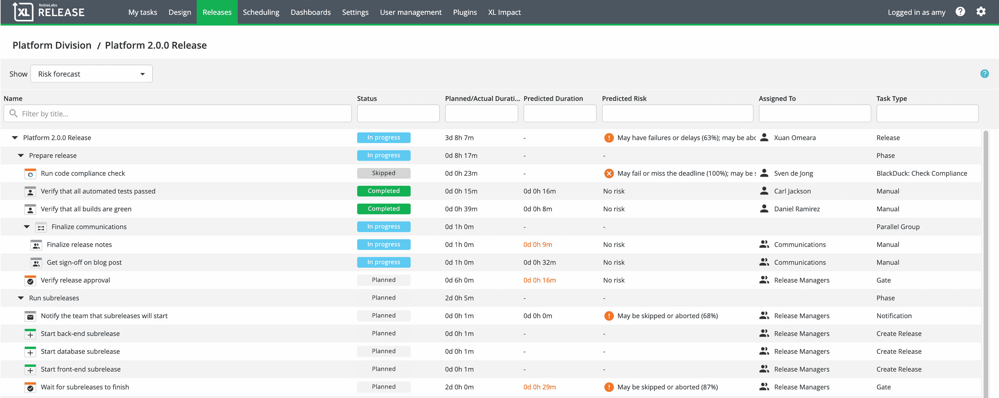

# XebiaLabs 将预测分析注入 DevOps 平台

> 原文：<https://devops.com/xebialabs-injects-predictive-analytics-into-devops-platform/>

XebiaLabs 正在努力消除 DevOps 的猜测，推出了一套工具，利用机器学习算法来预测应用程序的发布何时以及如何最有可能出错。

XebiaLabs DevOps 平台中添加的[风险预测模块](https://www.businesswire.com/news/home/20190327005061/en/New-XebiaLabs-DevOps-Prediction-Engine-Machine-Learning)紧随 XebiaLabs 推出其 XL JetPack 软件，用于在亚马逊网络服务(AWS)市场上实现自动化应用部署[。XL JetPack 是一个基于 YAML 文件的自动化框架和一个声明式编程框架，使 DevOps 团队能够在短短 15 分钟内在云平台上将应用程序投入生产。](https://www.businesswire.com/news/home/20190327005395/en/XebiaLabs-Launches-DevOps-Cloud-Offering-AWS-Marketplace)

XebiaLabs 首席执行官 Derek Langone 表示，虽然 DevOps 在实现持续集成方面取得了进步，但实现持续交付的目标被证明更加难以实现。他说，随着 XL JetPack 等自动化框架变得越来越容易使用，IT 运营团队将能够更好地跟上组织部署和更新应用程序的速度。

越来越明显的是，自动化框架和机器学习算法的结合将使 DevOps 团队在应用发布生命周期管理方面实现重大飞跃。由于 IT 组织试图利用的不同平台之间的细微差别，手动部署应用程序已成为一大挑战。随着需要在大约同一时间发布的应用程序数量的增加，管理发布周期的过程已经超出了由普通人组成的 IT 团队的能力范围。

XebiaLabs 的风险预测模型承诺通过应用融合了机器学习和其他专有 XebiaLabs 算法的预测分析来识别 DevOps 瓶颈，从而增加成功的几率。该模块提供的功能包括在发布管道开始运行之前，当发布可能被延迟或失败时，向团队发出警告；风险预测视图，它总结了发布过程中每个任务的预计延迟和失败；提供历史背景的类似版本的统计概述；取证工具可以发现不可靠的自动化测试、有问题的构建设置、长时间运行的部署和耗时的手动任务。该风险预测模块旨在补充 XebiaLabs 已经包含在其平台中的风险评分功能。

可以说，今天采用 DevOps 的最大障碍仍然是成功所需的专业知识水平。但是，随着预测分析与机器学习算法和能够即时辨别 IT 环境变化将如何影响应用程序的算法的结合变得更加普遍，掌握 DevOps 流程所需的专业知识水平应该会下降。随着这种转变的发生，更广泛地采用 DevOps 的组织数量应该会增加。

与此同时，DevOps 团队最好考虑他们接下来可能希望在多大程度上依赖预测分析来规定自动化流程，以尽可能消除对人工干预的需求。

— [迈克·维扎德](https://devops.com/author/mike-vizard/)