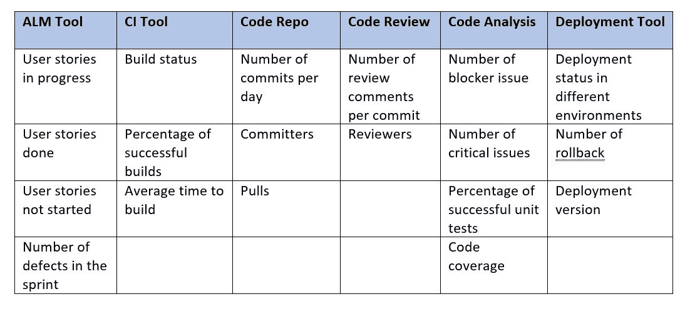
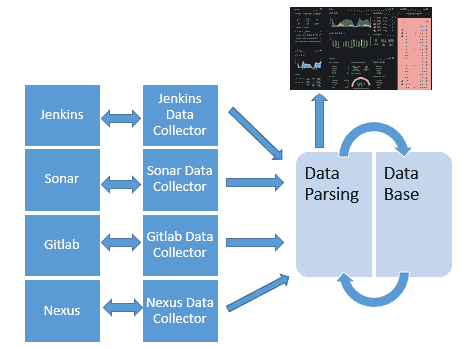

# 监控 DevOps 工具链

> 原文：<https://devops.com/monitoring-the-devops-tool-chain/>

DevOps 在许多寻求更高敏捷性和更高质量代码的公司中越来越受欢迎。当使用不同的自动化工具时，这些组织需要在一个公共仪表板上从不同的门户监控和跟踪这些工具和指标。工具链监控有助于将所有报告纳入一个公共门户。

从一个集中的平台启用监控工具可以节省大量的精力和时间。这些工具具有许多为企业带来价值的内置功能，例如预测警报、数据的图形表示以及与包括电子邮件、票务系统和自动补救在内的其他工具的集成。在当今竞争激烈的 SLA 驱动的标准环境中，这些新增功能改变了游戏规则。

监控可以分为三种方式:

*   **基础设施监控**:监控用于创建应用程序平台的环境、机器和资源。
*   **应用程序监控**:监控应用程序的性能、资源消耗、处理时间和响应能力。
*   **DevOps 监控**:监控从持续勘探到发布管理的管道和工具链。DevOps 监控工具能够监控作业运行状况、作业状态、性能和质量。

## **为什么开发运维监控至关重要**

在 DevOps 中，我们使用许多工具来创建工具链和管道。在一些拥有长发布系列的大型团队中，监控一个项目从需求收集到部署的状态可能是困难的，因为您必须跟踪许多不同的工具。即使这样，您也可能无法以期望的格式获得状态。DevOps 监控工具将一切都集中到一个仪表板上，您可以在这里看到状态和其他指标，包括关于项目质量和进度的有用信息。

## **DevOps 监控:不同于工具监控**

工具监控特定于工具的健康和性能；DevOps 监控的重点是 sprint 的状态、代码质量、代码分支状态、测试结果和部署状态。所有这些都是项目管理持续改进生产力和质量所需要的。

## **监控什么？** 

在 DevOps orchestration 中，我们希望监控许多事情，所有这些指标提供了项目或产品开发和生产力的当前状态的视角:

*   性能:应用程序的性能。
*   来自应用生命周期管理(ALM)工具的开发(sprint 或看板进度)和缺陷状态。
*   项目特定分支的代码库监控。
*   从持续集成(CI)工具构建作业或管道监控。
*   代码分析和安全测试结果和报告。
*   不同环境中的部署和升级状态。
*   使用工具的使用和质量数据开发成熟度。
*   工件(版本化的工件)。

这些是任何项目都将在单个仪表板上监控的基本和强制的区域。

## **监控用例**

在敏捷项目中，CI/CD 工具是按照 DevOps 的最佳实践来实现的。实现了一个 ALM 工具来管理 backlog 和开发冲刺。在这个项目中，CI 工具用于构建代码，所有代码都在代码报告中提交，使用代码审查和分析工具。已经实现了一个二进制存储库来存储每个版本的所有二进制文件。自动化部署工具用于在 QA、试运行和生产环境中部署应用程序。

现在，当监控每个工具、构建的状态和不同门户(CI 工具、代码报告、分析工具、部署工具等)上的进展时，问题就来了。).

使用集中监控工具可以帮助项目管理人员监控下面提到的指标。这些指标在一个仪表板上给出了构建、质量和部署状态的总体情况。

## **devo PS 监控可用工具**

以下是提供类似解决方案的几种可用产品:

*   Hygieia :免费软件工具，支持所有 DevOps 工具，但指标非常有限。
*   KlipFolio :有很多工具支持，但不是免费的。
*   **DevOps Insights** :仅支持 IBM 云平台的 IBM 工具。
*   [**DataDog**](https://blog.takipi.com/production-tools-guide/visualization-and-metrics/#datadog) :有广泛的工具支持，但不免费。
*   普罗米修斯:免费软件工具，监控大量使用工具的出口商。

## **构建与购买**

决定使用哪种工具总是一项艰巨的任务——您需要从不同的角度比较所有可用的工具及其产品。以下是在决定可用选项或构建您自己的解决方案时起重要作用的几个因素:

*   支持的工具范围(插件或数据收集器)。
*   免费或付费。
*   支持定制数据收集。
*   丰富的 UI，用于数据表示以及字段和视图的定制。
*   支持的度量范围。
*   易于安装和配置。
*   许可和分销政策。

## **构建开发运维监控的解决方案**

如果您决定构建或扩展任何现有工具，请考虑以下几点:

*   **确定你要监控的工具:**列出你要监控的 DevOps 工具；该列表应该涵盖 DevOps 的所有领域(构建、回购、代码质量、部署、监控等。)来获得完整的图片。

*   **确定指标:**一旦你有了工具列表，就要确定每个工具的重要指标。您的指标应该能够提供 DevOps 领域的 KPI。

*   **确定获取指标数据的 API 或命令行接口:**您需要很好地理解工具及其实现，以确定获取数据的最佳方式。它可以是预定义的 API、REST APIs 或任何命令行接口。确保你得到了所有想要的数据。

*   **将指标与业务价值相关联，或者定义开发运维 KPI:** 您的指标应该代表实现开发运维所涉及的所有工具的 KPI 和业务价值。仪表板应涵盖所有方面，并代表当前状态和差距。

*   **确定如何存储和处理这些指标:**您需要定义模式，以便在已定义的数据库中存储数据；您的模式应该足够通用，以适应来自不同工具的任何数据。为了处理数据，您需要一个位于数据库和 UI 之间的中间件组件，以一种可呈现的格式进行处理。

*   **基于指标构建记分板:**使用丰富的 GUI 以不同的格式显示记分板，如表格、图形和图表。

*   **支持高可用性:**工具的设计应该支持高可用性，以避免停机和数据点丢失。

## **监控工具如何收集数据**

我们用来实现 DevOps 和 CI/CD 的大部分工具都是基于网络的工具，比如 Jenkins、Sonar、Git、SVN、UDeploy、Gerrit、吉拉、Confluence 等等。这些工具提供了 REST APIs，从中我们可以获得描述格式的数据 json 或 xml。一些工具支持预定义的 API 或 CLI 来连接和获取数据。一旦您确定了与终端系统的通信机制，下一步将是编写健壮的代码，该代码可以获取所需的度量数据，并处理所有情况以解析数据并将其放入关系或非关系数据库中。

一旦数据库中有了数据，就需要一个 GUI 来以表格和图形格式显示这些数据，还需要一个中间件组件来从数据库中获取数据，并以所需的格式提供给 GUI。

从您想要监控的系统中获取数据是整个练习中真正的挑战，因为其他一切都依赖于它。以下是开发工具链监控系统时可能面临的一些挑战:

*   确定获取数据的 API 或任何其他机制。
*   确定要监控的指标。
*   确定您希望数据在 GUI 上的显示方式，是趋势图、饼图还是表格显示。
*   确定监控系统的身份验证机制，因为每个机制支持不同的类型。有时它需要一个预定义的令牌，而其他时候则需要在运行时生成令牌。

## **devo PS 管道监控的简单架构**

下面是一个简单的通用架构，大多数监控工具都是在这个架构上工作的。下图中，不同的 DevOps 工具在左侧；这些工具是我们希望从中获取数据的终端系统。仅示出了几个工具作为例子。

数据收集器从每个终端系统获取数据，并根据具体情况使用 REST API 或该工具或 CLI 公开的任何 API 与终端系统进行通信。使用已定义的通信机制，它将带来数据并将其传递给解析器，以获取所需的数据并以所需的格式将其放入数据库。

在开发数据收集时，您需要很好地理解要监控的工具以及可用的 API，包括 REST、CLI、SMIs 或工具中内置的任何预定义 API。

数据解析层将从数据收集器收集的原始数据中获取所需的指标值。原始数据可以是任何格式，包括键值对、json、xml 或 csv。根据数据类型的不同，解析方法也会有所不同。您可以使用任何通用 API 进行解析。

您必须找到一个好的 API 来解析不同格式和复杂度的数据。

数据库将保存每个工具和用户凭证的每个时间间隔的指标数据。

GUI 将从解析组件请求数据。它将以表格或用户友好的图形格式来表示它。

其他功能:一旦我们有了数据，我们就可以有趋势图来做出一些关键的决定，我们可以在违反任何定义的阈值时发出警报，并将其与电子邮件或短信相结合，以立即采取行动。

## **监控工具高可用性**

如果我们依赖我们的监控工具来获得 DevOps 中使用的所有工具的报告，我们承受不起停机时间。如果监控工具停止工作，我们可能会丢失数据点和趋势，如果不手动收集数据，管理层可能无法获得整个项目的实际状态。

为了避免这种情况，应该在监控工具上实现高可用性(HA)。在 HA 设置的情况下，我们将继续收集数据，以防监控节点出现故障。

要实现高可用性，我们需要考虑两个方面:GUI 和中间件(业务逻辑组件)的高可用性和数据库的高可用性。

GUI 和中间件中的 HA 可以使用 Apache 或 Nginix 集群来实现。在容器化环境中，我们可以使用任何编排平台的默认特性来实现高可用性，比如 Kubernetes。类似地，在数据库中，我们可以实现大多数可用数据库提供的集群数据库特性。

## **结论**

DevOps 工具链监控非常有用。它向管理层提供了一个项目健康状况的良好快照，并且能够识别任何可能影响发布的阻塞问题，以便可以纠正它们。监控有助于确定定义路线图时需要关注的难点。遵循 DevOps 实践并使用 DevOps 工具的组织应该有一个工具来监控 DevOps 管道。

— [普拉特克·库马尔·阿斯特哈纳](https://devops.com/author/prateek-kumar-asthana/)