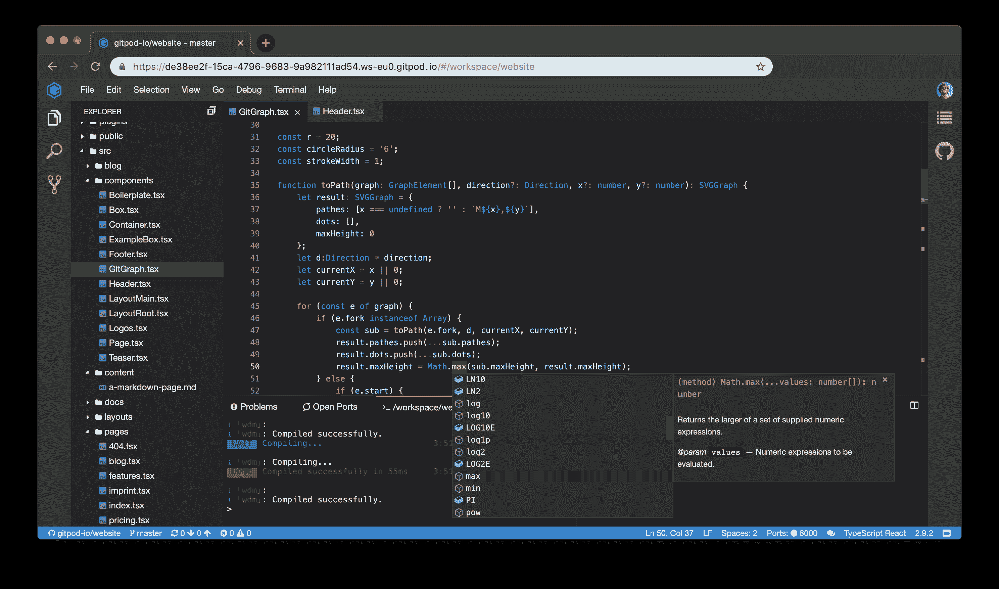

# TypeFox 将基于云的 IDE 绑定到 GitHub

> 原文：<https://devops.com/typefox-ties-cloud-based-ide-to-github/>

TypeFox 已经推出了一个 [GitPod.io](https://gitpod-website.netlify.com/blog/gitpod-launch/) 服务，该服务将基于 TypeFox 的云中的集成开发环境(IDE)与开源的 GitHub 存储库融合在一起。

TypeFox 的联合创始人斯文·埃夫廷格(Sven Efftinge)表示，这种程度的集成将使开发人员更容易导航多个项目，他们可以将代码从 GitHub 拉到基于 Eclipse 的 IDE 中。

此外，当开发人员打开 Gitpod.io 工作区时，他们会发现任何涉及 GitHub 中工件更新的构建都会自动完成，Efftinge 说。他指出，这将大大减少开发人员等待构建完成的时间。

TypeFox 与 Google、Ericsson、Arm 和 Red Hat 合作开发了开源 [Eclipse 忒伊亚](https://projects.eclipse.org/proposals/eclipse-theia)项目，该项目为使用 TypeScript、CSS 和 HTML 在云中构建 ide 以获得类似桌面的用户体验提供了基础。在最高级别，忒伊亚由运行在浏览器或本地桌面应用程序中的前端和运行在任何主机上或本地桌面应用程序中的后端组成。前端和后端都通过 WebSockets 上的 JSON RPC 进行通信。TypeFox 然后利用该项目构建了自己的基于云的 IDE。

Gitpod.io 通过添加捕获和共享开发环境快照的能力，进一步增强了基于云的 IDE 所固有的协作能力。

Efftinge 表示，继对 GitLab 的初步支持之后，下一步的工作将集中在将 Gitpod.io 与 GitLab repository 集成，git lab repository 在传统企业 IT 组织中广泛使用。

不管采用哪种存储库，都需要更加注意减少开发人员在开发应用程序时遇到的日常摩擦。虽然最佳 DevOps 实践对加速应用程序开发和部署大有帮助，但是在开发过程中有许多浪费的步骤，如果消除这些步骤，将会大大提高开发人员的工作效率。当然，开发人员变得越多产，通过持续集成/持续开发(CI/CD)管道的应用程序就越多。

目前还不清楚应用程序开发将在多大程度上迁移到云上。在云中简化开发过程当然更容易。但是许多开发人员仍然依赖于个人工作站，因为他们可能不总是在一个可以可靠访问互联网的位置。然而，随着应用程序开发——尤其是在微服务时代——变得越来越像一项团队运动，很明显更多的应用程序开发被推到了云端。将应用程序开发推到云中还可以减少组织需要为其开发人员购买的高端 PC 和工作站的数量。

无论选择哪条路，很明显，像 GitHub 和 GitLab 这样的库现在是应用程序开发的中心。现在很少有开发人员在写原始代码。他们中的大多数人正在组合存储库中存储的工件来构建他们的应用程序。组织现在面临的挑战是给原本很容易变得混乱的过程带来一些一致性。

— [迈克·维扎德](https://devops.com/author/mike-vizard/)