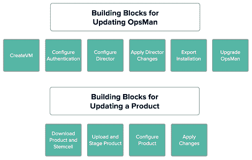

# Pivotal 软件预览自动化框架

> 原文：<https://devops.com/pivotal-software-previews-automation-framework/>

在[北美云铸造峰会 2019](https://www.cloudfoundry.org/event/nasummit2019/) 大会上，Pivotal Software 宣布它正在[测试一个自动化框架](https://content.pivotal.io/blog/pivotal-cloud-foundry-2-5-istio-envoy-make-your-developers-more-productive)，该框架承诺保持其平台即服务(PaaS)环境的分布持续更新。

此外，Pivotal 透露，它将在其 Pivotal Cloud Foundry (PCF)发行版中添加对开源技术的支持，包括在 Cloud Foundry Foundation (CFF)赞助之外开发的 Envoy 负载平衡和 Istio 服务网格软件。Envoy 和 Istio 正在为 PCF 增加一个新的路由层，让开发人员能够更好地控制网络流量。

Pivotal 产品副总裁 Richard Seroter 表示，PCF 平台自动化由一系列构建模块组成，这些模块将应用于 PCF 的所有组件，并最终应用于 Pivotal 与姐妹公司 VMware 合作策划的 Kubernetes 发行版。

Pivotal 还宣布，PCF 的运行时 Pivotal Application Service (PAS)将很快支持 Windows Server 2019，并能够为每个 PAS 容器配置多个自定义端口，从而从网络角度更高效地在 PaaS 环境中部署容器化应用。

最后，Pivotal 正在向它在 PAS 运行时公开的应用程序编程接口(API)添加更多的描述性元数据。

Seroter 表示，Pivotal 将继续致力于尽可能多地实现 IT 运营管道的自动化。Pivotal 没有分配 IT 人员来创建和管理这些管道，而是依靠一组托管服务，这些服务跨越在公共云或内部部署的虚拟机上运行的 Cloud Foundry 和 Kubernetes 实例。他说，这种方法依赖于 Pivotal 定义的高度自以为是的运营管道，it 组织需要采用这种管道，以从高度一致和可重复的方法中受益，从而大规模管理 IT 运营。

Seroter 补充说，随着组织在 Kubernetes 平台的同时采用 Kubernetes 平台，对管理 IT 运营的更结构化方法的需求只会变得更加迫切。事实上，CFF 发布的对 501 名 IT 领导者的[调查发现，几乎一半的受访者(48%)报告同时使用了 PaaS、容器和无服务器技术的某种组合。](https://www.prnewswire.com/news-releases/cloud-foundry-global-survey-finds-companies-commit-to-digital-transformation-process-with-confidence-in-cloud-300822426.html)

目前还不清楚 It 组织将在特定的应用程序开发平台上标准化多少。PaaS 环境通常拥有一套更强大的应用程序开发工具，但它们可能需要消耗数十台虚拟机才能维持运行。Kubernetes 平台的开发工具仍在发展，但该平台提供了一种更有效的方式来使用虚拟机和裸机服务器。很明显，在未来的一段时间内，许多 It 组织会发现自己管理着多个平台。开发运维团队面临的挑战是找到一种方法，使用通用框架一致地管理这些平台，而不是必须部署和掌握单独的管理。It 领导者可能需要一段时间来理顺他们的管理平台，但随着时间的推移，目标越来越近在咫尺变得越来越清晰。

— [迈克·维扎德](https://devops.com/author/mike-vizard/)