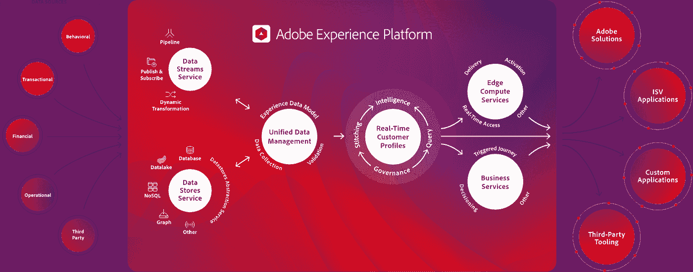

# Adobe 战略围绕 DevOps 展开

> 原文：<https://devops.com/adobe-strategy-revolves-around-devops/>

在本周举行的 [Adobe Summit 2019](https://summit.adobe.com/na/) 大会上，Adobe 详细介绍了其 Adobe Experience Cloud 客户体验生态系统依赖于一套最佳的 DevOps 流程，这些流程围绕着现代微服务架构，并位于部署在 Azure 云上的大数据平台之上。

Adobe 去年收购了电子商务平台提供商 Magento 和营销自动化平台提供商 Marketo。从那时起，Adobe 一直致力于将这些产品与现有的营销应用程序相集成，以创建 [Adobe 体验云](https://news.adobe.com/press-release/experience-cloud/adobe-summit-2019-driving-future-customer-experience-management)。

Adobe 平台工程副总裁 Anjul Bhambhri 表示，这套软件即服务(SaaS)应用程序正在围绕一个共享的公共数据模型进行集成，该模型基于运行在 Kubernetes 集群上的基于微服务的容器架构。他说，最重要的是，Adobe 正在将一系列机器学习算法分层，称为 Sensei，以在整个产品组合中嵌入人工智能(AI)。

Bhambhri 指出，随着这项工作的进展，Adobe 计划允许客户和合作伙伴利用存储在 Adobe Experience Cloud 中的数据，使用 Adobe 管理的数据来训练他们自己的人工智能模型。该数据模型被称为体验数据模型(XDM)，也与包括微软和 SAP 在内的合作伙伴共享，去年，微软和 SAP 致力于一项雄心勃勃的计划，与 Adobe 合作建立一个通用数据模型。Bhambhri 说，XDM 利用开源的 Kafka 消息软件来集成各种数据管道，这些管道是近实时大规模集成这些应用程序所需要的。

这些努力是对现有计划的补充，根据该计划，Adobe 正在公开开放应用程序编程接口(API)，以鼓励开发人员构建扩展 Adobe 体验云的应用程序。

组织可以使用 Adobe 代表他们管理的大数据平台来推动他们的数字业务计划，而不是构建他们自己的客户数据平台。许多组织一直在构建自己的平台来实现这一目标，并取得了不同的成功，首先在大数据平台上部署数据仓库，然后努力集成各种应用程序，以提供更丰富的数字客户体验。Bhambri 指出，Adobe 正在投入大量资源，以避免组织为实现这一目标而购买、部署和管理自己的 IT 基础设施。

IT 领导者必须决定他们是否希望减少构建这些定制平台所需的时间、资金和精力，转而使用 Adobe 的托管服务，这可以让他们将更多资源投入到开发应用程序中，从而更快地进入市场。

与此同时，很明显，接受数字化业务转型的需求将推动更多组织接受 DevOps 流程。现在的问题是，他们需要在多大程度上定义自己的一套最佳开发运维流程，而不是简单地照搬 Adobe 等组织已经证明的开发运维最佳实践。

— [迈克·维扎德](https://devops.com/author/mike-vizard/)