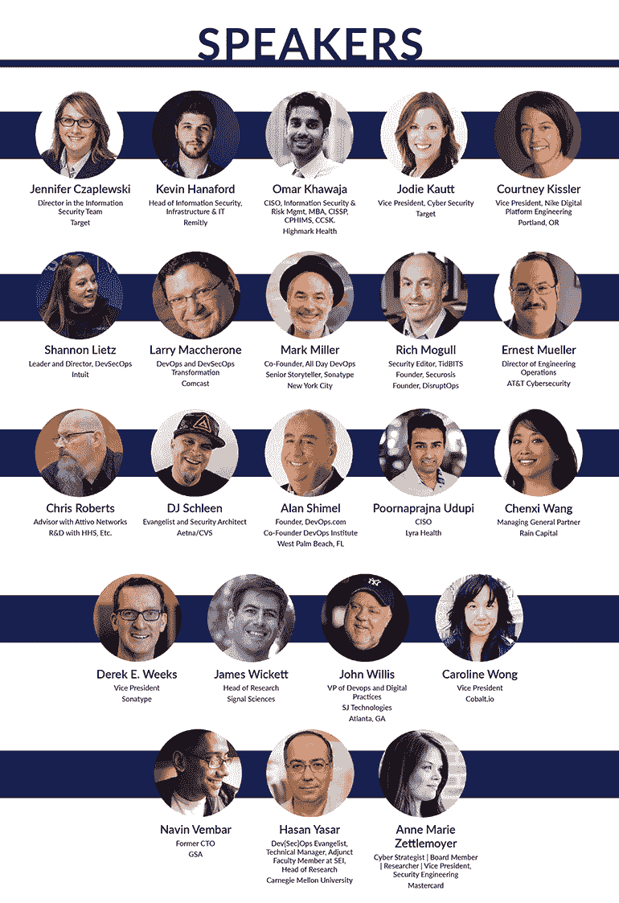

# 宣布 DevOps Connect: DevSecOps Days 虚拟峰会

> 原文：<https://devops.com/devsecops-days-virtual-summit-on-april-2nd/>

我们刚刚结束了第五届年度**DevSecOps Days @ RSA Conference 2019**，其中包括一系列出色的演讲者和各种信息丰富的会议，为所有人提供了无与伦比的体验。如果你不能来三藩市参加 RSAC 或者错过了任何会议，我们将在 4 月 2 日星期二举办一个虚拟版本的 DevSecOps Days @ RSAC **。**

您将听到来自 DevSecOps 从业者的故事，他们讨论了如何从遗留开发和部署过程到集成系统的文化转变，集成系统将安全性作为过程的一部分，而不是作为安全应用程序开发的监督者或瓶颈。

类似于我们为 [**DevOps Experience**](https://devopsexperience.io/) 和 [**Predict 2019**](https://predict2019.com/) 虚拟活动创建的环境， **DevOps Connect: DevSecOps Days 虚拟峰会**将提供一个虚拟环境，其中包括会议厅、演讲厅、博览馆等。**devo PS Connect:DevSecOps Days 虚拟峰会**不仅仅是一系列的 YouTube 现场演示；这是一次真正的会议体验，坐在舒适的办公桌前。

加入**约翰·威利斯、王晨曦、** **香农·利茨、詹姆斯·维克特**和其他行业名人的行列，深入了解开发人员的世界。立即注册参加 4 月 2 日星期二的直播。注册**免费**，但空间**有限**。立即预订您的位置！

[SAVE YOUR VIRTUAL SPOT](https://devopsconnectdevsecops.com/#join-us)

  

[去顶](#)
[SAVE YOUR VIRTUAL SPOT](https://devopsconnectdevsecops.com/#join-us)[Go to top](#)

MediaOps 是 DevOps.com 技术社区、Container Journal、Security Boulevard 和 DevOps TV 以及包括 DevOps Experience、Predict 2019 和现在的 DevOps Connect: DevSecOps Days 在内的活动背后的公司。我们的虚拟活动在业内首个真正身临其境的虚拟现实会议环境中举行。DevOps Connect: DevSecOps Days 不仅仅是一系列的 Google Hangouts，它是一个真正的虚拟会议，充满了每个主题演讲和演示的剧院，一个聊天和社交的会议大厅，以及一个真正的虚拟展览大厅，其中有虚拟参展商展台，配有视频，下载，甚至是参与者的赠品。

请在 Twitter @ devopsdotcom 和@securityblvd 上关注我们的活动更新。使用#devsecopsdays 标签，让我们知道你是否要去！

— [萨利姆](https://devops.com/author/saleem/)