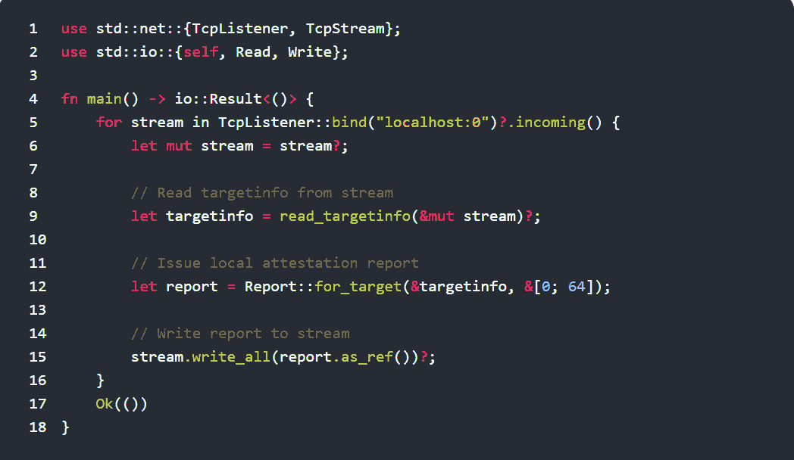

# DevSecOps: Fortanix 添加开源 Rust SDK 构建加密应用

> 原文：<https://devops.com/devsecops-fortanix-adds-open-source-rust-sdk-to-build-encrypted-apps/>

这些天来，人们对 DevSecOps 有很多关注，这是修复公认的网络安全模式的努力的一部分。但是，另一个想法正在 DevOps 社区中兴起，而不是试图确保在部署应用程序之前解决每个潜在的漏洞:首先使用现代编程语言构建安全的应用程序。

Fortanix 在 [RSA Conference 2019](https://www.rsaconference.com/) 上推出了一个基于 Rust 编写的开源软件开发工具包(SDK)的[飞地开发平台](https://www.businesswire.com/news/home/20190304005011/en/Fortanix-Launches-Native-Rust-based-Software-Development-Kit) (EDP)。该 SDK 针对英特尔软件保护扩展(SGX)进行了优化，这些扩展是对英特尔指令集的扩展，定义了内存的私有区域，称为飞地，防止数据被飞地之外的任何进程读取或保存。在最新一代的英特尔处理器中，默认情况下需要启用 SGX。

公司首席执行官 Ambuj Kumar 表示，Fortanix 一直在倡导采用一种运行时平台，使处理内存中的加密数据成为可能，而不必将其暴露为纯文本。通过与英特尔合作创建基于 Rust 的 SDK，该公司希望让开发人员更容易利用固有的安全编程语言来调用 Fortanix 运行时。

Fortanix 还提供管理加密的自助密钥管理服务，最近获得了由英特尔投资领导的 2300 万美元的额外资金。

Kumar 表示，Rust 作为一种编程语言越来越受欢迎，因为它的设计包括了护栏，可以防止网络犯罪分子通过破坏内存中运行的代码来进行注入式攻击。事实上，Kumar 指出，网络安全专业人员现在反对部署用 C 或 C#编写的应用程序的原因之一是因为没有这样的护栏可用。

Rust 和英特尔 SGX 的结合并没有消除组织定义一套最佳 DevSecOps 流程的需要。但是它确实减轻了选择使用现代编程语言构建应用程序的开发人员的大量压力，以创建不容易被黑客攻击的应用程序。

自然，开发人员需要一段时间来放弃基于遗留编程语言的工具，他们中的许多人已经使用了多年。但 Kumar 表示，Rust 的采用已经像野火一样蔓延，因为开发人员正在寻找一种方法来消除网络安全问题，现在一旦在生产环境中发现这些问题，许多人都被要求负责解决。

当然，数十亿行遗留应用程序代码不会仅仅因为一种新的编程语言流行起来就在一夜之间消失。但增强网络安全很可能成为重写一些最关键的遗留应用程序的令人信服的理由，特别是如果它们最终提高了性能。毕竟，这些遗留应用程序之所以成为攻击目标，是因为它们是组织最有价值的数据所在。当然，英特尔认为在不支持 SGX 的处理器上部署这些重写的应用程序是没有意义的。但无论理由是什么，开发人员必须投入到持续网络安全问题上的时间显然是有限的。

— [迈克·维扎德](https://devops.com/author/mike-vizard/)