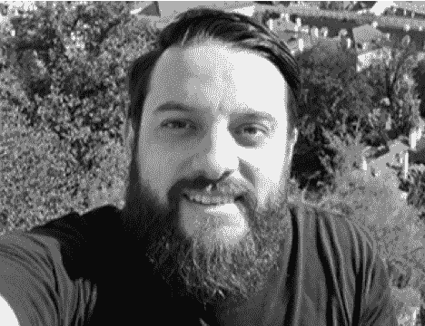

# SauceCon 扬声器简介:理查德·布拉德肖

> 原文：<https://devops.com/saucecon-speaker-profile-richard-bradshaw/>

*这是第六篇关于 [SauceCon 2019](https://saucecon.com/) 演讲嘉宾的系列文章。SauceCon 聚集了 Sauce Labs 用户和持续测试专家的全球社区，相互学习，提高他们的自动化测试和持续交付技能。今年的活动将于 4 月 23 日至 25 日在德克萨斯州奥斯汀举行。*

众所周知，理查德·布拉德肖掌管着测试部，在世界各地的活动中发表演讲，并且是“”友好的测试人员——这是一位开发人员给他起的绰号。

然而，Richard 对测试自动化金字塔并不完全友好。他说，它可以而且应该带来对话，但认为它缺乏太多功能作为一个坚实的自动化战略，这是多少人使用它。在 [SauceCon 2019](https://saucecon.com/) 上，Richard 将在他的演讲中提出一些其他选项，“金字塔是古老的——让我们谈谈自动化策略。”

Richard 希望人们能够接受这样一个事实，即要真正成功地实现自动化，您需要将自动化融入到您的整体测试策略中。在他的演讲中，他将回顾他在进行自动化审计时采取的步骤，这些步骤将使与会者能够立即回到工作中并开始应用。“我还希望，观察我对现有模型的评论，将激励他们对当前工作场所中使用的一些模型做同样的事情，并找到改进他们方法的方法，”他说。

Richard 完全有资格帮助测试人员提高这方面的能力。作为 [测试部](https://www.ministryoftesting.com/) 的 BossBoss(又名 CEO)，他的主要职责是确保他们坚持“共同创造更好的测试人员”的使命 Richard 和他的团队提供了许多学习和分享测试知识的方法。他们经营 [TestBash](https://ministryoftesting.com/testbash) 会议，管理一个名为 [的在线学习平台 Dojo](https://ministryoftesting.com/dojo) 并在世界各地举办聚会。

当他不工作或不考虑工作的时候(很少见！)，理查德热爱烹饪风暴，徒步旅行和旅游。

在第三届 Sauce Labs 用户大会 SauceCon 2019 上，你可以听到 Richard 和其他 30 多位专家的演讲。要查看完整的演示列表或注册， [访问 SauceCon 网站](https://saucecon.com/) 。

— [丽贝卡·克莱默](https://devops.com/author/rebecca-cramer/)