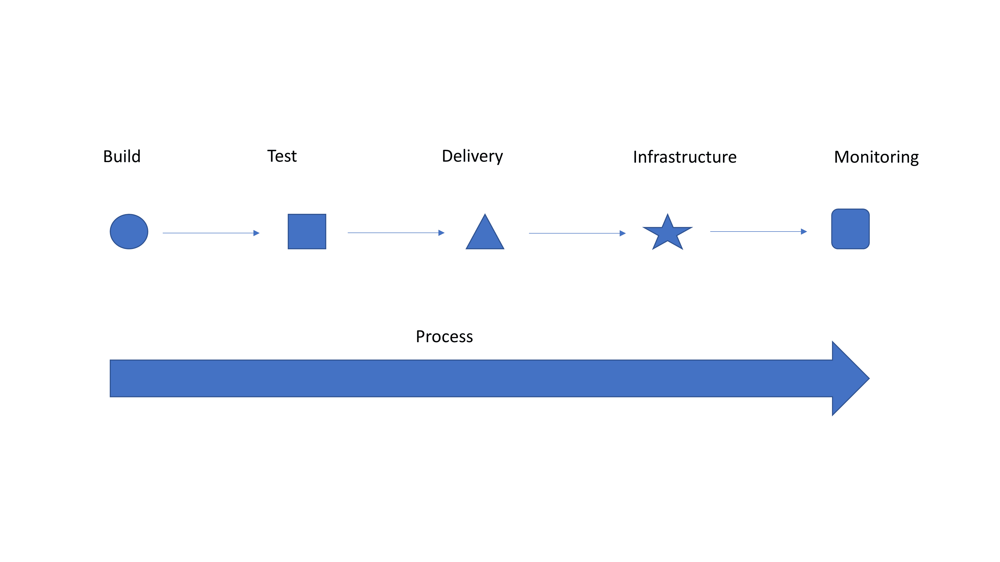

# 自动化:我们还没有达到平衡

> 原文：<https://devops.com/automation-we-have-not-yet-achieved-balance/>

我将以一个普通读者已经知道的非常明确的声明开始本周的博客:我站在 DevOps 等式的自动化一边。我认为 DevOps 首先是自动化，其次是流程。问题是到了“第二”部分。通过例子，自动化整个管道的行为应该显示集成这些不同的工具和不同的团队的好处。但似乎经常不是这样。

Simple Graphic for Discussion

所以我要花一点时间告诉你为什么会这样。如果你有整合的工具和团队，恭喜你！希望你从这个博客中一无所获，你正在某个海滩上享受一杯饮料，而你的整个运作都在照顾自己。其他人，请继续读下去。

查看通用图形。注意到顶部的每一步都是不同的形状吗？这是因为它们是单独实现的，人员和流程的集成有限。所以你有一个工具可以提交测试……测试(或者最后的监控)会反馈到你的 bug 跟踪系统吗？它能创造完成工作的机会吗？当一个容器出现故障时，它会被简单地丢弃，然后一个新的容器会出现来代替它，因为“他们只是牛”吗？如果是，系统是否采取措施来保持故障容器(或者至少是关于它的信息)存活，以便进行故障排除？忽略被替换的失败实例以及它们对用户的影响很小，这正是几年前 CloudBleed 发生的情况。

首先实现自动化，获得自动化的优势并加快交付速度。然后利用所有的自动化，使之成为一个简化的过程。这是一个非常复杂的系统，即使你把所有东西都放在一个“平台”上，它也永远不会完美。但是定期发生的问题也可以自动化，以提供系统之间的集成。隔离一个实例，并向缺陷跟踪系统发送一个通知，说明它还活着，但是没有通信(因为它已经被替换了),这是一件相对容易编写脚本/集成的事情，并且提供了发现实际上哪里出错的能力。与删除实例并启动一个新实例相比，这个过程要好得多，而且通过集成团队，开发人员和运营人员可以一起解决导致实例停机的任何原因。

强大的集成和顺畅的管道是应用程序发布自动化等技术旨在处理的，但大多数商店认为这些工具是“不必要的”开销。我不同意。找一个你喜欢的——有一百万个——用它来连接东西。这只是一步，但这是将您的运营交付系统从独特的雪花转变为协同工作的集合的一部分的一步。

就是这样。首先自动化，因为收益是惊人的，但不要止步于此。真的——不要。如果你这样做，你就是在给自己帮倒忙。整个“我们要改变你的世界！”人群是令人讨厌的，因为改变你的世界是你的决定，但无论如何要听听他们的意见，看看他们的哪些想法适合你的组织。一旦自动化完全到位，你会惊讶于 DevOps 的流程方面提供了多少有意义的东西。

唐·麦克维蒂