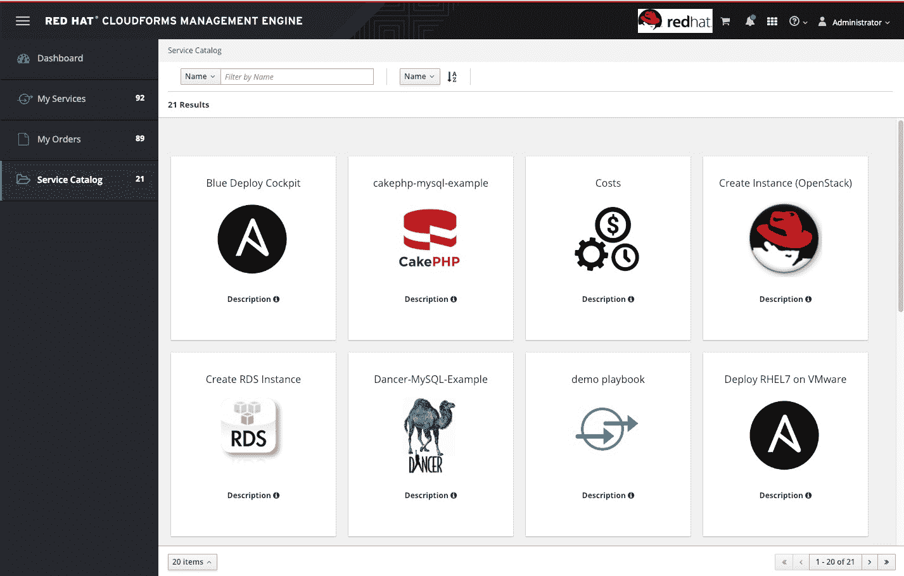

# Red Hat 加强了 CloudForms 与 Ansible 的集成

> 原文：<https://devops.com/red-hat-tightens-cloudforms-integration-with-ansible/>

Red Hat 加强了 CloudForms 和 its Ansible 框架之间的集成，cloud forms 是用于管理内部和云中 IT 基础设施的工具，its ansi ble 框架用于自动化 IT 运营。

Red Hat 管理产品营销经理 Pete Cruz 表示，Red Hat cloud forms 4.7 版本和 Ansible 共同承诺使用一套通用工具来更轻松地管理内部和云中运行的多个 it 环境。如今，大多数 IT 组织都试图在现有的 IT 环境中管理至少一个公共云。Cruz 说，IT 组织可以采用多个 Red Hat 工具和框架来统一多个云及其内部 IT 运营的管理，而不必为每个 IT 平台掌握一个单独的框架。

Red Hat CloudForms 4.7 版现在可以直接从内部部署的 cloud forms 执行 Red Hat Ansible Tower 工作流。这些工作流已经可以扩展到包括多个云。

随着 Red Hat CloudForms 的发布，Red Hat 继续努力将其触角延伸到网络和服务器的管理。CloudForms 现在与 Lenovo Clarity(一套系统管理工具)和 Nuage Networks 的虚拟化服务平台(VSP)相集成。Cruz 说，与网络平台的集成正变得越来越重要，因为内部 it 组织现在被要求像云服务提供商一样敏捷。他指出，如果 IT 组织可以在几分钟内启动虚拟机，但必须等待数周才能手动提供网络服务，这并没有什么特别的用处。

Red Hat 正试图建立一个基础，在此基础上，最佳 DevOps 实践可以扩展到多个 IT 环境。Cruz 指出，组织每增加一项云服务，内部 it 组织就变得越不灵活，除非它找到一种方法，使用一套通用工具集中管理所有正在使用的平台，而在这一级别有效管理 IT 的唯一方法是依赖自动化框架。

不幸的是，随意采用多种云的组织数量似乎大大超过了定义混合云统一管理战略的组织数量。但是，随着管理多个云的运营成本变得越来越明显，统一管理多个公共云和内部 IT 环境的压力将不可避免地增加。

与此同时，精明的 IT 领导者正在努力确保他们的组织不会过度依赖任何一家云服务提供商。IT 组织越深入云服务提供商提供的管理框架，移动应用程序工作负载的难度就越大。这并不是说，因为工作负载构建在一个平台上，所以它永远不会移出该平台。

自然，计划由 IBM 收购[的 Red Hat 并不是唯一一家着眼于统一混合云管理需求的供应商。但有一点可以肯定的是，即使在交易完成之前，红帽也在调整其投资组合，以专门抓住这一机会。](https://devops.com/how-ibms-34b-bid-for-red-hat-will-spur-devops-adoption/)

— [迈克·维扎德](https://devops.com/author/mike-vizard/)