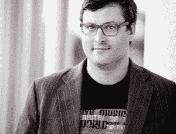

# SauceCon 扬声器简介:Titus Fortner

> 原文：<https://devops.com/saucecon-speaker-profile-titus-fortner/>

*这是第三篇关于 [SauceCon 2019](https://saucecon.com/) 演讲嘉宾的系列文章。SauceCon 将全球的 Sauce Labs 用户和持续测试专家聚集在一起，互相学习，提升他们的自动化测试和持续交付技能。今年的活动将于 4 月 23 日至 25 日在德克萨斯州奥斯汀举行。*

俗话说，“第三次是一种魅力。”当谈到 SauceCon 演讲者 Titus Fortner 时，老生常谈被证明是正确的:测试是他的第三职业。提图斯首先去了海军学院，学习核工程，并成为一名潜艇军官——周游世界，做从发射弹道导弹到帮助自动化和简化伊拉克总司令的高级职员之间的通信的一切事情。离开海军后，Titus 回到学校学习了一年的计算机科学，然后在一家初创公司找到了一份初级开发人员的工作。专注于测试自动化是一个意外，但是测试对整个系统和过程的影响立刻吸引了他。

Titus 随后成为 Selenium 项目的核心贡献者和 Watir 的项目负责人，Watir 是一个基于 Selenium 构建的开源测试库，以及许多其他与 Ruby gems 相关的测试。在加入 Sauce Labs 担任高级解决方案架构师之前，他还在五家不同的公司实施过自动化测试解决方案。如今，他与客户密切合作，帮助改善他们的测试实践。

在 SauceCon 2019 上，Titus 将展示“页面对象:你做错了。”虽然页面对象使新用户能够针对应用程序编写复杂的测试，但是 Titus 发现页面对象模式经常被误用。“关于什么是好的实施，有许多不同的想法，实际上我已经在某一点或另一点上尝试过其中的大多数，并且我的个人经验告诉我某些方法优于其他方法的建议，”他说。“聪明人不同意我的一些观点，我在 SauceCon 的目标是在解释我的偏好的同时展示双方的观点。”

当 Titus 无法说服客户如何更好地使用页面对象时，他会阅读、编写开源代码，并带着他那只喜欢坐车的盲犬去一日游。

在第三届年度 Sauce Labs 用户大会 SauceCon 2019 上，你可以听到 Titus 和其他 30 多位专家的演讲。要查看完整的演示列表或进行注册，请访问 [SauceCon](http://saucecon.com/) 网站。

— [丽贝卡·克莱默](https://devops.com/author/rebecca-cramer/)