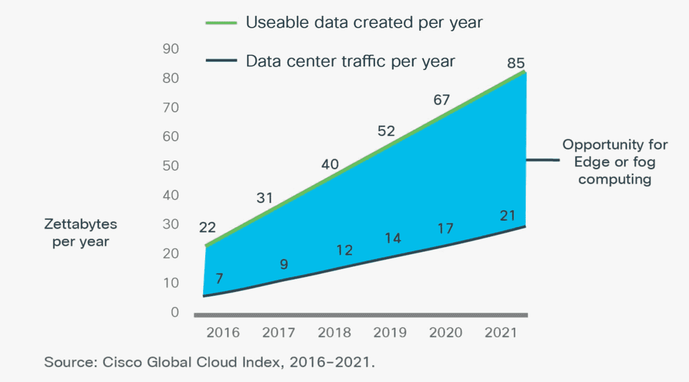

# 边缘计算:从短暂数据中拯救云

> 原文：<https://devops.com/edge-computing-saving-the-cloud-from-ephemeral-data/>

边缘计算正在迅速发展。上周 Linux 基金会关于 LF Edge 的新闻是 Edge 加速增长的又一个迹象。是什么让你突然产生了如此强烈的兴趣？这不仅仅是边缘设备的数量或对互操作性和安全性的担忧。将计算资源推向边缘可以将云和网络从短暂的数据浪潮中拯救出来。

边缘计算的概念当然不是新的。在公元前年(“连接之前”)，有大量的边缘计算箱。这些功能的单板计算机设计规范，如 VMEbus，STDbus，PC/104，CompactPCI，AdvancedTCA 和许多其他。当数据到达时，处理发生在边缘。以太网连接使得管理和结果共享更加容易，但是很少有架构依赖于将所有数据传送到网络中。

当然，有一个很大的例外:一种将所有数据拉入网络的商业模式。电信提供商将流量从边缘汇聚到他们的核心网络。随着数据流量加入语音流量，核心网络随着巨大的带宽和增加的服务而增长。核心网络互联。数据流量增长更快，推动网络进入云架构。在公元 70 年(“发布后”)，所有来自边缘的东西现在都连接到了云上。

数据流量的大部分增长来自于向视频内容的转移。用户期望更高分辨率的视频节目具有相同的无延迟性能。流媒体网络和服务质量(QoS)实现在内容交付方面取得了长足的进步。正在进行的 5G 基础设施部署将使移动设备成为一个强有力的下游竞争者。

物联网等上游应用呢？几乎同样的术语也适用于此。设备在边缘收集数据，并通过网关将其传输到云端。然而，大多数物联网应用有两个关键区别。如果到云的流连接中断，实时数据可能会丢失。此外，如果所有的数据都被传输，低带宽的谬论在规模上不起作用。在某个时刻，可能是一万、十万、一百万或更多的传感器，总带宽问题出现了。

就像在公元前时代一样，现在是时候重新考虑将所有物联网数据运送到上游，而不是在边缘采取措施。思科系统公司对数据趋势进行了广泛的研究，编写了白皮书“思科全球云指数:预测和方法，2016-2021 年”该公司指出，物联网很快将迎来“千兆字节时代”。思科估计，2016 年产生了 220ZB 的数据，预计到 2021 年，将有近 850ZB 的数据来自人、机器和其他东西。

现在是有趣的部分:思科还估计，多达 90%的数据是短暂的，短暂的数据没有保存的用处。即使只有 10%的数据是有用的，到 2021 年，预计数据中心的流量也会增加四倍。这是思科白皮书中的图 24:

边缘计算(Edge computing)或其近亲雾计算(fog computing)允许发生两件事:它可以预处理摄入的数据，消除协议和格式差异，以便所有到达云的东西都立即为算法做好准备。在云计算中，由于没有在计算前对数据进行洗牌而带来的任何节省都是有价值的，可以提高处理能力和网络带宽的可用性。算法的一部分可以很容易地被外包到边缘，也许是在将数据传送到上游进行大量分析之前进行抽取或过滤。

边缘计算的一个更大的用途可能是使用算法来避免将短暂的数据一起传送到上游。在边缘使用生成模型可以在识别有用数据方面产生巨大的差异。我们大多数人都听说过，没有人可以坐在那里看几个小时的来自多个来源的监控视频，寻找问题发展的一刻。考虑另一个与智能手机相连的 EKG 监护仪的例子:当患者在家休息且无压力时，EKG 处于应用程序学习的完全正常的范围内。当读数超出正常范围时，医生会得到警告，如果需要，原始数据会被传输进行观察。一个类似的例子是等待一个电机发生故障，同时监控其运行。

LF Edge initiative(T1)和 open fog Consortium(T2)的工作都在为边缘计算制定规范。这些倡议旨在建立可互操作的、安全的架构，其中协作处理挖掘数据。如果可以从边缘的有用和短暂的数据中高效地提取出感兴趣的项目，云与网络的负载将会更轻。边缘计算可能会更快地检测异常，让人们更快地了解正在发生的事情。结果将是更多可扩展的物联网应用，更有机会从所有这些数据中提供价值。

— [唐·迪丹吉](https://devops.com/author/don-dingee/)