# 第四届年度 DevOps 十几名获奖者揭晓

> 原文：<https://devops.com/4th-annual-devops-dozen-winners-announced/>

我们很高兴地宣布 2018 年 [DevOps 十几位获奖者](https://devopsdozen.com/)。当我推出 DevOps 系列时，我希望它们能够反映和认可成熟的 DevOps 领域中的精华。

今年，在我看来，毫无疑问，获奖者在 DevOps 社区中无人能及。事实上，整个提名过程是公开的；从公众中选出入围者；评委和他们使用的标准，确实代表了我们最大的努力。

祝贺 12 个类别中的每一位获奖者。能走到这一步已经是很大的成就了。但是，不仅仅祝贺获奖者，所有的决赛选手都应该为成为如此令人印象深刻的名单的一部分而感到自豪。

自提名程序开始以来，我们的团队已经进行了数千次投票，选出了每个类别的决赛选手。这不是一项简单的任务，因为我们无法实现自动化(DevOps );我们不得不用手来做。同样，非常感谢评委们做出的艰难决定，感谢 DevOps.com 的每一个人给予的帮助。

话不多说，下面是 2018 年 DevOps 十几名获奖者:

# 最佳 DevOps 开源项目

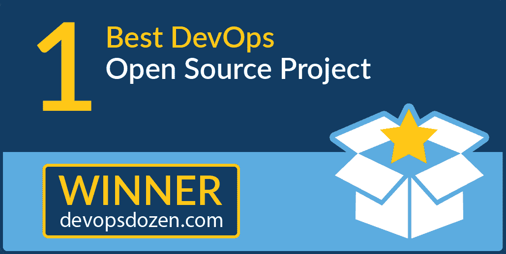 [Jenkins X](https://jenkins-x.io/) 是 2018 年最佳 DevOps 开源项目的获胜者。Jenkins X 使开发人员能够利用 Kubernetes 开发云- 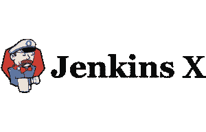原生应用程序，而不必了解 Kubernetes 的复杂性。开发人员可以通过使用 Jenkins X 引导的工作流来快速建立 CD 最佳实践和云开发，该工作流充分利用了 GitOps 或作为代码管理的环境。GitOps 的强大功能允许开发人员轻松定义、管理、部署和扩展具有完整历史和可追溯性的环境。Jenkins X 利用并打包了 Kubernetes 周围的云原生计算基金会社区的许多其他开源项目，如 Knative、Helm、Prometheus 和 Vault，提供了与它们的自动集成，并节省了用户自己集成所有这些组件的麻烦。【https://jenkins-x.io/】了解更多:[T4](https://jenkins-x.io/)

# 最佳 DevOps 商业解决方案

来自 JFrog 的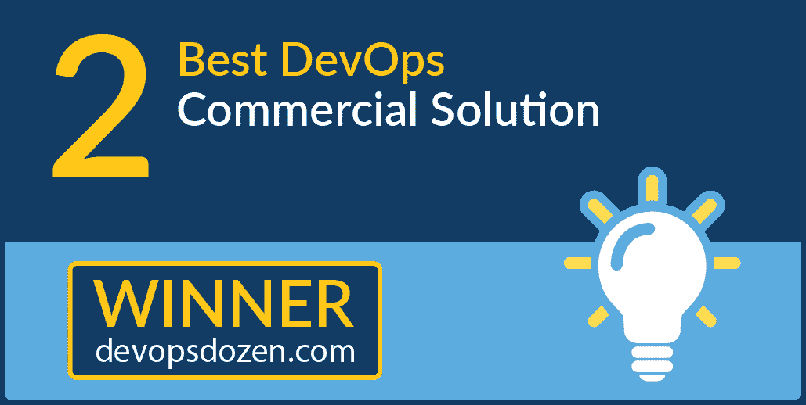 [JFrog Artifactory](https://jfrog.com/artifactory/features/) 获得了 2018 年最佳 DevOps 商业解决方案奖。JFrog Artifactory 是世界上唯一的通用存储库管理器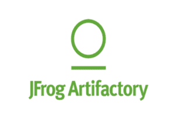,全球有超过 500 万开发人员支持 4，500 多家全球企业的开发组织，并支持所有主要的打包格式(超过 25 种)、构建工具和 CI 服务器。**2018 年，JFrog Artifactory 还获得了 IDC 的创新者奖和 451 Research 的 Firestarter 奖。** Artifactory 与您现有的生态系统相集成，支持端到端二进制管理，克服了使用不同软件包管理系统的复杂性，并为您的 CI/CD 工作流提供了一致性。Artifactory 有 OSS 和商业版本，支持整个企业的混合开发和部署。了解更多:[https://jfrog.com/artifactory/features/](https://jfrog.com/artifactory/features/)

# 最佳 DevOps 解决方案提供商执行官

[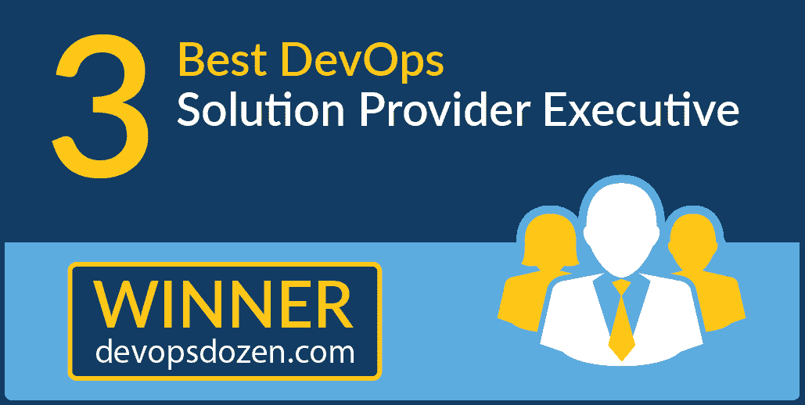](https://devops.com/wp-content/uploads/2018/01/ddbestspexec.png) 这一类别的投票结果实际上是 DevOps 领域的两位首席执行官打成平手。[萨查·劳里](https://www.cloudbees.com/team/sacha-labourey)是 CloudBees 的首席执行官和创始人，该公司通过建立世界上第一个自动化软件交付的端到端系统来推动持续经济。Sacha 还是 Codenvy(前 eXo Platform)的顾问委员会成员和投资者，也是 Wallix 的董事会成员和投资者。他被称赞为对技术和商业有深刻理解的梦想家。Sacha 在开源、云计算、软件开发等领域经验丰富。

[什洛米·本哈姆](https://www.linkedin.com/in/shlomibenhaim)是 JFrog 的联合创始人兼首席执行官。他拥有 20 多年创建高利润、高增长信息技术公司的经验。Shlomi 是 DevOps 领域公认的有远见的人，他现在已经带领一家公司从最初只有三位联合创始人(还有 Yoav Landman 和 Fred Simon)发展成为一家估值十亿美元的私人控股全球 DevOps 公司。随着过去两年 JFrog Xray 和 JFrog EnterprisePlus 平台的发布，Shlomi 继续预测市场动态，推动 JFrog 向前发展，以提供下一代解决方案。

# 最佳 DevOps 解决方案提供商

[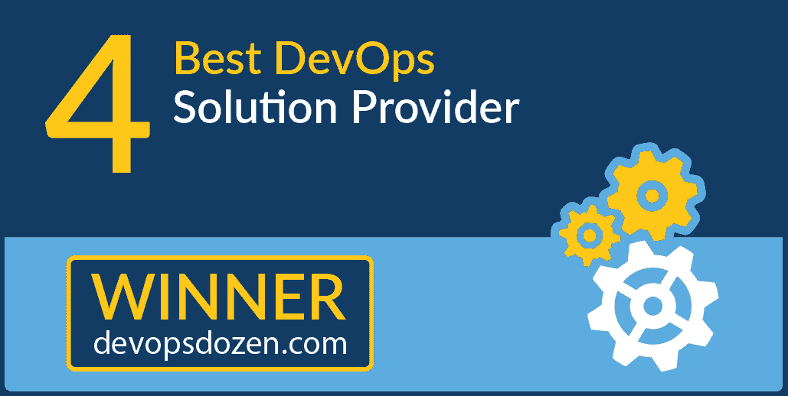](https://devops.com/wp-content/uploads/2018/01/solprovider.png) 电云连续第三年被 Gartner 评为应用发布流程编排领域的领先解决方案，在[Gartner 2018 年](https://electric-cloud.com/resources/whitepapers/gartner-magic-quadrant-application-release-orchestration/)应用发布流程编排关键能力的三个用例中，获得最高分。2018 年第四季度，Forrester 在新发布的报告“[The Forrester Wave:Continuous Delivery and Release Automation(CDRA)](https://electric-cloud.com/resources/whitepapers/forrester-wave-continuous-delivery-release-automation/)”中将电子云列为领导者此外，ElectricFlow 被 [EMA Research](https://electric-cloud.com/company/news/press-releases/item/ema-top3-ai-ml-devops-2018/) 选为其新报告《EMA 人工智能(AI)和机器学习(ML)前三大企业决策指南》中的前三大企业软件产品该报告为企业如何从人工智能和人工智能中获得最佳收益并不断发布更好的软件提供了务实的指导。电云也是美国 [DevOps 企业峰会](https://events.itrevolution.com/us/)的创始合作伙伴。

# 年度最具创新性的 DevOps 解决方案

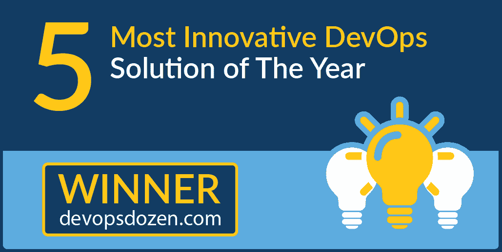 [ 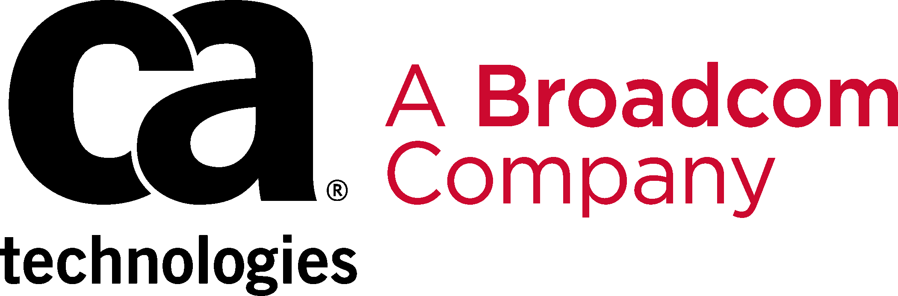 ](https://www.openmainframeproject.org/) CA Brightside 是 2018 年最具创新性 DevOps 解决方案的获奖者。CA Brightside 是第一个跨企业的 DevOps 解决方案，旨在大大提高开发团队的生产力和效率，以便像其他任何云平台一样为大型机控制、编写脚本和开发。CA Brightside 也是[开放大型机项目的 Zowe initiative](https://www.openmainframeproject.org/) 的基础元素，这是第一个针对大型机的开源项目，旨在吸引新一代 IT 管理员使用大型机平台，并使大型机更容易包含在跨多个平台的集成 DevOps 流程的更大范围内。CA Brightside 旨在通过允许开发团队通过命令行界面(CLI)使用熟悉的开源工具(如 Jenkins、Gradle 和 IntelliJ)来控制、编写和构建大型机，就像他们对任何其他云平台一样，从而使大型机集成到企业 DevOps 工作流中变得更加容易。了解更多:[https://www.ca.com/us/products/ca-brightside.html](https://www.ca.com/us/products/ca-brightside.html)

# 最佳德沃普斯福音传道者

Compuware 的总裁兼首席执行官克里斯·欧玛利是 2018 年 DevOps 的最佳布道者。Chris 是 DevOps 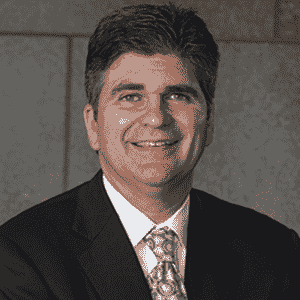的一个高谈阔论、充满激情的传播者，更具体地说，是大型机上的敏捷和 DevOps。在 Compuware 领导敏捷转型之后，他说出了自己的心声。无论是客户会议还是 LinkedIn 更新，这个行业中没有其他高管能像克里斯那样展现出他的活力。Chris 坚定不移地致力于让 Compuware 客户取得成功，并相信大型机开发运维在促进这一成功方面发挥着关键作用。自 2014 年末以来，Chris 一直致力于向市场宣传大型机开发运维及敏捷的优势，并开发新一代大型机软件来加速这一工作。Chris 在 2018 年的广泛媒体报道和社会宣传，包括超过 25 篇文章、博客、采访、播客和会议演示。看看他最近在 [ZDnet](https://www.zdnet.com/article/making-the-mainframe-relevant-in-the-world-of-agile-development-and-devops/) 、[福布斯](https://www.forbes.com/sites/jasonbloomberg/2018/10/27/secret-to-devops-success-be-like-lennon-and-mccartney/#5b2282fc440e)、[信息周刊](https://www.informationweek.com/strategic-cio/it-strategy/stop-calling-them-kids-make-the-most-of-its-generational-shift/a/d-id/1332447)、 [eWeek](https://www.eweek.com/development/how-compuware-is-bringing-agile-devops-to-mainframe-development) 、[DevOps.com 聊天](https://soundcloud.com/devopschat/chris-omalley-compuware)、 [AgileCXO](https://agilecxo.org/agile-leadership-podcast-interview-with-chris-omalley/) 和 [DevOps 企业峰会](https://www.youtube.com/watch?v=r3H1E2lY_ig)上的几篇帖子，以及 2018 年十几篇 [LinkedIn](https://www.linkedin.com/today/author/christophertomalley?trk=pprof-feed) 的帖子。

# 最佳 DevOps 转换

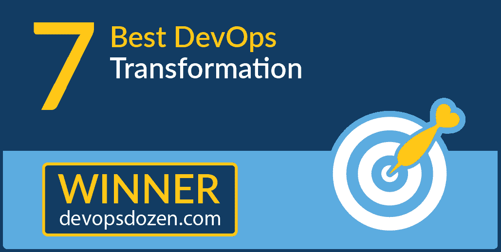  首都一号被评委选为 2018 年最佳 DevOps 改造。作为美国最知名的品牌之一，也是美国按存款额排名的前十大银行之一，Capital One 为商业客户、小型企业和个人消费者提供广泛的金融产品和服务，包括在线和亲临分行。该公司成立的愿景是，可以利用信息、技术和测试的力量，将高度定制的金融产品直接带给消费者。Capital One 软件开发组织中的数千名软件工程师、测试人员和其他专业人员正在将这一愿景变为现实。除了财务上的成功和规模，Capital One 在科技行业还有一个众所周知的当之无愧的声誉，即它是市场上最具创新性和开源友好型的企业之一。

检验这个案例研究: [Capital One 投资于自动化软件开发管道的持续交付](https://www.cloudbees.com/sites/default/files/case-study-capital-one_1.pdf)

# 最佳 DevOps 转型领导者

 [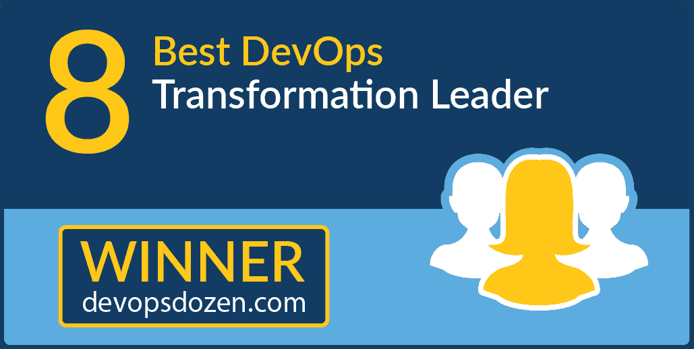 ](https://devops.com/wp-content/uploads/2018/01/devops-transformation-leader.png) 乔治·斯旺是 2018 年最佳 DevOps 转型领导者的获胜者。George 是 Autodesk 的工程解决方案总监，他的职责包括使用 CI/CD 解决方案和最佳实践来现代化和优化 Autodesk 的开发和部署功能。George 领导工程解决方案团队，负责基于 CI/CD 方法实现开发和部署解决方案的现代化。该团队使用 GitHub Enterprise 构建了一个源代码解决方案，并使用 Artifactory 构建了一个二进制管理解决方案。接下来，Autodesk 对 CloudBees Core 进行了标准化，并开始实施安全、自动化的 Jenkins 管道。这些管道通过持续交付，以更短的交付周期实现了持续集成和更频繁的部署。Swan 和他的团队取得了惊人的成果:“生产率提高了 10 倍。Autodesk 的一个团队在采用 CI/CD 后，生产力提高了 10 倍。如果我们能够在整个工程组织中复制其中的一小部分，那将会产生难以置信的影响。”

查看此案例研究: [Autodesk 通过 CI/CD 支持云计划和更快的版本](https://www.cloudbees.com/sites/default/files/case-study-autodesk.pdf)

# 最佳新 DevOps 解决方案公司

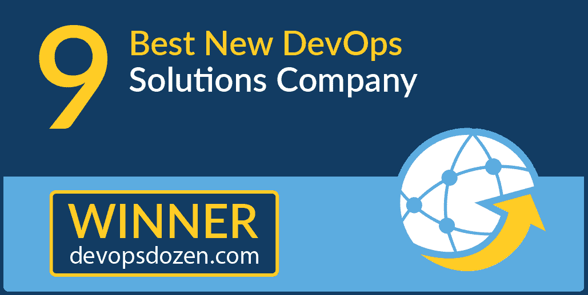 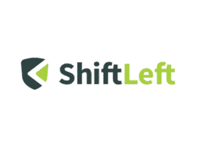 [ ShiftLeft ](https://www.shiftleft.io/) Inc .是 2018 年最佳新 DevOps 解决方案公司的获奖者，是特定于应用程序的云安全领域的创新者，提供业界首个全自动安全即服务(SECaaS)解决方案，该解决方案了解每个应用程序的每个版本的独特安全需求，并为其创建自定义安全和威胁检测。借助 ShiftLeft，DevOps 可以将威胁检测作为其 CI/CD 流程的一部分。ShiftLeft 的方法允许团队既能立即保护他们的应用程序，又能增强他们代码的安全性。该公司由一个在安全和云基础设施领域拥有丰富背景的团队创建，他们是沙盒、下一代防火墙、下一代电子支付网络和欺诈建模等技术以及几项开源计划的早期创新者。总部位于加州圣克拉拉的 ShiftLeft 得到了贝恩资本风险投资公司(Bain Capital Ventures)和梅菲尔德(Mayfield)的支持。更多信息，请参见 https://www.shiftleft.io/的[。](https://www.shiftleft.io/)

# 最佳 DevOps 书/电子书

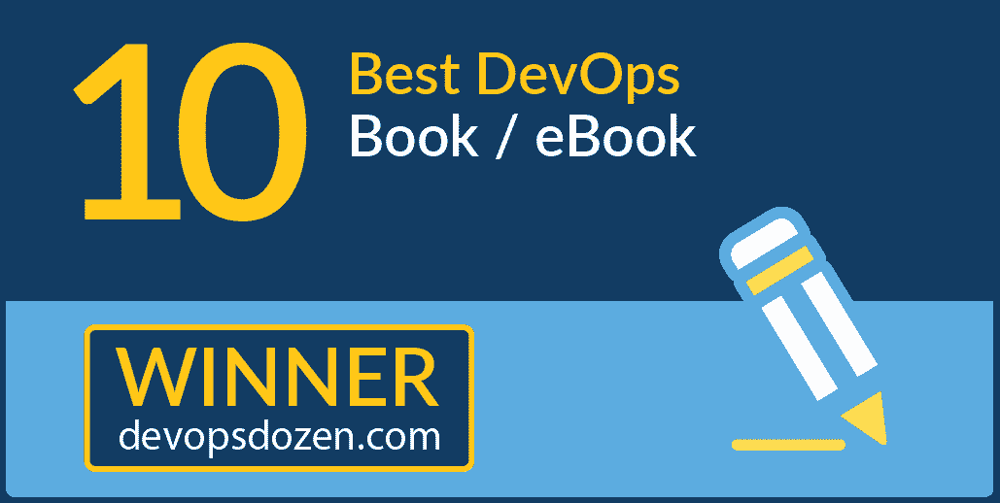 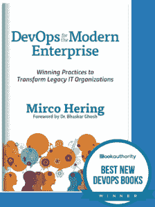《现代企业的开发应用》(DevOps for the Modern Enterprise)，埃森哲(Accenture)的米尔科·海林(Mirco Hering)获得 2018 年最佳开发应用图书奖。Mirco 是传统组织中管理 IT 的思想领袖，他在书中为 IT 经理描绘了一幅成功的路线图，向他们展示了如何创建正确的生态系统，如何让人们每天都发挥出最佳水平，以及如何将正确的技术放在驾驶座上，推动他们的组织走向成功。但是仅仅拥有正确的方法和工具不会神奇地改变一个组织；最困难的文化变革也是最有影响力的。使用敏捷、精益和 DevOps 的原则，以及来自企业世界的第一手例子，Mirco 解决了传统组织在转变为现代 IT 部门时面临的不同挑战。米尔科的书还被[图书权威](https://bookauthority.org/books/new-devops-books)列入“2019 年 26 本最佳新书”名单[亚马逊上的观点](https://www.amazon.com/DevOps-Modern-Enterprise-Practices-Organizations/dp/1942788193?tag=uuid10-20)。

# 年度最佳 DevOps 演示

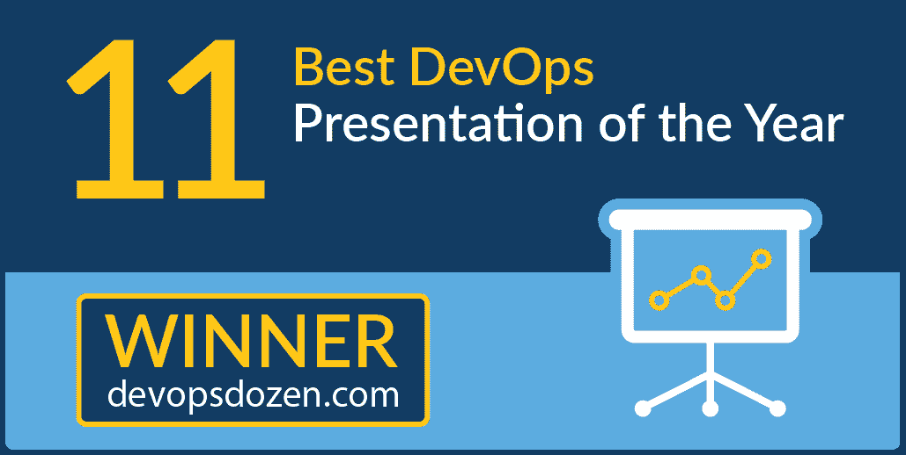“[项目到产品:大规模企业的实际现实](https://www.youtube.com/watch?v=3BQw5PTsCrU)”，2018 年伦敦 DevOps 企业峰会上的 30 分钟演讲，获得 2018 年最佳 DevOps 演讲奖。演讲邀请了目前在 Tasktop 担任高级 VSM 策略师的[卡门·迪尔多](https://www.linkedin.com/in/carmendeardo/)和 Tasktop 产品副总裁[妮可·布莱恩](https://www.linkedin.com/in/jnicolebryan/)。Carmen DeArdo 是 Nationwide Insurance 的 DevOps 技术总监，他是领导团队的一员，在 Nationwide 的 20 多个 IT 领域实施 DevOps 实践和技术。他被认为是 DevOps 行业的领导者，在 DevOps.com 定期就这些主题在会议上发言并撰写文章。他还定期接受分析师(如 Forrester)和技术出版物(如 TechBeacon)的采访，以获取研究和文章。他曾在以前的美国 doe 会议上介绍过。请同时查看 DevOps 企业峰会 2018 上 Carmen 的观点。

Nicole 在软件和产品开发方面有 20 多年的经验，主要致力于将数据可视化/信息图表和人为因素考虑引入敏捷和 DevOps 的前沿。她热衷于增加女性在技术领域的代表性，改善软件的创建和交付方式——让体验变得愉快、有趣甚至令人愉快。

[https://www.youtube.com/embed/3BQw5PTsCrU?feature=oembed](https://www.youtube.com/embed/3BQw5PTsCrU?feature=oembed)

# 年度最佳 DevOps.com 文章

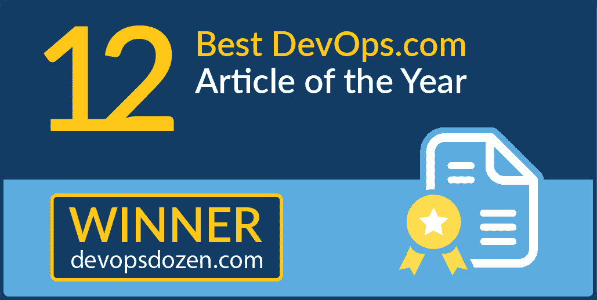[连续讨论，第 90 集:吉恩·金和 DOES18 演讲者](https://devops.com/continuous-discussions-episode-90-gene-kim-and-does18-speakers/)，[安德斯·瓦尔格伦](https://devops.com/author/anders-wallgren/)的作品获得 2018 年 DevOps.com 年度最佳文章奖。Anders 主持了 Gene Kim 和几位来自即将举行的 [DevOps 企业峰会拉斯维加斯](https://events.itrevolution.com/us/) (DOES18)会议的发言人，讨论 DevOps、会议计划和新一代运营和基础设施的新兴会议主题。

DOES 的 18 位发言人包括 **Cornelia Davis，**Pivotal 的高级技术总监； **Damon Edwards，**run deck 联合创始人兼首席产品官； **Mik Kersten** ，Tasktop 的 CEO 汤姆·莱蒙塞利，StackOverflow.com 的 SRE； **Gene Kim** ，IT 革命创始人，《DevOps 手册》、《凤凰计划》、《加速》的合著者；还有电云的**山姆·菲尔**和**安德斯·沃尔格伦。**

[查看博客](https://devops.com/continuous-discussions-episode-90-gene-kim-and-does18-speakers/)找出他们讨论的要点。

感谢所有投票和提名候选人的人。敬请关注 2019 DevOps 十几，并一如既往地感谢对 DevOps.com 和其他 MediaOps 社区大家庭的支持。如果您有问题，请写信给我们 [【电子邮件保护】](/cdn-cgi/l/email-protection#327676725657445d42411c515d5f) 。

— [Alan Shimel](https://devops.com/author/ashimmy/)