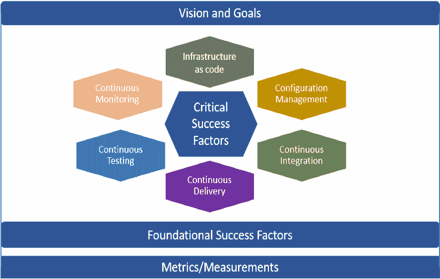

# 实现 DevOps？从策略开始

> 原文：<https://devops.com/implementing-devops-start-with-a-strategy/>

当今的组织关注于改进 IT 交付流程，并使其更上一层楼。如果做得好，DevOps 在实现这一目标的过程中起着关键作用。虽然开发运维的概念并不新鲜，但它已经存在了十多年——相当大比例的[组织](https://go.forrester.com/blogs/2018-the-year-of-enterprise-devops/)尚未实施开发运维，或者在利用开发运维实现预期收益方面面临挑战。为什么有些公司通过 DevOps 实现取得了成功，而其他公司却举步维艰？简单:那些让 DevOps 为他们工作的人带着一个清晰且可实施的策略开始了他们的旅程。事实上，许多组织已经[围绕 DevOps 形成了他们的商业战略](https://devops.com/wp-content/uploads/2018/06/Comcast2FINAL6.29.18.pdf.pdf?_hsenc=p2ANqtz-_fyyf2jfif78sYgZ6RpG9_sLMtCV1UfCDClym346a6E8bI-kAbYk1mjP0hDt4E7QSTZLgazomC5APJYx2jM2i1mTt0vjjS6JeCI1so8OtPyMDI0Tc&_hsmi=64070564)。

DevOps 和敏捷的关系是互补的；然而，DevOps 的实现必须与敏捷有所不同。在建立之前，需要将它视为常规 It 交付范围之外的独立计划。它需要战略思维、高度的专注和承诺才能取得成功。

## **devo PS 战略的主要支柱**

DevOps 战略的四大支柱是:

*   确定愿景和目标。
*   确定基本因素。
*   关键成功因素。
*   将战略建立在衡量的基础上，以跟踪进展和效益的实现。

### **愿景和目标**

驱动因素和挑战构成了愿景和目标的基础。在踏上开发运维之路之前，分析“现状”并了解当前的挑战和驱动因素至关重要。当前的挑战可能包括:

*   生产缺陷太多。
*   业务涉众要求团队无法交付的功能。
*   痛苦的部署。
*   团队倦怠和挫败感。
*   部署以仪式形式完成，多个团队随叫随到。

如果这些听起来很熟悉，那肯定是你的项目需要 DevOps 的信号。

创建愿景和目标的驱动因素可能是外部的，也可能是内部的。外部驱动因素可能通过满足可用性、可靠性、可用性、性能、功能、价值和上市时间方面的期望来提高客户满意度。内部驱动因素可能是提高运营效率(速度、吞吐量、质量)，或者提高员工忠诚度，提高技术能力，或者只是让部署不那么痛苦。

### **关键成功因素**

以下是实施 DevOps 管道的关键因素，包括持续集成、持续交付和部署。持续集成方面包括配置管理、代码打包、分支/主干实现、静态代码质量分析、代码审查和静态安全扫描。连续交付和部署的目标是以自动化的方式将代码从较低的环境转移到生产环境。作为持续交付的一部分，关键方面是在管道中嵌入持续测试，并自动化适用的测试——单元测试、系统测试、API 测试和/或浏览器测试，以及非功能性测试(性能和安全性)。另一个关键方面是将持续监控集成到管道中—基础架构监控(应用和数据库服务器)和应用最终用户监控，这提供了关于用户如何使用应用的关键输入和指标，并可用于改善客户体验。

Key pillars of DevOps strategy

### **基本成功因素**

基础因素对于开发运维在组织中取得成功至关重要。在开始旅程之前，确保基础因素到位，例如管理层的认可和支持、当前敏捷流程的成熟度、有益的文化、团队间的协作、CI/CD 工具和技术技能集的可用性。

敏捷项目团队很难专注于开发运维项目以及特定于 sprint 的“功能”需求。提高优先级的一个方法是在 sprint 中包含与 DevOps 相关的项目。也就是说，关注和实现 DevOps 目标可能具有挑战性，因为在冲刺阶段，他们可能会让位于功能需求。另一种选择是在项目内部(基于技术技能和创新倾向)成立一个以开发运维为中心的小组，负责构建和实施 CI/CD 渠道。如果有必要，这个群体可以通过供应商获得帮助或专业知识。事实证明，组建一个以开发运维为重点的小组有助于实现开发运维目标。

### **指标:识别、衡量和持续改进**

汤姆·狄马克有句名言，“你无法控制你无法衡量的东西。”在 DevOps 中，度量和测量是成功的关键，因为实现需要时间。因此，度量标准应该与目标和远景保持一致，以跟踪进展。同样至关重要的是确定已确定指标的有效性，对现有指标进行任何修改，以及确定和采用其他成功要素。

通过度量指标来量化实施开始时的“现状”是很有帮助的。这可以让你在前进的过程中看到每个方面的进展。

这些指标可以按照[平衡计分卡](https://hbr.org/1992/01/the-balanced-scorecard-measures-that-drive-performance-2)的视角进行分类:

*   财务(例如成本节约)。
*   客户观点(例如上市时间、每次部署的缺陷数量)。
*   内部视角(例如，每次冲刺的平均部署、成功部署的数量、每次部署的平均时间、平均修复时间)。
*   创新视角(例如，对渠道的改进数量)。

虽然有多个 DevOps 方面可以测量，但最好从小处着手，以免被测量所拖累。例如，您可以从获取每次部署的平均时间或上市时间开始，并在进行过程中添加其他指标。

## **结论**

DevOps 是当今组织的关键计划和重点领域。为了取得成功，DevOps 策略(在组织内提供清晰性和透明度的自上而下的方法)是必要的。开发运维战略的关键支柱有助于奠定基础，让组织做好准备，并在开发运维之旅中保持正轨。该策略可以是单个项目的项目计划的一部分，也可以用于扩展整个企业的开发运维计划。

— [吉里什·库卡尼](https://devops.com/author/girish-kulkarni/)