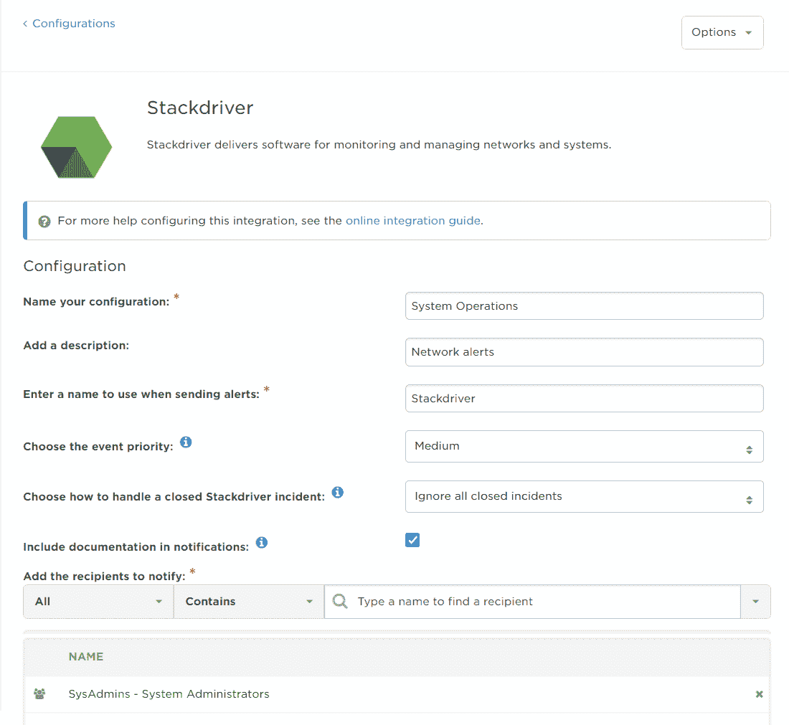

# xMatters 结合了 Google 的 Stackdriver APM 指标

> 原文：<https://devops.com/xmatters-incorporates-stackdriver-apm-metrics-from-google/>

作为 Google 云平台(GCP)上用于驱动 DevOps 流程的一组应用程序监控服务，Stackdriver 一直在稳步获得追随者，特别是自从 Google 将该服务的范围扩展到内部系统领域以来。今天，事件管理工具提供商 xMatters 宣布，它正在将 Stackdriver 生成的警报和数据集成到其工作流程中。

公司首席技术官 Abbas Haider Ali 表示，xMatters 事件管理软件现在将自动将 Stackdriver 数据转发给正确的人和系统，以帮助更快地协调和解决事件。海德尔·阿里说，Stackdriver insights 将被嵌入通知、合作邀请和服务管理标签中。

他说，目标是直接在用于访问事件管理平台的用户界面中，为 DevOps 团队提供更多关于特定问题的上下文。

Google 通过 Stackdriver 不仅提供了应用程序性能管理(APM)工具，还有效地将站点可靠性工程师(SREs)的最佳实践嵌入到服务中。海德尔·阿里说，虽然谷歌定义的最佳实践非常固执，但它们正开始作为实施 DevOps 过程的一种具体方法而受到关注。

对 Stackdriver 的支持是在最近发布的 xMatters 更新之后提供的，该更新添加了一个事件泛洪控制功能，以抑制连续出现的类似请求，这是为了降低单个事件所产生的噪音水平。该公司还增加了无限的事件可见性功能，允许组织从过去的事件中获得洞察力，以更快地确定问题的潜在根本原因。

当然，虽然谷歌可能发明了 SRE 的概念，但很明显，其他云服务提供商正在提出自己的风格，许多内部 it 运营团队可能会创建自己的对等物。但是随着 SRE 概念的不断深入，企业范围内采用 DevOps 过程的比率应该会增加。大多数企业 IT 组织目前面临的挑战是，他们的内部团队主要由管理员组成，而不是知道如何以编程方式将基础架构作为代码进行管理的工程师。许多这样的组织要么雇佣以前的开发人员成为 sre，要么投资培训以提升现有 IT 管理员的技能。

但是，随着越来越多的组织接受 SRE 概念，他们中的许多人将寻求创建开发运维的闭环方法，使他们能够显著缩短从发现问题或事件到将其分配到持续集成/持续部署(CI/CD)环境中以编程方式解决之间的时间。

与此同时，开发运维流程和事件管理系统之间可能存在的任何差距正在不断缩小。并非每个组织都必须雇用 sre 来实现这一目标。但是，那些有能力雇用和保留 sre 的组织应该预料到，他们会坚持将事件管理与一组更大的复杂 DevOps 流程结合起来。

— [迈克·维扎德](https://devops.com/author/mike-vizard/)