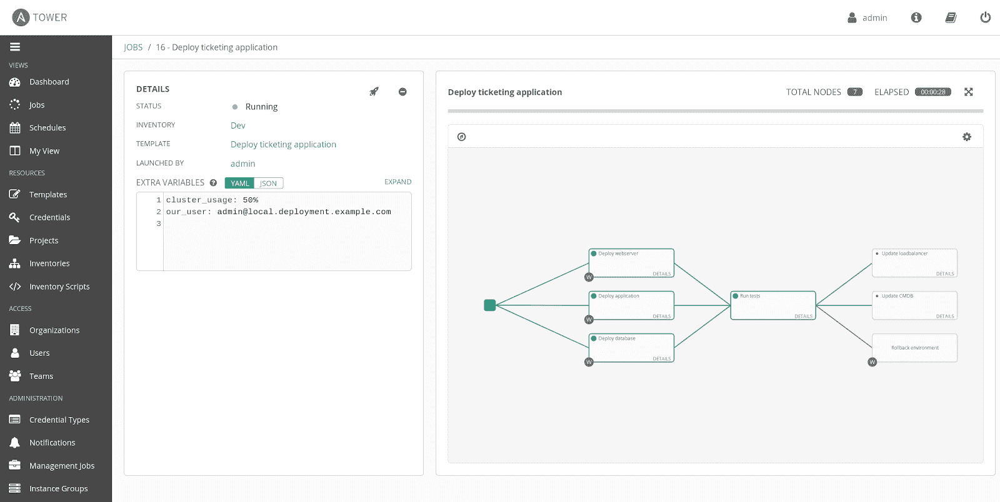

# Red Hat 为 Ansible 自动化框架增加了对嵌套工作流的支持

> 原文：<https://devops.com/red-hat-adds-support-for-nested-workflows-to-ansible-automation-framework/>

Red Hat 今天宣布，它将增加对使用开源 Ansible automation framework 创建的[嵌套剧本的支持，这反过来将使复杂的 it 流程更容易自动化。](https://www.businesswire.com/news/home/20190109005112/en/Red-Hat-Unifies-Automation-Hybrid-Cloud-Management)

Ansible 的产品经理 Bill Nottingham 表示，目标是让 DevOps 团队能够重用现有的 Ansible 剧本，使用 Ansible Tower 的 3.4 版本启动一系列嵌套的 IT 工作和工作流，控制台 Red Hat 提供了创建和管理 Ansible 剧本的功能。

Ansible Tower 的 3.4 版本现在还可以将一个 it 作业分割成一系列更小的作业，这些作业可以分布在一个集群中以加速执行。他说，这种能力使得扩大可翻译剧本的处理范围成为可能。

最后，红帽还宣布 Ansible 塔。3.4 现在可以在 Red Hat Enterprise Linux 上以联邦信息处理标准(FIPS)兼容模式运行。

Nottingham 表示，Red Hat 预计在一组嵌套流程中重用可翻译剧本的能力将鼓励 IT 组织创建更多剧本，因为现在更容易将它们作为一组模块化组件重用。他补充说，IT 组织甚至可以使用 Ansible Tower 中的调度机制，使启动作业依赖于其他作业的完成。

尽管 IT 自动化框架的采用并不均衡，但在过去几年中，随着 IT 环境变得越来越复杂，IT 组织越来越依赖于它们来管理任务。随着 IT 组织部署更多基于微服务的应用程序，这种复杂性只会增加，而微服务是使用需要频繁更新的容器创建的。IT 自动化框架对于弥补熟练 IT 管理员的长期短缺也大有帮助。随着应用程序的数量和更新速度不断加快，这一能力变得尤为重要。

大多数 IT 管理员的编程技能有限，这就是为什么一种以 Ansible 开源项目的形式实现 IT 自动化的声明性方法越来越受欢迎的原因。事实上，由于自动化，传统的 IT 指标(如每个管理员管理的服务器数量)正变得越来越过时。

It 自动化框架成为常规而非例外可能还需要一段时间。但是，随着 IT 社区现在接近 21 世纪第二个十年的尾声，依赖于上世纪末开发的手动流程在这个分布式工作负载时代不再可行。事实上，无论应用程序部署在哪里，开发运维时代的期望都是现有的 IT 运营团队能够管理它们，而无需雇用额外的 IT 管理员。

— [迈克·维扎德](https://devops.com/author/mike-vizard/)