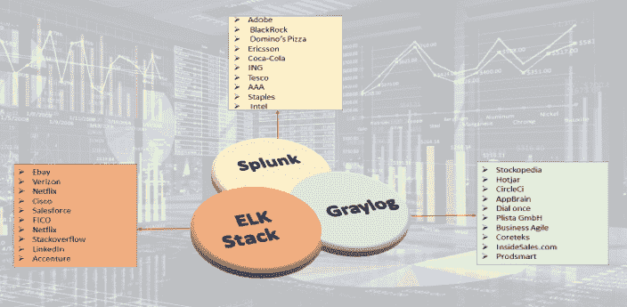

# 2018 年最佳:日志监控和分析:比较 ELK、Splunk 和 Graylog

> 原文：<https://devops.com/log-monitoring-and-analysis-comparing-elk-splunk-and-graylog/>

在我们结束 2018 年之际，我们 DevOps.com 想要强调今年最受欢迎的五篇文章。以下是我们为期一周的 2018 年最佳系列的第五期。

当组织面临中断和各种安全威胁时，监控整个应用程序平台对于了解威胁来源或中断发生的位置，以及验证事件、日志和跟踪以了解该时间点的系统行为并采取预测和纠正措施至关重要。监控日志和日志分析对于任何 IT 运营团队来说都非常重要，有助于识别入侵企图和错误配置、跟踪应用程序性能、提高客户满意度、增强针对网络攻击的安全性、执行根本原因分析以及根据日志分析来分析系统行为、性能、措施和指标。

根据 Gartner 的报告，到 2019 年，监控工具和 APM 工具的市场预计将增长到 49.8 亿美元，日志监控和分析将成为 AI Ops 事实上的一部分。日志分析工具正在成为监控应用程序和基础设施(硬件和网络)的低成本解决方案。

随着日志监控分析工具市场的成熟，有商业和开源工具可供选择。日志监控工具的一些关键功能包括强大的搜索功能、仪表板的实时可见性、历史分析、报告、警报通知、阈值和触发警报、图表测量和指标、应用程序性能监控和分析以及跟踪事件。本文主要关注日志监控工具 ELK、Splunk 和 Graylog 的区别。

## ELK、Splunk 和 Graylog

Elastic 为开源和商业(云和企业)日志监控工具提供了可以说是最流行的日志管理平台。Elastic Stack——通常被称为 ELK Stack——结合了 Elasticsearch、Logstash 和 Kibana。Elasticsearch 是一个基于 Apache Lucene 的现代搜索和分析引擎，而 Logstash 提供数据处理和丰富。Kibana 提供日志发现和可视化。

Splunk 是一个平台，用于搜索、分析和可视化从网站、应用程序、传感器、设备等收集的机器生成数据。覆盖整个基础设施领域。它与不同的日志文件通信，并将文件数据以事件的形式存储到本地索引中。它提供了最简单的搜索功能，并具有从多个来源收集日志的广泛选项。Splunk 有 SaaS 版和企业版。

Graylog 提供开源日志监控工具，提供类似于 ELK 和 Splunk 的功能。Graylog 执行集中式日志监控；其中 Graylog 用于数据处理和 Elasticsearch，MongoDB 用于搜索和存储。它提供了日志归档和对度量和测量的深入研究。

下表提供了基于 ELK、Splunk 和 Graylog 的开源/免费试用版的比较分析。

Top 10 Companies using log monitoring tools (ELK Stack, Splunk, Graylog). Information source collected from ELK, Splunk and Graylog websites.

## 功能比较

| **特性** | **弹性堆叠** | **Splunk** | **灰色日志** |
| **通用** |  |  |  |
| 可用的许可证/版本 | **Open source,** **[Commercial](https://www.elastic.co/subscriptions)****云:**基于集群(内存、存储、数据中心区域)**企业:**基于/实例定价**免费试用:**14 天 | **Commercial****免费:** 500MB 索引/天**Splunk Cloud:** 根据每天向云传输的数据定价&5GB 数据 15 天免费试用可用于搜索和分析**Splunk Enterprise:** 基于摄取数据的定价 | **Open Source:** Based on daily volume, price per month**企业:**5gb 以下/天免费 |
| 实现语言和日志格式 | JavaJSON | C++, PythonJSON，。CSV，文本文件 | JavaGLEF-格雷洛扩展日志格式 |
| Community Support企业支持 | Available: Well Documented提供 24* 7 支持 | Available: Well Documented可用:直接联系客户支持团队 | Available: Well Documented可用:来自 Graylog 工程师的无限支持 |
| 支持的服务器平台 | 所有 OS-x、Window、Red hat | Linux、操作系统 Solaris 和 Windows | Linux，Ubuntu，Centos，Windows |
| 易于配置 | 需要设置 Elasticsearch，Logstash，Kibana，beats 与集群配置和中等复杂的设置。 | 具有来自客户端的服务器和转发器的单一平台，设置起来不太复杂。 | Need to set up Graylog – Graylog web server, Elasticsearch, MongoDB and medium complex to set up. |
| 涉及的基本组件 | Elasticsearch – Search and storagelog stash–数据处理ki Bana–可视化beats–日志收集器和发货器 |  Splunk ServerSplunk 转发器 | Graylog – Data processing and web interface弹性搜索–日志存储MongoDB–配置数据存储 |
| **数据** |  |  |  |
| 数据收集 | Beats, Logstash, Elasticsearch Ingest nodes | Using app-add-ons and Splunk forwarders | GELF TCP/UDP消息输入和内容包(输入、提取器、输出流、仪表板配置)灰色边车 |
| 数据格式 | Common Log files format例如:nginx，tomcat 日志常用格式。 | 接受任何数据类型，包括。csv、JSON、日志文件、xml 等。 | Common log files formats. Ex: nginx [ error_logs, access_logs]系统日志，系统日志，GLEF 格式 |
| 附加数据输入 | HTTP、TCP、脚本输入、系统日志输入 | HTTP, TCP, Syslog input, various Log stash plugin | GLEF 卡夫卡，GLEF HTTP，Beats，消息输入，rsyslog 和 syslog-ng |
| 用字段创建数据库和数据库模式 | Elastic search – document oriented DB特定 beats 插件/日志转发器中定义的模式。 | Splunk uses built-in data structure, and stores the indexes to disk. | Elasticsearch – to store the logsMongoDB——存储元数据和死信队列消息特定内容包中定义的模式 |
| Data Correlation&聚合 | 通过聚合过滤器和 logstash 关联事件过滤器完成 | Done through index event correlate commands装修工。 | 通过聚集过滤器、装饰器来完成。 |
| 集中式日志支持 | 适用于原木运输商 | Splunk 企业转发器、通用转发器提供 | 可与日志收集器 Graylog sidecar、RSyslog 一起使用。 |
| 数据导入/导出 | 从各种来源导入/导出数据，如流入数据库 | 可以通过 Splunk DB 连接到关系数据库来完成导出/导入 | GELF output pluginREST API |
| 数据传输 | 卡夫卡、拉比特、里兹 | Persistent Queue处理管道组件 | 阿帕奇卡夫卡，RabbitMQ (AMPQ) |
| 数据收集间隔 | 实时流和批处理 | 实时流和批处理 | 实时流和批处理 |
| **搜索** |  |  |  |
| 搜索能力 | 通过弹性搜索提供高度可伸缩的全文搜索和分析引擎 | 提供动态数据探索提取一切，因为它有自己的搜索语言。 | 基于[实时 UDP/GELF 日志](https://www.itcentralstation.com/product_reviews/graylog-review-49012-by-john-paul-dienst)的全文搜索，具有直观的搜索界面 |
| 搜索语言 | 查询 DSL (Lucene) | SPL (Splunk 处理语言) | 非常接近 Lucene 语法 |
| 用于读/写操作的协议 | REST API，HTTP API | REST API，HTTP API | HTTP API，REST API |
| Log Filter搜索过滤 | Grok Filter Plugin具有字段级别、保存的搜索、图表等的搜索过滤器。 | 过滤日志将转换应用于事件 | Uses Drools rules, extractors, fields filter黑名单， |
| **可视化** |  |  |  |
| Reporting历史数据管理 | Available in X-Pack component快速生成任何 kibana 可视化或仪表板和任何原始数据的报告。每份报告都经过打印优化，可定制且为 PDF 格式 | Built-in feature为保存的搜索、可视化或仪表板创建报告，设置计划报告，配置支持历史和流数据的计划报告的优先级 | No built-in reporting capabilityREST API 可以用来生成自己的历史数据和流数据报告。 |
| 发信号 | Supported through X-pack / watcher configurations can be created可用于向 AIOps 工具发送警报的集成 | Built-in feature, support real time or scheduled alerting可用于向 AIOps 工具发送警报的集成 | Built-in feature基于流发出的警报可用于向 AIOps 工具发送警报的集成 |
| **监控** |  |  |  |
| 服务器，设备日志监控 | 使用 Metricbeat、Filebeats 捕获与服务器相关的日志 | 将 Splunk Insight 用于基础设施 | 使用灰度对数节拍，NXlog |
| 网络日志监控 | 通过数据包捕获网络日志 | 使用 Splunk MINT 捕获网络日志 | 使用 SNMP 和 netflow 插件 |
| 云日志监控 | 使用 Logstash、Filebeat、模块 | Configurable via add-ons in Splunk, for different clouds | 可用于从云中提取日志的插件。 |
| 容器日志监控 | 对 Docker 日志使用 Logstash、文件节拍和度量节拍、Logstash 处理器 | Docker 的 Splunk 日志记录驱动程序 | 使用 Filebeat 和本机 Graylog (GELF 日志记录驱动程序)集成 |
| Kubernetes 编排监控 | 使用 Fluentd、metric beat 从 Kubernetes 获取日志 | 使用为 Kubernetes 构建的收集器 | 使用 Filebeat 收集器边车 |
| 数据库日志监控 | 通过 Filebeat 模块、Logstash 启用 | 通过 Splunk 插件为不同的数据库和 Splunk 数据库连接启用 | 通过附加插件和不同数据库的 GLEF 库实现，包括 mysql、mongodb 等。 |
| 最终用户事务监控、应用性能监控 | 通过 APM 和不同的 beats、Logstash 关联、X-Pack 组件启用。 | 通过 Splunk 综合监控应用、Splunk ITSI 模块、Splunk MINT SDK 启用。 | 来自 marketplace 的应用程序日志和加载项。 |
| Analytics(原因分析、异常检测等) | 通过 X-Pack 支持机器学习。 | Splunk IT 服务智能模块为异常情况等提供机器学习算法。 | 没有现成的机器学习支持 |
| **其他** |  |  |  |
| 定制/可扩展性 | Can create customized dashboards with Kibana controls and search queries.自定义指标集和插件可以创建自定义规则来定义阈值和警报可以通过 webhooks /插件扩展/集成其他工具，并通过 REST HTTP/JSON API 进行编程访问托管弹性堆栈通过 X-Pack 提供开箱即用的用户管理功能。 | Flexible to add/ edit new components and views to Splunk dashboards using SplunkJs stack and Javascripts.可以使用 statsD、collectD 创建自定义指标索引并收集数据。可以通过 webhooks /插件扩展/集成其他工具，并通过 REST HTTP/JSON API 和 1000 多个插件进行编程访问。开箱即用的用户管理。Slunk 企业安全 | Flexible to add Custom dashboards based on stream using widgets, graphs, CLI stream dashboards.可以创建自定义索引模型，自定义提取器与使用 REST API，内容包所需的指标。通过在流和条件上定义的自定义警报，在默认条件下提供很少的现成警报。Graylog 中有插件，可以与其他工具集成提供用户管理、LDAP 和其他身份验证机制(单点登录/双因素)集成。 |
| 可量测性 | 支持主/从集群的可伸缩性(水平)和高可用性。 | 可通过 Splunk 企业组件的分布式部署进行扩展，用于数据输入、索引和搜索。 | es、MongoDB、Graylog 服务器上的多个节点以及任何队列(Kafka / RabbitMQ)都是可伸缩的。 |
| 备份/恢复 | Can take snapshots backup of indexes to any external repository such as S3, Azure, etc.通过 Elasticsearch 策展人保留 ES。 | 支持基于策略的配置、索引和热数据库存储桶的备份。 | Archival Plugin available in Graylog Enterprise, to back up indexes and restore to new cluster, via web UI, Rest API |

日志监控作为完整堆栈监控的一部分非常重要，它可以为更快的故障排除提供更好的见解。日志监控工具的选择将取决于您的需求、基础设施、价格以及监控和维护需求。Elasticstack、Splunk 和 Graylog 都有用于日志监控的企业级平台和解决方案，并且都广泛用于多个企业和领域。

— [Ritu Bhargava](https://devops.com/author/ritu-bhargava/)