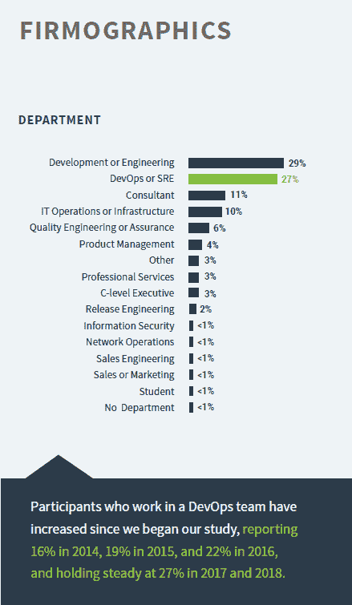

# 文化，在 DevOps 变化不大

> 原文：<https://devops.com/culture-not-changing-much-in-devops/>

从 DevOps 运动的第一天起，困扰我的一件事就是如何用一种奇怪的二分法来看待文化。这同时也是 DevOps 最大的优势和最大的弱点。

当然，这种现象有一个简单合理的解释。DevOps 想改变文化。抵制变革的文化被归类为“坏的”，而不抵制变革的文化被归类为“好的”事情从来没有那么简单，但这就是写照。

十年后，你会认为我们会有大规模的 IT 文化变革，在某个层面上(从试点项目到公司标准的规模上)支持几乎所有地方的 DevOps 计划。

但数据似乎表明事实并非如此。这里声明:我更倾向于“什么是 DevOps，真的吗？”问题。我不认为这在这里有什么关系，因为我指的是来自于[DORA“devo PS 研究报告状态](https://cloudplatformonline.com/2018-state-of-devops.html)”的数据，这是你们 1900 个人说的，不是我。

Image Credit: DORA State of DevOps Report

这份报告的大部分报道是由那些将整个职业生涯都押在 DevOps 上的人撰写的——这是一个坚实的赌注，但可能会导致虚假的报道，这种报道将所有积极因素都带走，并将它们高高举起。而且有许多积极的方面有待发现。但我注意到一种趋势，那就是不以批判的眼光看待数据。今天我想重点介绍的是朵拉所谓的“公司地理学”——按标题对受访者进行分类。

只有 27%的回答者属于 DevOps 团队。大概是因为 Google 是 DORA 的赞助商，所以它将站点可靠性工程包括在 DevOps 团队中，这是一个公平的包含，因为 sre 按照定义就是在做 DevOps。

考虑代表“文化变化”的数据点，在这个世界中，被调查者通过自我认同，正在做 DevOps。有些人会认为这是错误的看待方式，但文化人士不断提出的一个问题是打破孤岛，围绕产品或产品组合组织，而不是开发和运营。但看起来更像是组织在筒仓中敲出洞来，并通过它们进行沟通——这意味着我们应该更多地关注开发人员的这种风格，并停止喋喋不休地谈论组织变革。同样，这非常符合我的世界观，我的世界观一直是“共享硬件的专家不会转移到 DevOps 团队。”例如，EMC 专家为整个组织增加了价值，因为他们具有特定领域的知识，而不是因为他们对整个 DevOps 工具集有深刻的理解。一旦你为存储、网络和平台专家划分了例外，让每个人都加入 DevOps 团队就没什么意义了。

我不会猜测为什么只有 27%的人被转移到专门的团队，也不会猜测为什么这个数字从 2017 年开始没有上升。我倾向于“因为没有必要”，但当这种讨论获得动力时，可能会有两个阵营，因为更多的报告显示变化率很低——A 组将是，“因为那些人抵制变化”，而 B 组将是，“因为那些人*不觉得他们需要变化。”你猜怎么着？那会是同一批人，那个讨论的角度就无关紧要了。重要的一点是，“你是否完成了所有需要完成的事情，你的结构是什么？”这就是讨论的实质所在。因为根据推断，参与 DORA 调查的 73%的人在做 DevOps，而不是在一个专门的(例如:重组的)团队。*

这完全没问题，只要他们实现了目标，这才是最重要的。当决定朝某个方向前进时，方法是有用的，但交付是应该衡量的事情——现在通常是这样。

唐·麦克维蒂