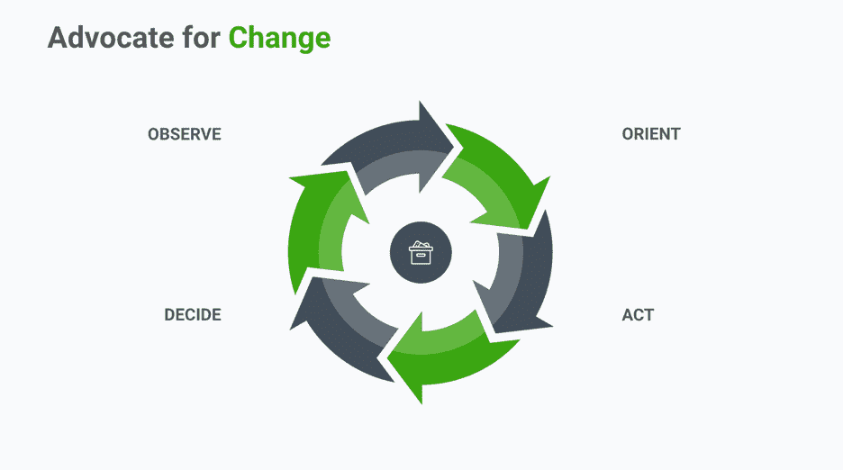

# 如何成为一名优秀的工程经理

> 原文：<https://devops.com/how-to-become-a-great-engineering-manager/>

我最近写了关于 10 倍软件工程师和 20 倍软件工程师的属性。因此，我收到了一些意见，建议我为工程经理创建一个类似的列表。我在网上查了一下，找到了几篇文章，但是没有一篇在我脑海中传达了一个完整的列表。如果你认为软件开发效率已经成为高管在[的第一要务，排名高于获得工程人才或资本，那么我想这是一个值得讨论的话题！工程经理可能会对他们工程团队的生产力产生最大的影响。](https://anaxi.com/blog/2018/11/05/engineering-efficiency-is-now-the-biggest-challenge-to-companies/)

我将首先回顾一个好的工程经理的品质，然后列出是什么造就了一个伟大的工程经理。

## 优秀工程经理的 10 个特质

我试着按优先顺序排列这个列表，从基本到额外。欢迎在评论中给我你对此的看法。

1.  **相信别人**

如果你指的是什么最大程度地破坏了开发者的生产力，信任是它的核心。管理者需要信任他们的团队，给他们一些空间。微观管理意味着破坏团队完成工作的技能和能力，因此破坏他们的动力和自信(顺便说一下，他们需要解决困难的问题)。管理者和他们的团队之间的信任应该是他们关系的基础。这是经理的角色和工作来创造它，而不是相反。所以首先，相信你的团队。

2.  **情商和建立信任的能力**

这与第一点联系在一起。你需要团队内部的相互信任，团队才能运转良好。再说一遍，经理的工作就是确保他们的团队信任他们。经理是如何做到这一点的？通过展示情商。

工程经理必须确保自己有时间回答问题，即使他们不想被打断。这可能与高效率背道而驰，但经理们花时间建立人际关系是很重要的，这样在团队内部以及与经理之间就能自然地进行坦诚和开放的对话。

另外很重要的一点是倾听任何人和每个人。当团队开会讨论他们计划做的项目时，房间里的每个人都需要被倾听和考虑。经理需要尊重他们团队能够带来的任何经验或见解。团队中的任何一个成员都可能是某个特定主题的最博学的人。

现在，这肯定不是迪斯尼乐园:经理们有时可能需要强硬和坚定不移。但在这种情况下，保持来之不易的信任不变的原因是透明的，这很重要。

3.  **保护团队不受干扰的能力**

开发人员非常讨厌中断和会议(把它们看作是有计划的中断),这是有原因的。他们实际上摧毁了他们的生产力。开发人员喜欢进展迅速的项目；它们让人精神振奋！经理们会帮他们一个大忙，消除干扰，确保他们有大量不受干扰的“创造者时间”

一个典型的例子是关于某个技术话题的长时间电子邮件交流，但没有解决方案。经理可以简单地让每个人在一个房间里一起讨论 10 分钟，迅速解决问题。

4.  **管理团队动力的能力**

团队的动机与他们的产出和他们发布的成功直接相关。有很多方法可以保持高动力。以下是几个例子:

*   帮助团队通过他们对公司的影响来看待他们的工作。
*   不要太担心失败。事情总是会失败:构建、部署、错过时间表等等。如果事情失败了，承担责任，专注于学习。关键是不需要两次修复同一个问题。这会给你的团队一个行动和成长的心态。
*   庆祝每一项成就，无论其大小。并对参与者大加赞赏。
*   要透明。默认为过度沟通。虽然一些领导者认为他们需要保护他们的团队免受高管层发生的事情的影响，以防止分心，但有效的保护和无意中否认工程师重要的公司背景是有区别的。经理们希望他们的团队感到被包括在内，并投入到公司的发展方向中。

5.  **强烈的职业道德和与公司文化的凝聚力**

职业道德意味着在你期望你的团队行为的所有方面都是模范。以身作则。管理者必须接受公司文化，否则会给团队成员发出是否应该接受公司文化的混淆信号。

这也意味着保护你的团队远离那些没有相应行动的人。例如，雇用一个拥有大量资历和经验的人，如果他们的价值观与公司的价值观不同，仍然可能是一场灾难。或者，不幸的是，不得不解雇那些不具有团队精神或不符合公司和团队文化的人，无论他们的技能水平如何。

优秀的管理者会牢记，团队作为一个整体的生产力是重要的，而不是个人的表现。

6.  **倡导变革，不断寻求良性发展**

优秀的管理者在团队中树立积极发展的心态。他们采取一种不断寻求改善某种状况的心态。当一个过程很慢或很麻烦时，他们会试图改变它，让它变得更好。一种方法是使用 OODA 循环:观察，定位，决定，行动。

**

7.  **能够与工程部门以外的部门合作**

非技术涉众使用的语言可能与开发团队的语言非常不同。然而，优秀的经理不希望成为唯一的联系人，因为他们会给项目带来潜在的负担——对 T2 的强烈依赖。他们倾向于让他们的团队参与相关讨论，但要确保他们保护团队成员不被连续打断。优秀的经理会努力成为*的第一个*联系人*、*，这与成为单一联系人有很大的不同。

8.  **指导能力**

有效的经理是由他们的软件团队的有效性来衡量的。他们所能做的任何让团队中的每个人变得更好的事情都会让他们的团队变得更好。大多数指导实际上是为团队成员牵线搭桥，让他们参与与他们的兴趣、他们想要创造的价值以及他们想要如何成长相一致的高影响力项目。这就是动力变得有机的时候。

关于一对一会议的文章已经很多了，我就不多说了。但是指导也发生在每一天，每一个场合。例如，如果一个经理碰巧审查代码或解释某些约定，他们一定要清楚地解释团队为什么以特定的方式做某事的原因。好经理是伟大的老师。

9.  **技术素养和解决问题的技能**

一方面，技术上有能力的管理人员将对他们管理的工作有更好的处理，因此能够更好地提出建议和评估必要的权衡。另一方面，有技术天赋的经理通常更能赢得团队的尊重。非技术经理可能很难管理高绩效的个人贡献者，他们往往很难接受不完全了解他们技能的经理的命令。

但是，如果你没有任何工程背景，这并不意味着你不能成为一个好的——甚至是伟大的——经理。我建议你通过与你的团队的每一次互动来了解项目的技术层面(谦逊地)，可能的话在你的业余时间。拥有足够的技术经验来理解项目和决策，并有能力信任他人的技术深度，这真的很有效。

10.  **做出艰难决策和管理冲突的能力**

好的工程经理会做出勇敢的决定，即使这并不受欢迎。他们不会做出错误的决定，仅仅因为这在社会上是正确的，而且他们的团队建议这样做。优秀的工程经理关注的是道路和他们所信仰的价值观，而不仅仅是他们所面临的眼前问题。他们选择最佳行业实践不仅仅是因为他们会吸引“合适的”人才。例如，管理者会避免自动使用最新的技术:他们会权衡利弊，根据团队和公司的资源和需求做出最佳选择。

## 怎样才能成为一名伟大的工程经理？

11.  **体现愿景**

伟大的管理者有一种天生的能力，能够想象公司的未来，并激励其他人朝着那些崇高而现实的目标努力。他们利用每一个机会，通过在讨论中结合上下文来阐述公司愿景。他们质疑做出的决策，“如果我们有 20 倍多的用户会怎么样？这是可持续的吗？”或者，“这个技术决策在 24 个月或 36 个月后仍然有效吗？”

12.  **在短期和长期支持你的团队**

说到底，作为一名技术经理，你的工作主要是关于人类的。优秀的经理会考虑以两种方式支持他们的团队:日复一日和年复一年。

优秀的经理会帮助他们的员工制定一个长期计划，让他们在自己的公司快乐而富有成效。有时候，工程师不知道如何表达他们想要如何发展。这不是问题，因为优秀的经理已经与他们的团队成员建立了牢固的关系和信任，以帮助他们发现这一部分并制定计划:

*   需要提高的技能。
*   他们想要的技术/非技术体验。
*   他们希望如何扩大自己在公司的影响范围。

当然，伟大的管理者会帮助他们的员工实现他们的抱负(在公司内部或者甚至在公司外部)。

13.  **挑战团队更快成长**

优秀的经理会努力在团队中加强学习。他们知道把他们的人推出他们的舒适区，并挑战他们去完成他们甚至不知道自己能做的事情。但在这样做的时候，他们设置了坚固的护栏来帮助他们的团队一路上保持航向。

例如，工程师增加影响力的一个方法是设计和拥有越来越复杂的需要新解决方案的技术问题。伟大的管理者会在正确的指导和监督下，将他们的员工扔进游泳池的深水区，并让他们立即开始解决日益复杂的问题。他们还将努力在经验丰富和经验不足的工程师之间保持平衡，让他们一起工作，定期分享知识。他们希望创造机会，确保这些对话真正是双向的。

另一个例子是估算。你知道这条法律吗？

霍夫施塔特定律:即使你把霍夫施塔特定律考虑在内，花费的时间也总是比你预期的要长。

估计是困难的。当你做得更多的时候，你会做得更好…但是你还是会时不时地出错。挑战你的团队做出评估是让他们习惯于走出舒适区的一种方式。

14.  **拥抱差异**

多样性是无价的。所有的人都不一样，过着不一样的生活。这非常有价值，因为你的用户也会不同。和不同背景的热情的人在一起。我所说的背景不仅仅指性别或种族，还包括教育和过去的经历。团队中思考方式不同的人越多，你的团队在解决问题时考虑的方法就越多，从而做出更好的决策。一个伟大的经理明白这一点，并会努力从不同背景的人那里获得关于相同问题的意见。

15.  **提升产品和工程合作伙伴关系**

伟大的工程经理知道从用户故事中提取精华；他们首先关注核心能力，提供有价值的输入并尽早挑战产品。他们从不把复杂的功能归咎于产品，也不会找借口说有些东西一开始就没有解释清楚，或者改了 10 次。他们从不抱怨构思过程缺乏可见性。他们自己建立了这样的知名度。他们用同一个想法的几个备选方案来挑战产品团队。他们知道在不深究技术水平和术语的情况下解释利弊。他们帮助产品团队做出更好的决策，并向他们传授特性的技术层面。

16.  **了解自己并教育他人了解自己**

伟大的工程经理努力理解他们自己是如何工作、行为、思考和决策的。在这些事情上对他们的团队保持透明，可以建立更加信任和富有成效的关系。他们致力于在团队成员面前实现自己的目标和任务。

17.  **尽可能推动他们的团队获得所有权**

伟大的工程经理倾向于给他们的开发人员更多用户故事的所有权。将所有权转移给开发人员会让他们有更大的动力去做好工作。伟大的工程经理不会试图承担所有的责任，或者把所有的责任都交给几个精选的个人(技术领导)。

优秀的经理知道什么时候给出建议，什么时候做决定，什么时候后退一步，让团队获得更多的所有权。他们提倡一种负责任的文化，在这种文化中，他们信任每个团队成员做好自己的工作，从不坚持要求完全了解他们的团队在做什么。

18.  **了解系统更大的局限性**

优秀的管理者了解流程和组织内部的低效，以及他们自身的局限性。他们与高层管理人员分享他们的想法，以帮助组织成长(不仅仅是他们的团队)。

这就是我列出的从*优秀的*到*伟大的*工程经理的属性清单。如果你想到任何我忽略的，或者有任何想法或建议要补充，我很乐意听到你的想法！请在下面留下你的评论和看法！

——[约翰拉福尔](https://devops.com/author/john-lafleur/)