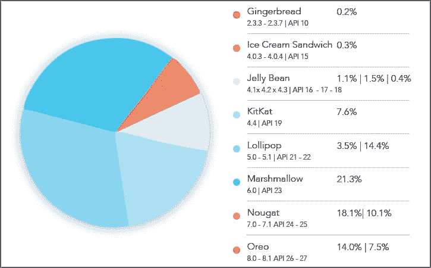

# DevOps 在移动应用开发中的作用

> 原文：<https://devops.com/role-of-devops-in-mobile-app-development/>

2001 年，DevOps 从敏捷方法中脱颖而出，基本上代表了传统瀑布软件开发方法的根本背离。

DevOps 是一种现代软件开发方法，主要关注软件开发人员、项目经理和运营人员之间的有效协作，同时也与业务目标保持一致。

当开发人员和运营人员一起更有效地克服与持续软件交付相关的挑战时，DevOps 应运而生。

## **移动应用中的 devo PS**

Peerbits 对移动 DevOps 有一个整体的看法，将其定义为持续移动应用交付的能力，使我们的客户能够缩短新功能的上市时间，同时抓住新的市场机会。

DevOps 的关键原则是持续交付，这意味着在移动应用开发周期的任何阶段，自动按需部署软件(在这种情况下是移动应用)及其运行环境。

DevOps 基本上应用相同的原则，不管你是想为移动还是网络开发一个应用程序。然而，移动开发运维面临的挑战有所不同，也很特殊。

## **移动开发运维挑战**

移动开发运维面临的挑战主要包括:

**不同的操作系统版本:**大多数移动应用程序都有多个目标环境和多个设备，需要处理不同的规格、不同的操作系统版本和不同的外形规格。

再者，不仅市场上运行的操作系统种类繁多，而且安装的版本也各不相同。

以安卓为例:安卓市场几乎占据了智能手机市场的 85%。下面提到的图表显示了截至 10 月 26 日已安装的 Android 版本的明细。

Image source: www.developer.android.com

正如你从图表中看到的，Android 6.0 版本，根据维基百科的[现在不受支持，仍然有 21.3%的 Android 用户在使用。](https://en.wikipedia.org/wiki/Android_version_history)

这清楚地表明，只有少数用户在新版本出现后立即更新，而其他人则没有，要么是因为他们不想，要么是因为他们的智能手机制造商没有提供更新的操作系统更新。

除此之外，大多数 Android 智能手机制造商还会稍微调整新的 Android 操作系统，导致操作系统碎片增加，并使启动时间变慢。

硬件:智能手机硬件面临两大挑战。首先，智能手机制造商提供了一系列芯片组、内存、存储选项，最重要的是，不同的屏幕尺寸。这使得很难支持它们中的每一个。

其次，移动设备战争不再仅仅是苹果和三星之间的战争。新的智能手机制造商比以前更频繁地进入市场。在这些新的竞争对手中，也有许多制造商提供低价机型。

尽管苹果和三星现在可能统治着西方市场，但在中国，这两个品牌分别只占 13.7%和 20.7%。

2015 年，至少有 18 家新的智能手机制造商进入了亚洲市场。

可用设备及其不同操作系统版本的本地化和碎片化给移动应用程序开发增加了相当大的复杂性。

**平衡移动应用质量与不断变化的消费者需求:**随着应用经济在最近几年的发展，企业快速将其移动应用投放市场的需求也随之增长。

然而，由于消费者的期望也在提高，移动应用程序的质量是留住现有客户以及吸引新客户的最重要因素。

尤其是在 2018 年，这变得越来越困难，因为客户可以轻松删除应用程序，并对低质量的移动应用程序给予较差的评级和评论。

因此，企业需要在应用质量方面格外小心，同时不断增加价值，让现有客户满意。

所有这些因素都给移动应用程序开发团队带来了压力，因为瀑布模型方法对于今天的消费者来说不是一种可持续的做法。

## **成功采用移动开发操作系统的 3 条规则**

在您的商务移动应用程序中采用 DevOps 只需要考虑三个因素，下面将进行解释。

### **持续规划和整合**

持续计划是指将您的整个移动应用项目团队(开发人员、项目经理、运营人员和其他利益相关者)召集到同一个平台上，以最终确定移动应用的范围，从而准备发布计划。

另一方面，持续集成确保一个开发人员提交的代码能够与其他开发人员提交的代码协同工作。简而言之，移动 DevOps 中的持续集成需要频繁的构建，这必须与最后开发的代码集成。

### **连续测试和监控**

大多数移动应用程序测试是在模拟器上执行的，而不是在实际设备上。另外，测试也是手动的。鉴于操作系统版本的数量，不可能对所有版本进行手工测试。

一个手机 app 在测试环境下可以表现的很好，但是在真人环境下会失败是很常见的。

这些故障的原因可能很多，比如内存、网络条件、电源等。因此，开发人员和企业有必要确保通过第三方 SDK 对日志、崩溃报告等进行持续监控，以找到问题的根源。

### **连续交付和部署**

连续交付指的是通过向类似生产的环境提交每个变更来确保代码被部署到生产环境的实践。

持续部署是持续交付的下一步。在连续部署中，每个通过连续测试批准的变更都会自动部署到生产环境中。

## **外卖**

在我们的认知中，不存在针对移动应用开发的单独 DevOps。DevOps 是一种通用方法，适用于所有组件以及不同种类的应用程序开发。

虽然在移动应用中采用 DevOps 存在一定的挑战，但也有可衡量的好处，使整个旅程值得。

总而言之，尽管建立一个应用程序的成本和初期的痛苦，DevOps 的好处使投资物有所值。

— [nasrullahpatel](https://devops.com/author/nasrullahpatel/)