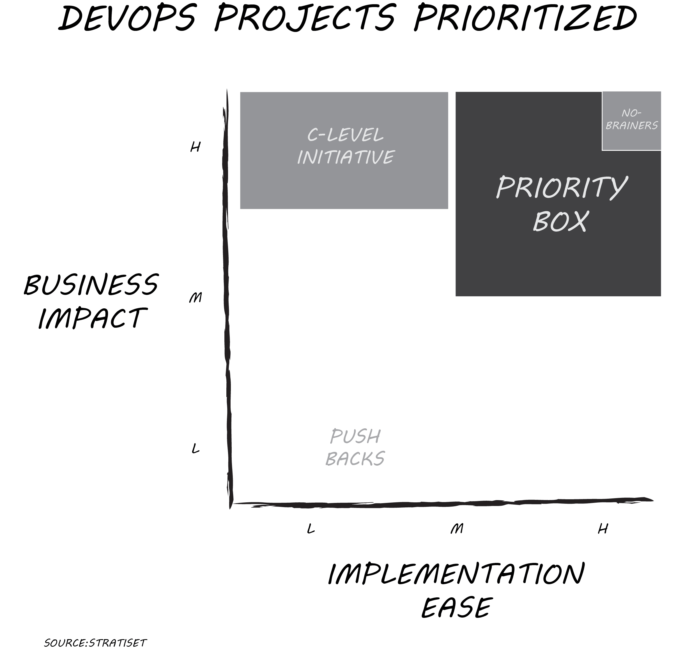

# 项目太多:打破主动霸王

> 原文：<https://devops.com/too-many-projects-breaking-initiative-overload/>

主动性超载。这些话让世界各地的 IT 领导者不寒而栗。超负荷的团队不仅要应付太多的项目，而且士气通常很低，每周工作很长时间，而且看不到尽头。然而，领导者不能随意扼杀或搁置项目而不遭受来自某个地方的反作用。如果你被任命领导一个 DevOps 团队，并且你看到有太多的项目在进行中，那么打破计划超载是当务之急。这里是开始的地方。

非常常见的是，高生产率的 DevOps 团队突然以 20 或 30 个“优先事项”的列表和快速发展的僵局而告终。作为球队新任命的教练，你只有一次机会来解决这个问题。你的策略是什么？实现这些目标对于打破计划超载至关重要:

*   优先考虑正确的计划。
*   缩短优先级列表，最好是五个或更少的项目。
*   分配资源，以便优先项目迅速开始和完成。
*   用透明的指标来沟通和维护优先级。
*   随着优先项目的完成，确定并计划“下一个项目”。
*   如果被接洽，授权团队“现在不是优先事项”。
*   获得认同并让所有团队成员负起责任。

## **收集列表**

听起来很复杂，对吧？保持简单通常是个好建议。当你有一长串项目时，首先要认识到它们并不都是平等的。有些是真正的首创，比如 CEO 要求实时跟踪小部件的销售。职能部门有他们的重要项目，提供所需的成本降低或效率提高。你可能会看到一些来自不同赞助商的愿望清单项目，但理由并不充分。

接下来，要明白每个项目都有一些隐性成本。一个是将宝贵的资源分配给 it 而不是其他事物的机会成本。另一个原因是，当团队过多地同时处理多项任务时，会产生转换成本。这两种成本都无法消除；然而，它们可以在需要什么资源的环境中被优化。

因此，列出你关注的所有开发项目。列出 C 级发起人不可触及的计划。添加功能项目和那些宠物项目请求。根本不要过滤列表——任何消耗资源或等待启动的东西都需要可见性。现在，你应该明白走廊里所有的倡议超载讨论是怎么回事了。深呼吸，召集你的团队领导，预定你喜欢的头脑风暴食物开会。

## **创建情节**

坐在你周围的应该是你最好的技术专家和行业专家的组合。一起看名单。发起人可能在没有真正评估价值的情况下证明了项目请求的合理性。如果你需要有人对一个团队领导没有见过的项目发表意见，那就找一个部门专家。如果他们无法解释，或者这是一个过时的要求，他们想修改，把它放在一个停车场。当你确定你的团队领导都理解列表上的每个项目时，为每个项目指定一个字母。

在您的白板或共享屏幕上，根据两个维度来绘制每个项目:实施简易性和业务影响。对每个轴使用低、中或高的相对标度。实施简易性可以包含许多变量，包括工具成本、技术难度、内部专业知识等。业务影响可以解决收入增加、成本降低、竞争优势或法规遵从性等问题。不要担心绝对；你希望看到一个项目与所有其他机会相比如何。如果需要，在打印最初几个项目后调整图钉。即使清单很长，你也能在一两个小时内找到窍门。

## **排列优先级**

很少有项目是具有高业务影响和高实现简易性的优先项目。更有可能的是，你有几个项目在“优先级框”中，得分高于中等/中等。如果你有五个以上的项目，再看一看，稍微整理一下，得到一个易于管理的列表。确保可用资源与“优先级”框中确定的项目相匹配。允许一个例外:C 级计划可能被评为高业务影响和低/中实现容易性。仅仅因为它很难就取消它不是一个好的举措，但是在上下文中确定优先级可以帮助解决资源分配问题。

这是你带回团队的优先列表。如果它在清单上，努力完成它。如果有些东西不在列表上，你的团队会把对这些项目的任何询问踢给你。将具有低业务影响和中/低实现难度的项目推回给它们的发起人，以进行论证或删除。当一个优先项目完成后，才开始下一个排名最好的项目。在第一组项目完成后，对整个项目列表进行重新评分。

太容易了？这里有一篇[最近 HBR 的文章，“太多的项目”，](https://hbr.org/2018/09/too-many-projects)描述了一个更大的计划的更详细的方法。对于需要更多资源的 C 级计划，您可能需要这样的深入分析。对于你列表中的大多数项目，更多的分析需要更多的时间，并且可能产生与这个更快的方法完全相同的优先级。

打破主动性超负荷的关键是开始和完成正确的项目。快速创建一个经过审核的优先级列表，并让团队重新运转起来，这值得花一个下午和一些食物的代价。当您的团队看到进步，企业更快地看到价值时，士气会迅速提高。

我希望您能就这一流程如何为您服务提供反馈。

— [唐·迪丹吉](https://devops.com/author/don-dingee/)