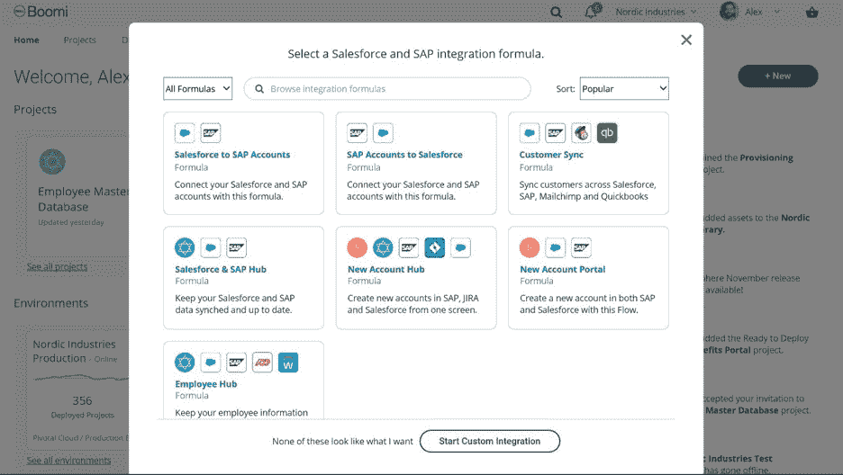

# Dell Boomi 利用行业领先的智能和区块链功能重新构想了 iPaaS

> 原文：<https://devops.com/dell-boomi-reimagines-ipaas-with-industry-leading-intelligence-blockchain-capabilities/>

*超过 20TB 的数据和无与伦比的全新用户体验之旅*

[https://boomi . com/press _ release/Dell-boomi-re imagines-ipaas-with-industry-leading-intelligence-区块链/](https://boomi.com/press_release/dell-boomi-reimagines-ipaas-with-industry-leading-intelligence-blockchain/)

**拉斯韦加斯–Boomi World 18****–2018 年 11 月 6 日**–[戴尔 Boomi](http://www.boomi.com/)(Boomi)是构建互联业务的领先云集成和工作流自动化企业转型提供商，在 [Boomi World](https://boomi.com/boomiworld/) 上宣布了其重塑 iPaaS 行业的产品愿景。在未来几个月，这一愿景将融入 Boomi 的产品、服务和整体业务战略，以便继续为客户和合作伙伴提供最佳的业务成果。

作为业务转型的基础技术，iPaaS 需要做的不仅仅是集成应用程序。它需要提供整个商业生态系统(公司、合作伙伴和客户)的连接，并将应用程序、人和物连接起来。it 需要以无缝、高效的方式实现这一目标，从而提高工作效率并加快取得成效的速度。如今，Boomi 是唯一提供统一平台的 iPaaS 解决方案，包括:

*   *集成*–连接整个混合 IT 生态系统中的应用和数据
*   *Hub*–通过整个企业的单一真实来源同步和丰富可信数据
*   *交换*–使用传统 EDI 和现代 web 服务协议管理您的贸易伙伴网络
*   *协调*–在 API 的整个生命周期中对其进行设计、保护和扩展
*   *流程*–构建客户旅程并自动化简单和复杂的工作流程

Boomi 重新打造的 iPaaS 包括:

*   ***无与伦比的用户体验****–*Boomi 了解到，iPaaS 由不同技术专业水平的人使用，用于从简单到复杂的一系列项目。新的用户体验(UX)旨在满足从企业架构师到公民集成商的每一位用户的专业水平，并提供最适合当前项目或用例的指导。用户可以专注于他们希望解决的问题，并可以轻松完成项目或实现业务成果。从人力资源和财务到销售和运营，都提供了完全成型的指导和建议路线。

*   ***社区智能****–*2008 年，Boomi 通过 Boomi Suggest、Boomi Resolve 和 Boomi Assure 率先使用人工智能(AI)来简化构建和管理集成流程。Boomi 的愿景建立在这一基础上，并将智能融入用户旅程的每一步，使他们能够快速高效地完成项目。随着大约 20 TB 的匿名元数据集成到解决方案的智能中，这种无处不在的知识包含在 Boomi 平台的各个方面，以帮助用户提高工作效率。本着共享成功的理念，它向用户展示了如何根据社区的反馈和见解，针对特定需求优化配置 Boomi。
*   ***简化协作***–鉴于团队工作的重要性，Boomi 的新 UX 旨在支持跨用户和团队的实时协作，并提供必要的控制和跟踪。
*   ***区块链集成***–Boomi 的世界级统一平台为行业领先的区块链平台以太坊和 Hyperledger Fabric 提供支持，因此客户将准备好快速轻松地将区块链智能合约纳入其业务流程。在区块链演进的这段时间里，Boomi 将积极致力于区块链标准，并参与各种行业联盟，以影响客户采用区块链所需的集成要求。

“iPaaS 不再仅仅是集成，而是普遍的连接和业务转型。如果一家企业只是强调整合能力，那么它只是专注于拼图的一部分，”戴尔 Boomi 首席产品官史蒂夫·伍德说。“Boomi 提供了一个 iPaaS 平台，通过连接人和数据来实现转型。今天的 iPaaS 不会是明天的 iPaaS，Boomi 的愿景是重新定义市场，为我们的客户和合作伙伴提供最佳的集成云技术。”

弗林德斯大学数字商业服务副总监兼首席信息官 Nicole Fishers 表示:“弗林德斯大学以其作为当代教育的创新者和澳大利亚最具进取精神的毕业生的来源而自豪。“我们已经认识到高等教育行业对先进技术的迫切需求，Boomi 使我们能够在整个组织中保持联系。Boomi 有超过 25，000 名学生，正在帮助我们为他们提供前所未有的信息访问。”