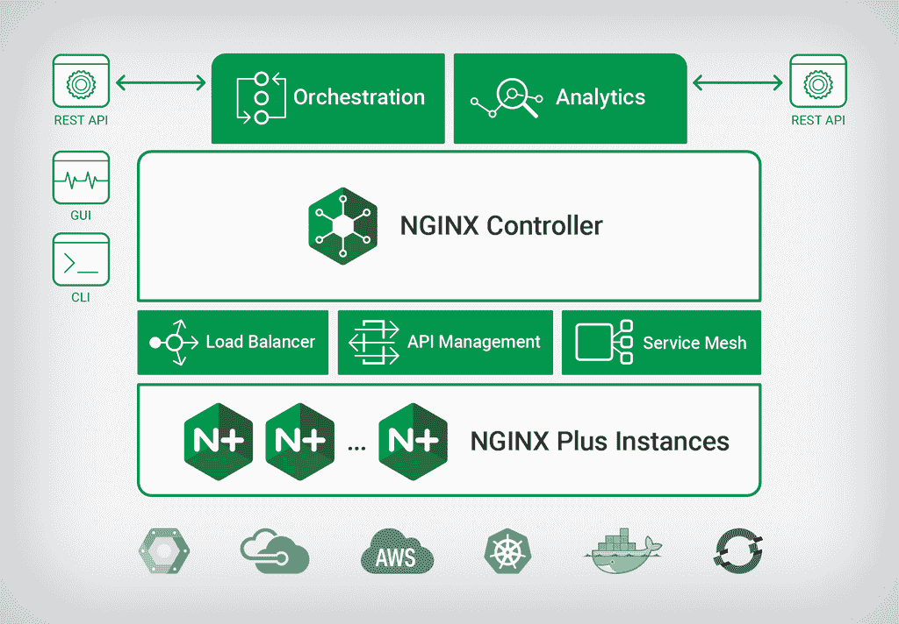

# NGINX 推出混合应用交付控制器平台

> 原文：<https://devops.com/nginx-unveils-hybrid-application-delivery-controller-platform/>

NGINX 本周宣布，它已经开发了一个管理应用交付的通用框架，可以应用于单片和基于微服务的应用。

在 [NGINX Conf 2018](https://www.nginx.com/nginxconf/2018/) 大会上宣布， [NGINX 应用平台](https://www.nginx.com/press/nginx-announces-new-solutions-for-application-delivery-api-management-and-service-mesh/)经过重新架构，提供传统的负载平衡功能和 web 应用防火墙(WAF)，以及用于管理微服务的内置服务网格和集成的应用编程接口(API)管理平台。

NGINX 产品管理副总裁 Sidney Rabsatt 表示，NGINX 控制器的更新是集成负载平衡、服务网格技术和 API 管理的更全面方法的核心。NGINX 控制器 2.0 将于今年晚些时候推出，它基于模块化架构，能够通过插件模块添加额外的功能。API 管理模块计划在第四季度发布，而服务网格模块计划在 2019 年上半年推出。

Rabsatt 表示，it 组织显然不想复制现有的应用交付控制器来管理微服务。永远不会有这样的企业 IT 环境，它完全由微服务构成。他说，NGINX 控制器的最新版本使管理现代 it 环境中需要解决的各种应用程序的应用程序交付成为可能，并指出实际上，这是一种通过单一结构管理应用程序交付的通用方法。

作为这一努力的一部分，NGINX 本周还透露，NGINX Plus R16 是核心 NGINX 负载平衡软件的企业级版本，除了支持亚马逊网络服务(AWS) PrivateLink 集成外，它还更新了负载平衡算法，以应用于 Kubernetes 集群上运行的微服务。

最后，NGINX 宣布了 Unit 的 1.4 版本，这是一个开源的 web 和应用服务器，支持 TLS 加密，通过 API 进行动态重新配置，并通过 Node.js 对 JavaScript 进行实验性支持，以扩展对 Go、Perl、PHP、Python 和 Ruby 语言的现有支持。计划在 2019 年全面支持 JavaScript 和 Java。

总的来说，Rabsatt 表示，很明显，在统一应用交付管理的需求方面，采用 DevOps 的组织是最先进的。事实上，NGINX 最近的成功很大程度上是从开发者下载 NGINX 的开源实例来嵌入他们的应用程序开始的。随着 NGINX 的这些实例开始在企业中扩散，更多的 IT 运营团队开始接触 NGINX 平台的其余部分。

基于微服务的应用可能需要一段时间才能达到足够的临界质量，从而迫使组织重新考虑其应用交付方法。但现在，组织需要决定他们希望在多大程度上为微服务应用部署独立的应用交付控制器和服务网格，而不是追求更混合的方法，这只是时间问题。NGINX 显然把赌注押在了后者上，因为大量遗留的单一应用程序将会运行数年。

— [迈克·维扎德](https://devops.com/author/mike-vizard/)