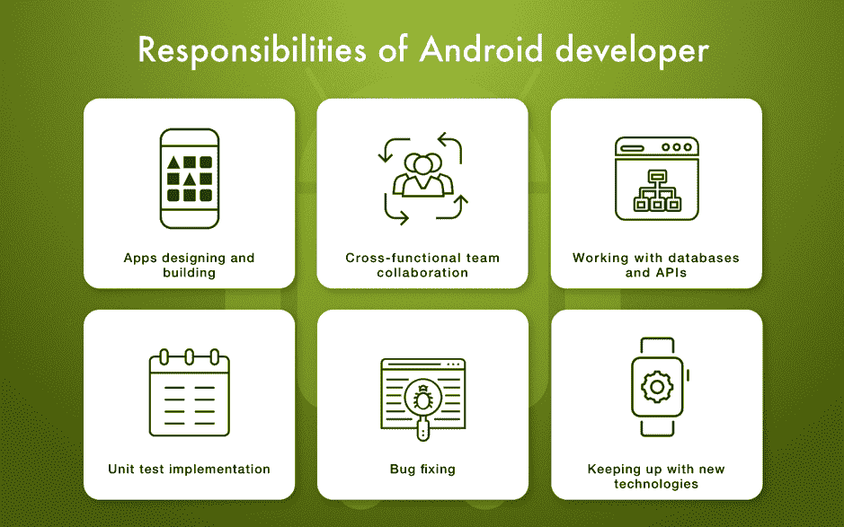
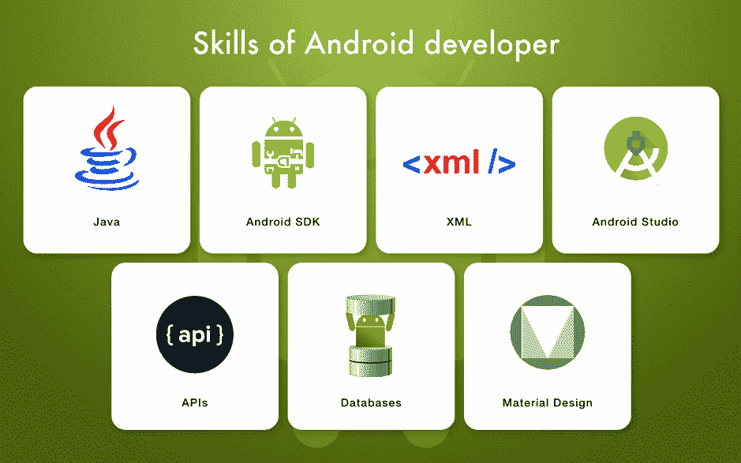

# 2018 年如何寻找和雇佣安卓开发者

> 原文：<https://devops.com/how-to-find-and-hire-android-developers-in-2018/>

一个优秀的应用程序创意同样需要一个优秀的移动开发团队。这意味着你必须花时间去寻找和招募熟练的 Android 开发人员，并相应地克服许多挑战。这里有一些提示，可以帮助你克服困难，减轻寻找合格的 Android 开发者时可能出现的问题。

## Android 开发人员的角色和职责

深入了解员工的职责总是一个好主意。因此，如果你没有技术背景，这一部分对你来说会非常有用，因为它讲述了一个熟练的 Android 开发者的更多技能。

值得一提的是，由于操作系统的差异，Android 和 iOS 开发人员的技术技能也有所不同。每个操作系统都使用一套特定的技术，如果你想 [雇佣 iOS 开发人员](https://www.cleveroad.com/blog/where-and-how-to-hire-ios-app-developers-salary-skills-more) ，你应该根据最新的市场需求检查他们需要具备的技能。

## 熟练程度

在 IT 行业中，开发人员被划分为不同的级别，指定他们的熟练程度。这些级别是:

*   入门级意味着开发人员没有太多开发软件产品的经验。初级 Android 开发人员通常从事简单的项目，他们由更有经验的同事管理。
*   有经验的开发人员从事复杂的项目，没有管理职责。
*   高级开发人员通常有 5 年以上的经验，经常领导大型项目，并监督技术任务的执行。

## 责任

让我们更详细地考虑 Android 开发者的责任。

### **UI 工程和业务逻辑开发**

开发者必须在开发应用功能的同时，重新设计应用的设计。此外，他们应该预测可能出现的错误并防止它们出现。

### **协作技能**

在大多数情况下，开发人员并不是单独在一个项目上工作。他们周围都是其他专家，需要有效地与他们合作，以实现一个共同的目标:一个功能良好的最终产品。

### **数据库和第三方 API**

Android 开发人员应该足够擅长阅读其他开发人员编写的代码，因为他们必须在项目期间使用外部 API 和数据库。

### **单元测试**

模块化测试是一种行业标准。Android 开发人员必须执行它来测试应用程序功能的某个部分，并修复任何错误。单元测试是敏捷软件开发的一部分，旨在快速创建高质量的应用程序。

### **Bug 修复**

Android 开发者应该尽一切可能来交付一个无 bug 且稳定运行的产品。

## Android 开发者的类型

有几种类型的开发人员可供选择。选哪个看你的喜好和项目了。

*   自由开发者。如果你预算有限，并且想尽可能地省钱，这种类型可能是个不错的选择。然而，请记住，事实上，你无法控制自由职业者的工作，剩下的就是依靠他们的责任。
*   内部开发人员。这些是在你公司办公室为你的项目工作的人。这是一个很好的选择，如果你已经有一个办公空间，你想自己管理开发。
*   **外包团队。这个计划很简单:你雇佣一家软件外包公司，向他们解释你的需求，他们会为你从头开始建立一个项目。**

## Android 开发者的技术技能

Android 开发人员必须拥有一套技术技能，才能真正实现应用程序开发。下面，我们列出了每个 Android 开发者应该能够使用的基本技术。

*   **Java:** 这是开发 Android 应用的官方语言。这种面向对象的语言创建于 1995 年，目前是世界上最流行的编程语言。每个 Android 开发人员都必须对这种语言有相当的了解，才能构建软件。
*   Kotlin: 这是 Android 开发的第二官方语言，许多程序员因为各种原因正在转向它。
*   XML: 扩展标记语言广泛用于 web 开发，但它也是 Android 开发的必要技术。简单地说，XML 旨在通过互联网提供信息交换。因此，如果你的应用程序需要与互联网连接，开发者必须使用 XML。
*   **安卓 SDK。** Android 软件开发包是一套用于各种用途的程序。例如，它具有用于调试、代码测试、检查与不同操作系统版本的兼容性等的集成工具。
*   **安卓工作室。**它是一个集成开发环境(IDE ),开发者用来方便地编写源代码。这可能是由于各种内置工具(例如，用于不同操作系统版本的预览应用程序)。
*   **API:**与第三方 API 协同工作并将其集成到软件中的能力是 Android 开发者的另一个需求。例如，如果你需要应用内支付，开发者可以使用 Stripe API，并根据应用的需求修改现成的代码，而不是从头开始构建支付系统。
*   **数据库:** Android 开发者应该具备整合云数据库(如 Firebase)或本地数据库(如 SQL)的技能，以存储应用程序的数据。
*   **材料设计。**它是 Android 设计语言，开发者应该知道它的指导方针，以正确的方式构建应用程序的用户界面。

## 安卓开发者费率

IT 服务的价格通常显示为一个工作小时。价格也很大程度上取决于地区。

*   **北美:**$ 150-170/小时
*   澳大利亚:$ 110/小时
*   西欧:$ 70/小时
*   东欧:$ 35-50/小时

现在你知道找到一个合格的 Android 开发者需要什么了吧！

— [娜塔莉亚·哈尔琴科](https://devops.com/author/nataliia-kharchenko/)