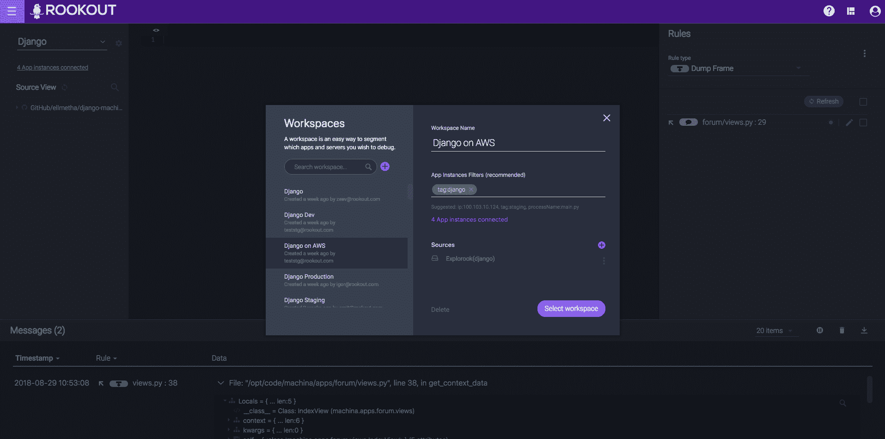

# Rookout 工作区为生产调试带来了团队合作

> 原文：<https://devops.com/rookout-workspaces-brings-teamwork-to-production-debugging/>

Rookout 发布了第一款按需协作调试代码的工具，包括在生产中。Rookout 的 Workspaces 功能类似于调试实时代码的“Google Docs ”,让开发人员安全地共享一个 IDE 来跟踪问题和收集数据。

在 Rookout 工作区内，开发人员可以在实时代码中设置“不间断断点”，无需重启、重新部署或编写任何新代码。从“断点”收集的数据与共享工作区的任何其他团队成员共享。团队成员可以安全地在工作区中创建他们自己的“不间断断点”,并在服务器上一起调试，而无需共享屏幕或访问本地机器。如果开发人员希望独立地处理相同的代码，而不互相妨碍，他们也可以定义单独的工作区。

Rookout 工作区还允许开发人员为数据收集定义环境的特定部分。可以将工作区设置为“生产”或“暂存”目标、特定客户端、单个流程或单个 IP 地址。Rookout 只从定义的工作空间内部收集数据，减少了无用的收集和过滤。

学术研究表明“成对调试”，即两个或更多的人一起工作来发现代码中的问题，是发现具有挑战性的 bug 的强大工具。然而，传统的调试器运行在单独用户的本地环境中，并且具有非常有限的协作能力。

Rookout Workspaces 使跨公司的深度协作成为可能。例如，客户支持团队成员可以在一个工作区中直接与开发人员合作来解决客户的实际问题，或者数据分析师和产品团队可以使用一个工作区来一起优化代码。

Rookout 联合创始人兼首席技术官 Liran Haimovitch 表示:“作为一名开发人员，你试图处理的每个问题都存在于一个特定的‘空间’内。“在数据过载的世界中，标记、分段、包括和排除环境中的部分数据的能力至关重要，这种能力可以在您需要的时候为您提供所需的数据，并让您与其他需要数据的人共享这些数据。”

Rookout 的联合创始人兼首席执行官 Or Weis 表示:“Rookout 的工作空间是为分布式软件团队必须调试分布式系统的世界而构建的。“分布式协作调试正迅速成为现代软件的必备条件。工作区让开发人员只关注他们基于自己的业务逻辑想要的环境，并帮助公司的不同部门合作，安全快速地解决 bug。”